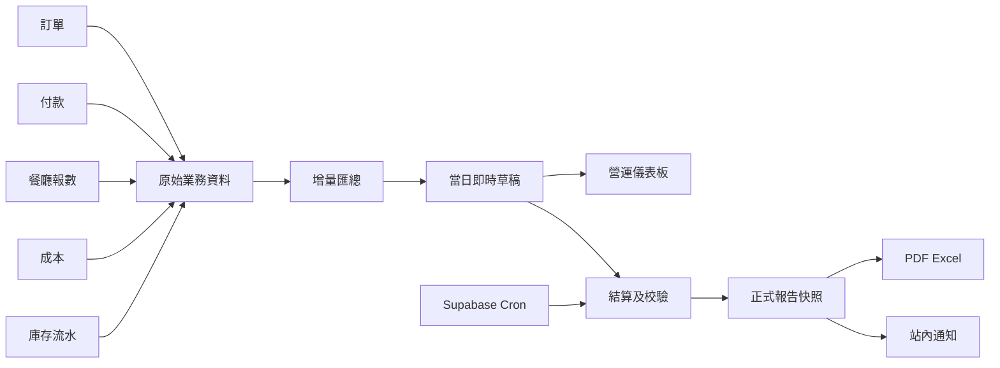
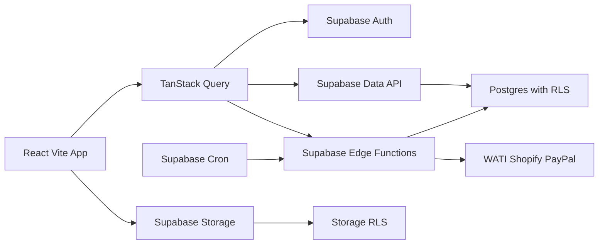

# Food Channel Catering 新系統功能 PRD

## 1. 文件資訊

| 項目 | 內容 |
|---|---|
| 文件版本 | 1.0 |
| 文件日期 | 2026-08-11 |
| 舊系統 | Bubble `fc-order-system` |
| API 來源 | `https://cs.foodchannels-catering.com/version-test/api/1.1/meta/swagger.json` |
| 規格版本 | 宣告為 Swagger 2.0 |
| 分析環境 | Bubble `version-test` |
| 目標技術棧 | React、Vite、Tailwind CSS、shadcn/ui、Supabase、Recharts、Lucide React、TanStack Query |

### 1.1 文件定位

本 PRD 依公開 Swagger 契約逆向整理，描述 API 能證實的資料能力、工作流程入口，以及新系統應具備的功能與驗收標準。

標記規則：

- **已證實**：Swagger 明確記載的 endpoint、欄位、型別或回應。
- **產品需求**：為完成安全且可維護的遷移而定義的新系統行為。
- **待確認**：Swagger 無法證明，必須由 Bubble Editor、Privacy Rules、實際資料或業務人員確認。

本文件不能單獨證明 Bubble 頁面 UI、workflow 內部動作、公式、排程、角色權限與第三方設定。第一階段開始實作前必須完成這些盤點，建立可追溯的舊功能清單與行為驗收案例，作為 100% 功能等價的基線。

### 1.2 公司與營運背景

本產品服務一套以「到會（Catering）＋荃灣中央廚房＋分店」為核心的餐飲業務：

- **Food Channel Catering**：中西到會主力業務。
- **中露點**：目前主要為一間實體餐廳。
- **荃灣中央廚房／寫字樓**：集中處理到會生產、乾貨倉、凍房、凍肉加工與物流。
- **將軍澳分店**：向中央廚房訂購乾貨、凍貨及半成品。
- **多品牌網站**：約 6–7 個網站主要透過 Shopify 接單，再由中央廚房生產及司機配送。

大部分配送採地面交收；部分訂單包含餐具、服務員、佈置、司儀、開幕典禮或切豬等現場服務。

### 1.3 品牌與渠道基線

| 品牌／網站 | 定位 | 狀態 |
|---|---|---|
| Food Channel Catering | 中西到會主力 | 營運中 |
| 高級中式到會網站 | 高級中菜 | 名稱待確認 |
| 即日到會 | 4 小時內送達 | 營運中 |
| Catre | 英文網站，面向香港外國人 | 營運中 |
| Lunch Box | 多菜系飯盒、下午茶及點心 | 重點業務 |
| Party Food | 開幕、切豬、司儀及現場佈置 | 重點業務 |
| 福滿樓 | 舊品牌 | 已停止營運，只保留歷史查詢 |

## 2. API 基線

### 2.1 規格摘要

| 指標 | 已證實數量 |
|---|---:|
| API paths | 248 |
| API operations | 652 |
| Workflow endpoints | 46 |
| Data API paths | 202 |
| Data types | 101 |
| Definitions | 245 |

規格內使用 `type: "option set"` 等 Bubble 自訂型別，並非標準 Swagger 2.0 schema。使用 code generator 或 validator 前，必須先正規化為 string／enum 並補齊合法值。

所有 101 種 Data API 類型均提供：

- `GET /obj/{type}`：列表與搜尋
- `POST /obj/{type}`：建立
- `GET /obj/{type}/{UniqueID}`：讀取單筆
- `PATCH /obj/{type}/{UniqueID}`：部分更新
- `PUT /obj/{type}/{UniqueID}`：整筆取代
- `DELETE /obj/{type}/{UniqueID}`：刪除

列表 API 共同支援：

| 參數 | 行為 |
|---|---|
| `limit` | 預設 50，最大 100 |
| `cursor` | 預設 0 |
| `sort_field` | 指定排序欄位 |
| `descending` | 控制排序方向 |
| `constraints` | JSON 字串化的 Bubble 查詢條件 |

列表回應包含 `results`、`cursor`、`count` 與 `remaining`。

### 2.2 舊系統認證

Swagger 定義全域 query-string API key：

```text
api_token=<token>
```

25 個 workflow 顯式標記為 `security: []`。這只代表 Swagger 契約未要求 token，不代表執行期一定匿名可用。

新系統不得複製以下不安全設計：

- 不得把 API token 放在 URL。
- 不得讓匿名使用者執行訂單、庫存、付款、成本、採購或通知等副作用。
- 不得在前端保存 Supabase `service_role` 或第三方 secret。
- 不得將舊系統 `user.pw` 搬入業務資料表。

## 3. 產品目標與成功標準

### 3.1 產品目標

1. 第一階段先 100% 實現舊系統目前已啟用並被實際使用的功能與業務結果。
2. 保留 Bubble legacy ID 對照，使歷史資料、關聯與稽核可追溯。
3. 將 Bubble Privacy Rules 轉為 Supabase RLS 與後端權限檢查。
4. 將多資料表 workflow 改寫為具驗證、冪等、稽核與錯誤處理的 Edge Functions，原子寫入則由單一 PostgreSQL function／RPC transaction 完成。
5. 讓所有關鍵財務、庫存與配送結果可回讀、可對帳、可重跑。
6. 功能等價驗收完成後，第二階段才重設不合時宜流程、優化 UX，並加入自助落單、積分及 AI 輔助報價等新能力。

### 3.2 第一階段功能等價原則

- 等價目標是相同輸入、權限、狀態、計算、資料異動、通知及第三方結果，不要求複製 Bubble 技術架構或逐像素照搬舊 UI。
- 所有現行頁面、角色操作、Privacy Rules、option sets、排程、第三方整合及資料匯入／匯出都必須納入功能清單。
- 101 種 Data Type 與 46 個 workflow 逐項建立 mapping 與驗收結果；只有經實際使用證據確認未啟用／已廢棄，並由產品負責人簽核的項目才可排除。
- 第一階段不得以「未來會改進」為理由省略仍在使用的舊功能。
- 安全漏洞、匿名高風險寫入、query-string secret、明文密碼及無稽核改數不作原樣複製；須提供相同行為結果的安全實作。
- 排更 API 雖存在於 Swagger，但會議確認不在現行餐廳系統；須先驗證是否有任何角色實際使用。若未使用並獲簽核，才不列入等價範圍。
- 自助落單在會議中標記為未完成，因此不是舊功能等價範圍，列入第二階段。

### 3.3 成功標準

- 101 種舊資料類型均有目標 mapping、資料存取方式及逐項驗收結果。
- 46 個 workflow 均有安全等價實作與結果比對，或有「現行未使用」的證據及產品負責人排除簽核。
- 角色與資料範圍權限通過匿名、本人、跨客戶、跨店舖及管理員測試。
- 所有舊系統仍可查詢的必要歷史資料，在新系統可用相同業務口徑查詢；底層可採遷移或受控唯讀同步。
- 實際遷移資料通過筆數、關聯、檔案、付款總額及未付金額對帳。
- 訂單、付款、庫存、配送與第三方 webhook 的重複請求不產生重複副作用。
- 每個角色完成舊系統與新系統的平行操作案例，業務結果一致後才可標記功能等價完成。

## 4. 使用者與權限

### 4.1 可辨識使用者關聯

`user` schema 已證實包含：

- `Role`
- `available_pages[]`
- `Customer → a_customers`
- `shop restro → shopdsrestro`
- `User Name`
- `Email_Noti`
- Bubble authentication email 與 email confirmation 狀態
- `pw`

Swagger 不提供 Role 與 `available_pages` 的合法值，也不提供其優先順序。

### 4.2 產品需求

| 需求編號 | 需求 |
|---|---|
| AUTH-01 | 使用 Supabase Auth 管理登入、session、邀請及密碼重設。 |
| AUTH-02 | `profiles` 保存使用者業務資料，並以 `auth.users.id` 關聯。 |
| AUTH-03 | 舊 Bubble user ID 保存為 `legacy_id`，但不作為新系統主鍵。 |
| AUTH-04 | Role、permission 與 page access 正規化；前端隱藏不得取代後端授權。 |
| AUTH-05 | 客戶帳號只能存取其 customer 範圍。 |
| AUTH-06 | 店舖帳號只能存取其 restro／department 範圍。 |
| AUTH-07 | 司機只能存取指派給自己的配送資料。 |
| AUTH-08 | 付款、成本、角色管理及資料匯出只開放指定權限。 |
| AUTH-09 | 所有 exposed tables 啟用 RLS；授權不可依賴可由使用者修改的 `user_metadata`。 |
| AUTH-10 | 不遷移、不回傳、不記錄 `user.pw`；舊使用者以邀請或強制重設密碼啟用。 |
| AUTH-11 | 停權、角色降級或移除 tenant 時撤銷既有 session；敏感操作即時檢查帳號狀態與權限，不只依賴尚未到期的 JWT claim。 |

### 4.3 公司、品牌、據點與倉區

| 需求編號 | 需求 |
|---|---|
| ORG-01 | 建立品牌、Shopify Store、營運據點、倉區及訂單渠道主檔，避免以同一欄位混用不同概念。 |
| ORG-02 | 荃灣中央廚房至少區分到會生產、乾貨倉及凍房。 |
| ORG-03 | 將軍澳分店作為獨立庫存與營運據點，並可向中央廚房申請補貨。 |
| ORG-04 | 每個 Shopify Store 映射唯一品牌、credential、webhook namespace、商品規則及配送規則。 |
| ORG-05 | 福滿樓禁止接收新訂單，但保留歷史資料查詢及報表。 |
| ORG-06 | 使用者權限可按品牌、據點、倉區及部門限制。 |

### 4.4 角色與功能權限矩陣

舊文件中的角色只作業務需求來源，不直接映射 Bubble `Role`。新系統須把「可使用功能」與「可存取資料範圍」分開授權。

| 角色 | 主要功能 | 預設資料範圍 | 明確限制 |
|---|---|---|---|
| Office—Marketing | 客戶、商品、報價草稿、渠道及廣告分析 | 獲授權公司、品牌、渠道及客戶 | 不可入帳、退款、改庫存或查看未授權成本 |
| Office—Operation | 訂單履行、生產放行、配送、調撥協調 | 獲授權公司、品牌及據點 | 不可鎖帳、沖銷付款或管理角色 |
| Office—Account | 收款核實、退款／沖銷、對帳、應收應付及 P&L | 獲授權法律實體及期間 | 不可直接改庫存數量或冒充生產／配送執行 |
| 中央廚房廚師 | 已放行訂單、出貨日期、領料、進出庫、盤點、執貨及送貨交接 | 荃灣指定生產線及倉區 | 遮罩非必要 PII、售價、付款及毛利 |
| 分店廚師 | 廚房庫存進出、盤點、內部補貨申請、收貨及當日產品需求／銷售摘要 | 本店廚房部門 | 不可查看水吧、全店付款或自行批核補貨 |
| 生產部 | 生凍肉、半成品／熟貨進出、加工批次、產量及盤點 | 指定肉類倉區及生產線 | 不可查看客戶與銷售財務；成本另行授權 |
| 分店水吧 | 水吧庫存進出、盤點、內部補貨及當日水吧報數 | 本店水吧部門 | 不可查看廚房庫存、全店付款或 P&L |
| 分店店長 | 全店庫存總覽、補貨批核、每日報數覆核及差異處理 | 本店所有部門 | 不可存取其他店或公司級財務設定 |
| 收銀 | 每日銷售、付款方式及現金交更申報 | 本店、本人班次或指定營業日 | 不可自我覆核、鎖帳或作重大庫存調整 |
| 運輸司機 | 本人配送、導航、接拒、狀態、照片及每程收款申報 | 已指派車程及必要客戶資料 | 不可查看其他司機、成本或直接把收款過帳 |
| 客戶 | 自助下單、本人／所屬公司訂單、積分及禮品換購 | customer account／organization | 不可查看內部備註、成本、實際庫存或其他客戶 |
| 系統管理員 | 身分、角色、系統設定及技術管理 | 明確授權範圍 | 不因技術角色自動取得財務過帳或業務審批權 |

權限判斷至少包含：`legal_entity + brand + site + warehouse/department + assigned_resource + customer_account + document_status + accounting_period`。頁面可見性只改善 UX，RLS 與後端授權才是最終控制。

「make order」必須按使用情境分成三種不同權限與文件：

1. 分店向中央廚房的內部補貨申請。
2. 向外部供應商的採購單。
3. 客戶銷售訂單。

### 4.5 多公司與庫存所有權

| 需求編號 | 需求 |
|---|---|
| ENT-01 | 建立 `legal_entities`；至少包含 Food Channels Ltd 與 Food Channels Catering Management Ltd（FCCM），法律關係待確認。 |
| ENT-02 | Food Channels Ltd 作為現有存貨擁有人，可進貨、賣貨及向其他公司／客戶出貨。 |
| ENT-03 | FCCM 映射將軍澳餐廳營運；其他客戶作交易對手或 customer organization，不自動取得內部管理權。 |
| ENT-04 | 品牌、Shopify Store、法律實體、營運據點、部門及倉庫使用獨立資料模型。 |
| ENT-05 | 每筆庫存流水保存 owner legal entity、operator、location、counterparty、來源文件、批次、數量、單位及成本權限。 |
| ENT-06 | 同一擁有人內部調撥只改地點；Food Channels Ltd 向 FCCM 或外部客戶出貨時，按確認政策建立公司間／對外銷售及採購文件。 |
| ENT-07 | 在途庫存保留擁有人與來源／目的地，不得同時列作兩地可用庫存。 |
| ENT-08 | 跨公司 RLS 預設拒絕；共享資料必須由明確 membership／grant 授權。 |

## 5. 功能範圍

### 5.1 客戶與 CRM

資料來源包括 `a_customers`、`m_customer`、customer tag、sales partner、channel、communication channel 與 reminder person。

| 需求編號 | 產品需求 |
|---|---|
| CRM-01 | 建立、查詢、更新及封存客戶。 |
| CRM-02 | 維護公司、聯絡人、電話、Email、客戶類型與備註。 |
| CRM-03 | 管理客戶標籤、銷售來源、銷售夥伴及溝通渠道。 |
| CRM-04 | 在客戶詳情顯示其報價、訂單、付款及配送歷史。 |
| CRM-05 | PII 欄位須受 RLS、稽核及 log 遮罩保護。 |
| CRM-06 | `a_customers` 與 `m_customer` 在確認是否同一主體前維持獨立，並支援 mapping。 |
| CRM-07 | 新建報價單／訂單時，可按客戶姓名、公司、電話及 Email 模糊搜尋過往客戶。 |
| CRM-08 | 選擇既有客戶後，自動帶入公司、聯絡人、電話、Email、地址及其他可用資料，並保存為本次交易快照。 |
| CRM-09 | 支援貼上非結構化文字，識別公司、聯絡人、電話、Email、地址及備註；寫入前必須顯示解析結果供使用者確認。 |
| CRM-10 | 電話與 Email 在前端提供即時提示，後端再次校驗；電話以字串保存，支援國碼、空格及地區格式。 |
| CRM-11 | 客戶模糊搜尋必須遵守 RLS、限制結果數並避免向無權限使用者暴露完整 PII。 |

### 5.2 報價與訂單

核心資料：

- `a_order`：65 欄的訂單／報價表頭
- `s_order`：商品／套餐明細
- `quote_file`、`quote_t&c`、`quote_paymentmethod`
- `s_comment`、`nos_ordertag`

`a_order` 已證實包含客戶快照、訂單編號、金額、折扣、運費、Cashdollar、配送、報價狀態、工廠狀態、Shopify/WATI 欄位及多值狀態。

| 需求編號 | 產品需求 |
|---|---|
| ORD-01 | 建立報價並保存客戶、聯絡、地址、價格與條款快照。 |
| ORD-02 | 報價可加入商品、套餐、便當附加項、付款方式及附件。 |
| ORD-03 | 報價轉正式訂單時保留原報價來源及轉換紀錄。 |
| ORD-04 | 訂單明細支援商品、套餐、SKU、數量、單價、總價、加購、Void、排序、備註及配送日。 |
| ORD-05 | 計算小計、折扣、運費、Cashdollar、總額及未付金額，公式版本需可追溯。 |
| ORD-06 | Void 明細不納入有效總額、生產需求與列印。 |
| ORD-07 | 支援提交工廠、標籤列印、配送交接及歷史狀態追蹤。 |
| ORD-08 | 所有狀態轉移由後端驗證，禁止前端任意覆寫。 |
| ORD-09 | 建立與轉單 workflow 必須支援 idempotency key。 |
| ORD-10 | 訂單刪除預設改為封存；具付款、配送或生產紀錄時禁止硬刪除。 |
| ORD-11 | 新建報價單／訂單時，客戶搜尋、文字識別與自動帶入不得直接修改客戶主檔；更新主檔必須由使用者另行確認。 |
| ORD-12 | 套餐及單點訂單須檢查最低配送金額；門檻可按品牌、區域、日期及時段配置。 |
| ORD-13 | 明確定義運費及附加服務是否計入最低金額。 |
| ORD-14 | 未達門檻時依配置禁止提交、收取附加費或交由具權限人員覆核；Shopify 外部訂單須進入例外待辦。 |
| ORD-15 | 訂單可加入服務員、佈置、司儀、開幕典禮、切豬及其他現場服務項目。 |

### 5.3 商品、套餐與便當

核心資料包括 `a_products`、`a_packages`、`s_packages_product`、`s_packages_choiceset`、`cal_package_choice`、產品分類、標籤、食材與 Bento 設定。

| 需求編號 | 產品需求 |
|---|---|
| CAT-01 | 維護商品中英文名稱、SKU、描述、圖片、價格範圍、渠道、分類與狀態。 |
| CAT-02 | 維護套餐名稱、SKU、價格、描述、渠道、choice set 與食材。 |
| CAT-03 | Choice set 定義最大選擇數、可選商品、預設數量與附加價格。 |
| CAT-04 | 下單時保存實際套餐選擇快照，不因日後商品設定變更而改寫歷史訂單。 |
| CAT-05 | 驗證商品 active/status、渠道、封鎖日期及配送日期可售性。 |
| CAT-06 | 便當支援主菜、主食材、欄數、特殊要求、推薦及活動附加項。 |

### 5.4 付款與對帳

核心資料包括 `s_payment`、`s_paymentreport`、付款方式、報價付款方式及 payout workflow。

| 需求編號 | 產品需求 |
|---|---|
| PAY-01 | 記錄訂單付款金額、日期、方式、渠道、provider reference、收據與 payout 日期。 |
| PAY-02 | 付款報表可彙總 invoice、charges、total、net 與關聯付款。 |
| PAY-03 | 付款建立、沖銷及退款須保留不可變稽核記錄。 |
| PAY-04 | 付款異動後以後端交易重算 outstanding。 |
| PAY-05 | 金額使用 PostgreSQL `numeric` 或最小貨幣單位，不使用 float 作財務計算。 |
| PAY-06 | 明確保存 currency、精度、稅項與四捨五入規則。 |
| PAY-07 | 不保存 PAN、CVV 或完整卡片資料。 |
| PAY-08 | 重複 provider event 或 payout 請求不得重複入帳。 |
| PAY-09 | 預留線上支付 provider adapter、checkout reference、payment intent、付款狀態、webhook、退款及對帳欄位；未接入支付商前不得呈現可用的線上支付入口。 |

### 5.5 配送與車隊

核心資料包括 delivery schedule、surcharge、delivery district、shipping method、motorcade、subdriver 及 driver reminder。

| 需求編號 | 產品需求 |
|---|---|
| DEL-01 | 由訂單建立配送排程，保存日期、時段、地址、地區及取貨資料。 |
| DEL-02 | 依配送地區計算基本運費與附加費，並保存計算明細。 |
| DEL-03 | 指派主車隊與副司機，避免同時段衝突。 |
| DEL-04 | 記錄出車、取貨、完成、司機確認及配送狀態。 |
| DEL-05 | 司機僅可查看必要的訂單、地址與聯絡資料。 |
| DEL-06 | 配送照片存入 private Storage bucket，使用短效 signed URL。 |
| DEL-07 | 每次狀態變更記錄 actor、時間、舊值、新值及 request ID。 |
| DEL-08 | 司機可接單或拒接；接單後可更新出車／配送中、送達、取消及異常狀態。 |
| DEL-09 | 司機狀態變更成功後，後台訂單列表、訂單詳情、首頁待辦及站內通知必須即時同步。 |
| DEL-10 | 拒接、取消及異常必須填寫原因；送達須保存送達時間，並可按業務規則要求照片或簽收證明。 |
| DEL-11 | 司機狀態轉移由後端狀態機驗證，重複提交不得產生重複通知或重複業務副作用。 |
| DEL-12 | 司機工作台採手機優先設計，以大字、大按鈕及最少步驟完成接單、導航、狀態更新與拍照。 |
| DEL-13 | 按配送區域配置由荃灣出發的行車時間、緩衝、可承諾時段、截單時間及配送容量。 |
| DEL-14 | 地面交收作為可配置預設，若需上樓、停車或特殊搬運則記錄附加費與指示。 |
| DEL-15 | 追蹤餐具種類、送出、回收、遺失、損壞、押金及未回收待辦。 |
| DEL-16 | 司機拒單或逾時未回應後自動返回待派池，並通知調度人員重新派單。 |
| DEL-17 | 弱網或斷線時保存待上傳照片與狀態；恢復連線後安全補送並防止重複。 |
| DEL-18 | 司機可申報每程收取的現金、支票、轉數快證明或其他方式、金額、時間及憑證。 |
| DEL-19 | 司機收款先進入待核實狀態，由 Account 核對及過帳；短款、退款、現金交回及差異均須稽核。 |
| DEL-20 | 司機可查看本人按日／月的車程、送達、異常、代收及已交回統計；車隊主管另按授權範圍查看。 |

### 5.6 生產、食材與庫存

資料來源包括一般食材、包裝、店舖盤點、生肉、成品肉、調味料、採購、批次與產品食材關聯。

| 需求編號 | 產品需求 |
|---|---|
| INV-01 | 由有效訂單明細展開產品與套餐食材需求。 |
| INV-02 | 支援食材、包裝、店舖、生肉及成品肉盤點。 |
| INV-03 | 入庫、出庫、轉換、損耗與盤點差異以不可變流水記錄。 |
| INV-04 | 庫存流水保存品項、數量、單位、來源、批次、操作者及時間。 |
| INV-05 | 盤點不得直接覆蓋歷史；差異必須產生調整流水。 |
| INV-06 | 調味料與原料成本保存生效日期、單位、幣別及計價方法。 |
| INV-07 | 原料與數量陣列輸入必須檢查長度及一一對應關係。 |
| INV-08 | 庫存 workflow 重試不得重複扣帳或入帳。 |
| INV-09 | 訂單按當時生效的 BOM 同時預留／扣減食材與包裝物料，並保存 BOM 版本快照。 |
| INV-10 | 明確區分預留、領料、正式扣帳及回沖；取消、Void、改量、退貨與生產差異須產生對應流水。 |
| INV-11 | 庫存不足時產生待辦及警示；是否允許負庫存由據點與品項政策控制。 |

### 5.7 凍肉加工與真實成本

| 需求編號 | 產品需求 |
|---|---|
| COST-01 | 每個加工批次記錄原肉批次、投入包數、每包重量及總投入重量。 |
| COST-02 | 記錄解凍、修切、烹煮或其他工序後的實際產量及單位。 |
| COST-03 | 收成率以 `實際產量 ÷ 投入重量` 計算，保存原始數值、公式版本及異常原因。 |
| COST-04 | 記錄香料種類、實際用量及成本，並關聯對應加工批次。 |
| COST-05 | 按原肉採購成本、香料及經確認需納入的包裝、人工與損耗，計算每公斤／每包半成品真實成本。 |
| COST-06 | 支援同一肉類不同部位、供應商及批次的不同收成率，不以固定百分比覆蓋實際產量。 |
| COST-07 | 批次成本可回溯；月結後重算、調整或沖銷必須保留版本及審批記錄。 |

### 5.8 內部補貨與庫存調撥

此流程是將軍澳分店向中央廚房申請乾貨、凍貨及半成品，不等同供應商採購。

| 需求編號 | 產品需求 |
|---|---|
| TRF-01 | 分店建立補貨申請，指定品項、數量、單位、需要日期及備註。 |
| TRF-02 | 中央廚房可批核、部分批核、拒絕或標記缺貨。 |
| TRF-03 | 執貨時按乾貨倉或凍房扣減來源庫存，並建立在途庫存。 |
| TRF-04 | 出庫記錄批次、實發數量、操作者、車次及出發時間。 |
| TRF-05 | 分店收貨時確認實收數量、時間及收貨人。 |
| TRF-06 | 短缺、損壞、拒收或數量差異須建立異常及回沖／補發流程。 |
| TRF-07 | 申請、批核、執貨、在途、已收貨、取消及異常狀態均可追蹤。 |

### 5.9 採購與供應商

| 需求編號 | 產品需求 |
|---|---|
| PUR-01 | 維護供應商、聯絡人、電話、交貨與付款排程。 |
| PUR-02 | 分開處理 Catering 與 Shop 採購；Shop 採購必須指定 restro。 |
| PUR-03 | 採購保存日期、供應商、採購類型、金額、店舖及狀態。 |
| PUR-04 | 定義草稿、送審、核准、收貨、取消與沖銷狀態。 |
| PUR-05 | 採購金額、庫存收貨及付款不得在缺少審計下直接改寫。 |

### 5.10 店舖營運與分析

資料來源包括店舖、部門、每日銷售、付款方式、外送平台、成本、月成本、採購、盤點與產品。

| 需求編號 | 產品需求 |
|---|---|
| SHOP-01 | 維護店舖、部門、付款方式、外送平台、供應商及成本類型。 |
| SHOP-02 | 每日銷售按日期、店舖、部門、付款方式、時段與平台輸入。 |
| SHOP-03 | 支援現金、零用金與付款／配送數據核對。 |
| SHOP-04 | 依書面公式計算 revenue per hour 與平均人時指標。 |
| SHOP-05 | 月度成本保存月份、店舖、類型、金額與 P&L readiness。 |
| SHOP-06 | Recharts 儀表板支援營收、成本、工時、付款渠道與配送平台分析。 |
| SHOP-07 | 圖表資料必須遵守同一套店舖 RLS，不得以聚合繞過資料隔離。 |
| SHOP-08 | 每日約 21:00 提醒分店申報當日營業數字，實際截止時間與時區可配置。 |
| SHOP-09 | 每日申報包含營業額、付款方式拆分、流水紙核對、顧客／樓面人數、訂單數及實際工時。 |
| SHOP-10 | 付款方式拆分總額必須與申報營業額一致；差異須填寫原因並由主管覆核。 |
| SHOP-11 | 支援未提交、遲交、補交、退回修正、主管覆核及期間鎖帳。 |
| FIN-01 | 月度 P&L 歸集營業收入、食材、人工、租金、平台費及其他成本。 |
| FIN-02 | `P&L = 收入 − 成本` 的明細、公式版本、資料期間及來源均可追溯。 |
| FIN-03 | 已鎖期間的跨期調整不得覆蓋原數據，須建立調整版本與審批記錄。 |

### 5.11 排班（新增／待定範圍）

會議確認排更不在現行餐廳系統。下列需求來自 Swagger 線索；須先核實是否有現行使用者。若沒有並完成排除簽核，才列為第二階段新增候選。

| 需求編號 | 產品需求 |
|---|---|
| ROS-01 | 維護員工姓名、電話、店舖、部門、全／兼職及啟用狀態。 |
| ROS-02 | 依店舖、部門、日期、員工與時段建立 roster。 |
| ROS-03 | 自動排班前檢查假期、重疊、跨日與可用時段。 |
| ROS-04 | 計算每日與每週工時，公式與時區必須明確。 |
| ROS-05 | 自動產生後仍允許具權限人員手動調整，並保留變更紀錄。 |
| ROS-06 | 重複執行排班 workflow 不得建立重複班次。 |

### 5.12 檔案、圖片與列印

| 需求編號 | 產品需求 |
|---|---|
| FILE-01 | 報價附件、商品圖片、配送照片與渠道 Logo 分 bucket 或 path 管理。 |
| FILE-02 | 私人附件不得使用永久公開 URL。 |
| FILE-03 | 上傳須限制 MIME、大小與副檔名，並保留 checksum。 |
| FILE-04 | Storage RLS 依 customer、order、restro 或 delivery ownership 限制。 |
| FILE-05 | 標籤列印保存訂單、明細、標籤、數量、排序及備註。 |
| FILE-06 | 必須確認舊 workflow 是建立列印資料、產生檔案或直接送印。 |

### 5.13 報表與財務對帳

第一階段須完整實現舊系統現有的入帳與對帳能力。若舊系統並非完整總帳，介面名稱使用「財務對帳」，避免誤稱完整會計系統；第二階段才按需要擴展總帳能力。

| 需求編號 | 產品需求 |
|---|---|
| RPT-01 | 銷售與成本報表包含收入、折扣、運費、食材、包裝、配送、廣告及毛利。 |
| RPT-02 | 渠道報表按法律實體、品牌、Shopify Store、銷售來源及合作夥伴分析。 |
| RPT-03 | 產品報表包含數量、收入、折扣後收入、成本、毛利及套餐拆解口徑。 |
| RPT-04 | 訂單類別報表區分報價／正式訂單、到會／飯盒／單點／套餐及現場服務。 |
| RPT-05 | 廣告報表包含品牌、渠道、期間、支出、可歸因收入及未歸因支出。 |
| RPT-06 | 每份報表定義時區、取消／退款口徑、成本版本、資料更新時間及匯出權限。 |
| ACC-01 | 對帳 Shopify 訂單、退款、手續費及 payout。 |
| ACC-02 | 記錄到會供應商支出、廣告支出及其付款／憑證。 |
| ACC-03 | 對帳餐廳外送平台營收、佣金、調整及結算。 |
| ACC-04 | 每筆財務對帳可追溯原訂單、付款、採購、司機代收或平台結算。 |
| ACC-05 | 科目／成本類別 mapping、入帳日期、憑證、期間鎖定及匯出均受 Account 權限控制。 |

### 5.14 每日報告生成策略（暫定）

#### 決策

每日報告暫定採用「**即時草稿＋定時正式快照**」的混合方案：

- 營運儀表板顯示接近即時的當日草稿。
- 每日結算後由排程產生不可直接覆蓋的正式報告版本。
- PDF、Excel、站內通知及月度 P&L 只讀取正式快照。
- 結算後修正資料時建立新版本，不覆蓋舊報告。

此方案避免每次開啟報表都掃描全部歷史資料，同時保留日間即時性與正式報告的可追溯性。



#### 即時草稿

| 需求編號 | 產品需求 |
|---|---|
| DREP-01 | 新增、修改或取消訂單，以及付款、退款、餐廳報數、成本、工時、庫存及盤點改變時，只增量更新受影響日期與範圍的匯總。 |
| DREP-02 | 禁止每次資料改變或開啟頁面時完整掃描所有歷史交易。 |
| DREP-03 | 匯總至少可按 `business_date`、餐廳、品牌、渠道、付款方式及部門分組。 |
| DREP-04 | 前端透過 Supabase Realtime 接收匯總變更提示，再重新查詢權威資料。 |
| DREP-05 | 即時草稿必須清楚標示資料更新時間及「未結算」狀態。 |

#### 定時正式報告

香港業務日期及排程使用 `Asia/Hong_Kong`。建議預設流程如下，實際時間須可在系統設定調整：

```text
21:00  提醒餐廳提交每日報數
21:10  生成當日報告草稿及異常清單
23:59  檢查未提交、待核實及數據差異
結算後 生成正式報告快照
```

正式報告生成前必須檢查：

- 餐廳是否完成報數；
- 付款方式拆分總和是否等於營業額；
- 取消、退款及訂單收入是否完整；
- 司機代收是否已核實；
- 成本是否存在未分類項目；
- 是否仍有遲交、待主管確認或其他差異。

報告狀態至少包含：

```text
待提交
待核對
有差異
待主管確認
已結算
```

檢查未通過時不得標記為「已結算」。

#### 版本與稽核

| 需求編號 | 產品需求 |
|---|---|
| DREP-06 | 正式報告以業務日期、報告類型、餐廳／範圍及版本唯一識別。 |
| DREP-07 | 已結算報告不得原地覆蓋；解鎖須填寫原因並由具權限人員批准。 |
| DREP-08 | 修正後重新計算並建立下一版本，舊版本永久保留供稽核。 |
| DREP-09 | 每個版本保存生成時間、生成人／排程、數據截止時間、公式版本、來源摘要、修改原因及審批人。 |
| DREP-10 | 同一排程重試必須具冪等性，不得重複建立相同正式版本或重複通知。 |

#### Supabase 實作方向

建議資料結構：

```text
daily_report_drafts
daily_report_snapshots
daily_report_lines
report_runs
report_exceptions
```

- PostgreSQL function／RPC 負責增量匯總、校驗及原子建立正式快照。
- Supabase Realtime 只通知前端草稿或狀態改變，不作正式數據來源。
- Supabase Cron 觸發每日校驗與結算。
- Edge Function 負責 PDF／Excel、站內通知或電郵等外部輸出。
- `report_runs` 記錄開始、完成、失敗、重試、錯誤及 request ID。
- 月度 P&L 讀取每日正式快照，不重複掃描所有原始交易。

#### 效率選擇

| 方案 | 即時性 | 運算成本 | 決策 |
|---|---|---|---|
| 每次開啟掃描原始資料 | 高 | 最高，資料增加後明顯變慢 | 不採用 |
| 每次變動完整重算 | 高 | 高，寫入及計算重複 | 不採用 |
| 每日只定時生成一次 | 低 | 最低 | 不單獨採用 |
| 增量即時匯總 | 高 | 低 | 用於草稿與儀表板 |
| 即時草稿＋定時快照 | 高 | 可預測 | 暫定採用 |

## 6. Workflow 功能清單

以下「功能意圖」依 endpoint 名稱與輸入推定；內部規則均待 Bubble Editor 驗證。

### 6.1 訂單、套餐與標籤

| Workflow | 驗證契約 | 功能意圖 |
|---|---|---|
| `create_list_of_package` | Token | 為訂單依套餐與數量建立清單 |
| `add_print_label` | Token | 建立訂單明細標籤資料 |
| `Recur_S_Order` | Token | 遞迴／重複處理訂單明細 |
| `create_package_s_order` | Token | 由套餐商品建立訂單明細 |
| `add_product` | Token | 在新舊訂單間加入／複製商品 |
| `add_T&C` | Token | 在新舊訂單間加入／複製條款 |
| `add_Payment` | Token | 在新舊訂單間加入／複製付款 |
| `AorderStatic` | Token | 更新訂單靜態資料 |
| `addsortAorder` | Swagger 公開 | 補上訂單排序 |
| `adddeliToS` | Token；無 body | 批次加入配送資料 |
| `addDeliDate_S_order` | Swagger 公開 | 為一批明細加入配送日期 |
| `addstatustoSorder` | Swagger 公開；無 body | 批次加入明細狀態 |
| `addCalendarColor_aOrder` | Token | 計算訂單日曆顏色 |
| `add_product_AO` | Swagger 公開 | 將產品清單加入訂單 |
| `Order District Update` | Token | 更新訂單配送地區 |
| `create S_order_bento` | Token | 由訂單與商品建立便當明細 |
| `add-new product Name` | Token；無 body | 批次補上新商品名稱 |

### 6.2 庫存與成本

| Workflow | 驗證契約 | 功能意圖 |
|---|---|---|
| `stocktake_ing` | Swagger 公開 | 依日期執行食材盤點 |
| `chg_rawStock` | Swagger 公開 | 處理原料、包裝與成品肉出入 |
| `Seasoning_chgcost` | Swagger 公開 | 更新調味料成本 |
| `Duplicate_seasoning_cost` | Swagger 公開 | 複製調味料成本 |
| `Add_B_product_ing` | Swagger 公開 | 由訂單加入產品食材資料 |
| `ing_addP` | Swagger 公開 | 將食材關聯至訂單／產品 |
| `Q*ingQ` | Swagger 公開 | 計算產品食材數量 |
| `Shop_stockTake` | Swagger 公開 | 建立店舖盤點 |
| `stocktake_ing_packing` | Swagger 公開 | 依日期執行包裝盤點 |

### 6.3 採購、財務與店舖分析

| Workflow | 驗證契約 | 功能意圖 |
|---|---|---|
| `SupplierPurchase_catering` | Swagger 公開 | 建立 Catering 供應商採購 |
| `SupplierPurchase_shop` | Swagger 公開 | 建立店舖供應商採購 |
| `Payout=payment` | Swagger 公開 | 將 payout 與付款關聯／同步 |
| `add_singleBrand_adsCost` | Token | 加入單一品牌廣告成本 |
| `weeklyrangeStart` | Swagger 公開 | 計算每週成本起始日 |
| `SHOP_monthly_cost` | Swagger 公開 | 處理店舖月成本 |
| `add_shopcostSort` | Token | 補上店舖成本排序 |
| `addDailySales` | Swagger 公開 | 建立店舖每日銷售維度資料 |
| `ADD_revenuePerHr` | Token | 計算每小時營收 |
| `addAvgRmanhr` | Token | 更新平均人時指標 |

### 6.4 配送、通知與排班

| Workflow | 驗證契約 | 功能意圖 |
|---|---|---|
| `add_surcharge` | Token | 將附加費套用至配送排程 |
| `add_Driver_shipout` | Token | 為配送排程加入司機出車 |
| `ZAP_WATI` | Swagger 公開 | 對訂單清單觸發 WATI 流程 |
| `Schedule_sendremind1` | Swagger 公開 | 排程第一階段提醒 |
| `sendWATIreminder1` | Swagger 公開 | 發送第一階段 WATI 提醒 |
| `sendWATIreminder2` | Swagger 公開 | 發送第二階段 WATI 提醒 |
| `daily_sales_noti` | Swagger 公開 | 發送店舖每日營運通知 |
| `assign driver WATI` | Swagger 公開 | 發送司機指派 WATI 通知 |
| `Gen roster of the day (1)` | Token | 產生每日排班第一階段 |
| `Gen roster of the day (2) TimeList` | Token | 產生每日排班時段 |

### 6.5 Workflow 共通產品要求

| 需求編號 | 產品需求 |
|---|---|
| WF-01 | 每個現行已啟用 workflow 必須定義 request schema、required、enum、範圍與關聯存在性；未使用項目須有證據與排除簽核。 |
| WF-02 | 等價 workflow 的成功回應包含 operation ID、異動 ID／筆數及業務結果，不只回傳空 object。 |
| WF-03 | 訂單、付款、庫存等一致性寫入使用單一 PostgreSQL function／RPC transaction；只有無法納入同一資料庫交易的外部操作才設計補償流程。 |
| WF-04 | 所有可重試操作支援 idempotency key。 |
| WF-05 | 外部呼叫使用 timeout、退避重試、outbox 與 dead-letter 機制。 |
| WF-06 | 排程明確定義時區、頻率、取消條件及重疊執行策略。 |
| WF-07 | 三個無 body 的批次 workflow 必須先確認搜尋範圍，禁止無條件全表執行。 |
| WF-08 | 包含陣列與 `item` 參數的 workflow 必須確認 index、批次游標或數量語意。 |

## 7. 第三方整合

### 7.1 API 可辨識整合

| 整合 | API 證據 | 待確認 |
|---|---|---|
| WATI | workflow 名稱與 `Wati_mailed` | endpoint、template、收件人、狀態、重試 |
| Shopify | `Shopify_NewOrder`、order link、提醒欄位 | webhook、API scope、同步方向、去重 |
| PayPal | payment 與 payment method 的 `Paypal ID` | ID 語意、支付／退款流程、webhook |
| Asana | Quote Asana link | 只保存連結或自動建立任務 |
| Zapier | `ZAP_WATI` 名稱線索 | 是否實際使用 Zapier |
| 外送平台 | `shop_food_deli_platform` | 具體廠商及是否有 API |

### 7.2 整合產品需求

- Secret 僅存 Supabase secrets／Vault，不進前端 bundle、資料表或 Git。
- Inbound webhook 驗證簽章、timestamp 與 replay。
- Provider event ID 必須唯一，重送不得重複建立訂單、付款或通知。
- Outbound request 保存 provider request ID、結果、重試次數與最後錯誤。
- WATI 通知需保存 template、語言、同意狀態、message ID 與 delivery status。
- Shopify 同步需定義 source of truth、欄位 mapping、取消／退款及衝突規則。
- PayPal 僅保存必要 transaction/reference ID。

### 7.3 多品牌 Shopify 整合

| 需求編號 | 產品需求 |
|---|---|
| SHP-01 | 每個品牌使用獨立 Store／domain／credential，並保存可輪替的安全設定。 |
| SHP-02 | 商品、Collection、套餐、價格、最低配送額及配送規則須有品牌 mapping。 |
| SHP-03 | 多 Store webhook 使用 `store_id + provider_event_id` 去重，禁止跨品牌碰撞。 |
| SHP-04 | 訂單保存品牌、來源 Store、Shopify order ID／number 及原始事件 reference。 |
| SHP-05 | 新單、修改、取消及退款的同步方向、source of truth 與衝突規則須逐事件定義。 |
| SHP-06 | 即日到會的 4 小時承諾須同時檢查截單時間、區域行車時間、生產及配送容量。 |
| SHP-07 | 停運品牌拒絕新 webhook 訂單，但保留受權限控制的歷史查詢。 |

## 8. 資料模型範圍

### 8.1 101 個舊系統資料類型

#### 客戶、CRM、渠道與提醒（11）

`a_customers`、`m_customer`、`ds_customer_tag`、`ds_customer_tag_type`、`s_customer_tag`、`ds_salespartner`、`ds_channel`、`dscommuchannels(quote)`、`dssourceofsales(quote)`、`dsreminderperson(first)`、`dsreminderperson(second)`

#### 報價、訂單與備註（10）

`a_order`、`s_order`、`s_comment`、`nos_ordertag`、`quote_file`、`quote_t&c`、`quote_paymentmethod`、`ds_quote_t&c`、`ds_quote_payment`、`ds_quote_delivery`

#### 商品、套餐、菜單與標籤（22）

`a_packages`、`a_products`、`s_packages_product`、`s_packages_choiceset`、`cal_package_choice`、`dsaoproduct`、`ds_collection`、`ds_cooktype`、`ds_type`、`ds_tags`、`a_label`、`font`、`bento_maintype`、`bento_mainingredients`、`bento_numberofcolumn`、`bento_specialrequest`、`ds_bento_additionalitem`、`ds_bento_eventpart`、`quote_bento_additionalitem`、`quote_bento_eventpart`、`osdriver_menu`、`print_label`

#### 食材、包裝與生產計算（7）

`ds_ingredients`、`s_ingredients_product`、`b_product_ingredients`、`ds_packing`、`cal_control`、`m_cal_to_kg`、`m_calculation%`

#### 配送與車隊（9）

`b_deliveryschedule`、`b_deliveryschedule_surcharge`、`ds_deliverydistrict`、`ds_deliverysurcharge`、`ds_shippingmethod`、`ds_super_motorcade`、`ds_super_motorcade_subdriver`、`ds_driverassignremind`、`m_shippingmethod`

#### 付款、成本與採購（9）

`s_payment`、`s_paymentreport`、`ds_paymentmethod`、`b_costmonthly`、`ds_cost_type`、`b_supplierpurchase`、`b_adscostweekly`、`ds_purchasetype`、`ds__ingredient_supplier`

#### 肉類加工與庫存（11）

`m_rawmeat`、`m_raw_stock`、`m_donemeat`、`m_donemeat_stock`、`m_outdone_order`、`m_outdone_donemeat`、`m_seasoning`、`m_meatseasoning_cost`、`m_monthly_meatprice`、`s_ingredient_stocktake`、`s_packing_stocktake`

#### 店舖營運、銷售、庫存與排班（18）

`shop_dailysales`、`shop_dscost`、`shop_dscost_type`、`shop_ds_holiday`、`shop_ds_new_product`、`shop_dspaymentmethod`、`shopdsrestro`、`shop_ds_restro_depart`、`shop_ds_staff_list`、`shop_dsrestro_period`、`shop_food_deli_platform`、`shop_ingredients`、`shop_monthly_cost`、`shop_roster`、`shop_stocktake`、`shop_supplier_purchase`、`shop_ds_time_slot`、`shopds_purchasetype`

#### 日曆、節慶、訂單狀態與使用者（4）

`dsao_blockdate`、`ds_festival`、`ds_status`、`user`

### 8.2 資料設計要求

- 所有 Bubble Unique ID 保存於 `legacy_id` 並建立唯一索引。
- 關聯轉為 PostgreSQL foreign key，不再依賴無約束字串。
- 金額改用 `numeric`；電話改用字串；時間欄位保存時區。
- 訂單客戶、價格、地址與條款保留交易快照。
- 特殊字元及中英文舊欄位透過固定 mapping 遷移，不直接作為新 schema 命名。
- 主資料被歷史交易引用時採封存，不 cascade delete。
- 所有 exposed tables 預設 RLS；所有常用 foreign key 與 RLS filter 欄位建立索引。

### 8.3 歷史資料策略

來源資料逐類採以下其中一種策略：

1. **營運遷移**：仍在處理中的訂單、付款、配送、庫存及必要主檔搬入新系統。
2. **必要歷史遷移**：新流程必須直接引用的客戶、價格、批次及財務基線。
3. **歷史唯讀／分析**：透過受控同步、ETL、view 或報表資料層從舊系統取得，不為追求完整而硬 import。
4. **封存／不遷移**：已停用且無法規、財務或營運查詢需要的資料。

底層不要求全部硬 import，但第一階段不得因此失去舊系統現有查詢、篩選、報表、關聯追溯、附件或對帳能力。每類資料須記錄更新頻率、source of truth、保留期限及 Bubble 停用後的存取方案；只有確認不再使用並簽核的資料才可封存／不遷移。

## 9. UX 與資訊架構

### 9.1 整體導覽

頂部第一列以不展開下拉選單的 soft links 提供有權限控制的工作區入口：

- **到會／中央廚房**：訂單、生產、領料、執貨及出貨。
- **司機送貨**：司機手機工作台或後台調度。
- **餐廳營運**：報數、訂貨、收貨、盤點及 P&L。
- **客戶自助**：後期啟用；未完成前不在正式環境顯示。

工作區 soft links 只改變導覽及預設篩選，不能繞過 legal entity、品牌、據點、部門及資源範圍的後端授權。

| 一級頁面 | 頂部二級頁面／Saved Views | 主要功能 |
|---|---|---|
| 首頁／待辦 | 高機會報價、大單報價、待確定單、未付款、未派司機、低庫存主動訂貨、每週盤點、已送貨未付款 | 以角色範圍顯示可操作工作佇列、負責人、截止及逾期 |
| 訂單 | 所有訂單、建立新單、待確定、出產日曆、收款到賬、安排司機 | 同一訂單工作台的 saved views，不建立重複資料頁 |
| 報價與客戶 | 到會報價、客戶列表、跟進紀錄、重點客戶、客戶分類 | 報價、留言時間線、客戶 segment、負責人、下次跟進及轉單 |
| 商品與套餐 | 中西到會、飯盒、單點、套餐 | 以品牌、渠道、菜系及商品類型分類；飯盒／套餐使用專用編輯器 |
| 中央廚房／生產 | 已放行訂單、生產日曆、領料、執貨、製作中、完成生產、出貨交接 | 按出貨日、品牌、生產線及狀態安排工序，記錄領料、產量、完成與配送交接 |
| 凍貨 | 原肉、打單出貨、生貨存貨、熟貨存貨、售價／成本、標準香料、實際用量、盤點、分析 | 加工批次、出庫、收成率、真實成本、售價版本及差異分析 |
| 乾貨與庫存 | 到會食材、包裝用品、乾貨盤點、餐廳食材、內部調撥、分析 | 以據點、倉區及物料類型管理進出、盤點、臨期、缺貨及週轉 |
| 供應商與採購 | 供應商列表、偏好／最近使用、採購單 | 供應品項、有效價格、最小訂購量、交貨日及優先次序 |
| 配送與司機 | 待派、已派、司機回應、配送中、異常、已送達、代收核對 | 調度、拒單重派、照片、餐具、每程收款及月度統計 |
| 餐廳營運 | 餐廳報數、內部訂貨、供應商採購、收貨、盤點、月度 P&L | 區分內部補貨與外部採購，管理每日及每月營運 |
| 報表 | 銷售與成本、渠道、產品、訂單類別、廣告表現、庫存及凍肉分析 | 顯示口徑、資料更新時間、成本版本及匯出權限 |
| 財務對帳 | Shopify 入帳、供應商／廣告支出、餐廳平台結算、司機代收、期間鎖定 | 對帳、憑證、差異、核實、追溯及匯出 |
| 系統設定 | 使用者、角色與範圍、登入記錄、操作稽核、品牌、公司、據點、倉區、整合 | 身分、權限、主設定、登入安全及技術整合 |

首頁待辦規則：

- 高機會與大單報價需有可配置評分／門檻、負責人及最後跟進時間。
- 未付款以有效 outstanding 判定；已送貨未付款同時檢查配送與付款狀態。
- 未派司機只包含已確認、需要配送且沒有有效指派的訂單。
- 低庫存待辦可建議補貨量，但只能建立採購或內部補貨草稿。
- 每週盤點需配置週期、負責人、截止時間及逾期提醒。
- 待辦數字由後端授權查詢產生，不得先載入全量資料再由前端過濾。

### 9.2 設計要求

| 需求編號 | 產品需求 |
|---|---|
| UX-01 | 視覺參考公司 ACC 管理系統：色彩層級清楚、圖示明確、現代化且保持高可讀性。 |
| UX-02 | 採較大基礎字級、清晰對比與一致的狀態色；狀態不能只靠顏色辨識。 |
| UX-03 | 主內容區最大化，高密度資料表支援固定表頭、欄位顯示控制、快速篩選及排序。 |
| UX-04 | 常用查看及編輯使用抽屜、分割視圖或 inline action，減少跨頁跳轉與重複滾動。 |
| UX-05 | 到會、凍肉、配送及餐廳報數各自使用符合工作流程的首頁待辦，而非只呈現通用 CRUD。 |
| UX-06 | 桌面後台與司機手機工作台使用不同 responsive 版型；不可把桌面表格直接縮小到手機。 |
| UX-07 | 支援鍵盤操作、可見 focus、表單錯誤摘要及符合 WCAG AA 的文字對比。 |
| UX-08 | 參考舊介面截圖只為確認資訊與操作，不直接複製造成慢速、細字、橫向拖動及過度跳頁的版型。 |
| UX-09 | 整體 Layout 參考提供的 ONE TEAM CONNECT 截圖：左上品牌 Logo 保持固定位置，第一列顯示工作區 soft links 與右上工具區，第二列顯示一級導航，左側顯示二級導航，主內容區最大化。 |
| UX-10 | 品牌 Logo 使用 Food Channel Catering 官方版本；主題色採用護眼中等飽和藍色（非紅色），並以 design tokens 管理 primary、hover、active、focus、success、warning 及 danger；細節見 `docs/DESIGN_SYSTEM.md` 與 `docs/UI_DEVELOPMENT_STANDARD.md`。 |
| UX-11 | 提供 Light／Dark mode 切換；所有頁面、表格、圖表、Dialog、Toast、狀態色及 Logo 版本均須支援兩種模式。 |
| UX-12 | 提供繁體中文／English 切換，預設繁體中文；使用者選擇須跨 session 保存。 |
| UX-13 | 所有介面文字、導航、表單、驗證、通知及空狀態使用 i18n key，不得在元件內散落硬編碼文案。 |
| UX-14 | 日期、時間、數字及貨幣按 locale 格式化；香港業務時間預設使用 `Asia/Hong_Kong`，貨幣預設顯示 HKD。 |
| UX-15 | 頁面及工作區切換提供短暫、非阻塞的動態效果；不得延遲資料操作，並遵守 `prefers-reduced-motion`。 |

第一階段先確保所有舊任務可完成且結果等價；除安全、可用性及新技術框架所必需的調整外，UX 流程重設與步驟精簡在等價驗收後進入第二階段。

### 9.3 手機 APP 介面

第一階段採 responsive PWA 或原生 APP 須在技術驗證後決定；無論載體，使用相同 Auth、RLS、功能權限及稽核模型。

| 需求編號 | 產品需求 |
|---|---|
| MOB-01 | 依角色提供手機工作台：中央廚房、分店廚房、生產部、水吧、店長／收銀、司機及後期客戶版。 |
| MOB-02 | 常用動作使用大按鈕、最少輸入及明確成功／失敗狀態；高風險操作仍須確認。 |
| MOB-03 | 支援相機拍攝配送證明、收款憑證、盤點及異常照片，並保留時間與上傳狀態。 |
| MOB-04 | 可按實際流程加入條碼／QR 掃描，以辨識品項、批次、訂單或車程。 |
| MOB-05 | 弱網時只快取完成工作所需的最少資料；恢復連線後防重補送並顯示衝突。 |
| MOB-06 | 敏感資料不得長期明文保存於裝置；支援遠端 session 撤銷、裝置登出及本機資料清除。 |
| MOB-07 | 站內／推送通知遵守角色與資源範圍，通知內容不得在鎖定畫面暴露不必要 PII。 |

### 9.4 Layout、主題與國際化規格

#### 桌面 Layout

- 頂部左側固定顯示 Food Channel Catering Logo，不因導覽切換或側欄收合移動。
- 頂部第一列中間直接顯示具權限的工作區 soft links，不使用 dropdown。
- 一級導航下移至 Logo 下方的第二列；當寬度不足時改由可存取的手機 drawer 提供。
- 左側欄顯示當前一級頁面的二級導航、active state 及可選的收合控制。
- 右上工具區包含語言、Light／Dark mode、通知及使用者選單。
- 主內容區使用一致的 page header、breadcrumb／context、主要操作、篩選及內容容器；內容區採全寬（不設 `1600px` 等 max-width 夾限），四周邊距統一為 `28px`，見 `docs/UI_DEVELOPMENT_STANDARD.md`。
- 手機版改為符合角色任務的 header、bottom navigation 或 drawer，不保留縮小版桌面側欄。

#### 主題

- 品牌主色為中等飽和藍色（約 `oklch(0.52 0.145 250)`），用於主要操作、active state、focus ring 及品牌重點；不以高飽和紅色作為品牌主色。
- 實心主色按鈕（例如「建立新訂單」）的文字與圖示必須為白色（`--primary-foreground`），不可沿用深色內文色。
- `--destructive` 等錯誤／危險狀態維持紅色，與品牌藍分開。
- 儀表板「訂單進度」等多元狀態必須使用可清楚區分的多色（indigo／amber／violet／cyan／green），不得全部使用品牌藍系。
- Light／Dark mode 均使用語意化色彩 token，禁止元件自行寫死背景及文字色。
- 切換主題不重新載入頁面、不遺失表單內容，並保存至使用者 profile；未登入時可保存於本機。
- 首次使用的預設主題跟隨裝置設定；使用者手動選擇後優先使用其保存值。
- 完整 UI／設計系統約定見 `docs/DESIGN_SYSTEM.md`；已拍板硬規則見 `docs/UI_DEVELOPMENT_STANDARD.md`。

#### i18n

- 支援 locale：`zh-HK`（預設繁體中文）與 `en`（English）。
- Translation namespace 至少按 `common`、`navigation`、`auth`、`orders`、`quotes`、`inventory`、`delivery`、`restaurant`、`reports`、`validation` 分拆。
- 缺少 English 文案時 fallback 至 `zh-HK`，同時在非正式環境記錄 missing key；正式畫面不得直接顯示 translation key。
- API／資料庫保存穩定 code，不保存翻譯後狀態文字；顯示時由前端按 locale 翻譯。
- 使用者輸入的客戶名稱、地址、產品內容及備註不自動翻譯。

#### 動態效果

- Page／workspace transition 只使用 opacity、transform 或 View Transition 類的輕量效果。
- Loading、資料重新查詢與 transition 狀態分開；動畫結束不能作為資料完成條件。
- 使用者啟用 reduced motion 時關閉非必要動畫，只保留即時狀態回饋。
- 動態效果不得造成 layout shift、重複提交、focus 遺失或瀏覽器返回行為失效。

## 10. 第二階段改進與新增能力

### 10.1 熟客自助落單

- 列為第二階段核心新增能力，不納入第一階段功能等價驗收。
- 預留客戶帳戶、常用地址、歷史訂單、重複落單、歷史報價及線上付款模型。
- 自助訂單仍須遵守品牌商品、最低配送額、時段、區域、庫存與付款規則。
- 支援客戶組織成員、代理下單、訂單狀態、取消及按需要的公司內部審批。
- 支援積分賺取、換購、到期、退款回沖及人工調整的不可變流水。
- 禮品換購建立正式 redemption order，原子扣減積分並預留禮品庫存，防止重複兌換。
- 必須指定積分發行及負債法律實體、跨品牌規則、禮品庫存擁有人及換購成本承擔方。

### 10.2 AI 輔助報價

| 需求編號 | 產品需求 |
|---|---|
| AIQ-01 | 接受自然語言客戶需求，建議商品、套餐、數量、附加服務、配送費及條款草稿。 |
| AIQ-02 | 建議必須引用可用商品、價格、規則及資料版本，不能虛構不存在的 Element。 |
| AIQ-03 | AI 只能建立草稿；價格、條款、庫存承諾及對客發送必須由人員確認。 |
| AIQ-04 | 保存模型、prompt 版本、輸入來源、建議內容、人工修改及確認人。 |
| AIQ-05 | 客戶 PII、成本及商業價格不得送往未經批准的模型或第三方。 |

## 11. 新系統架構



### 11.1 前端

- React + Vite
- Tailwind CSS + shadcn/ui
- TanStack Query 管理 server state、cache、loading 與 error
- Recharts 顯示營運與財務圖表
- Lucide React 提供圖示
- 權限路由與操作狀態只作 UX；後端 RLS 為最終授權
- 訂單列表、訂單詳情、首頁待辦及站內通知訂閱 Supabase Realtime；斷線重連後須重新查詢 authoritative state

### 11.2 後端

- Supabase Auth：使用者與 session
- PostgreSQL：交易與主資料
- RLS：customer、restro、department、driver 與角色隔離
- Edge Functions：驗證、流程編排、第三方 API、webhook 與敏感操作；不可假設多次 Data API 呼叫屬同一 transaction
- PostgreSQL functions／RPC：在單一資料庫 transaction 內完成訂單、付款、庫存等原子多表寫入
- Storage：報價、商品及配送檔案
- Cron + job/outbox tables：排程、提醒與可靠重試
- Supabase Realtime：發布授權範圍內的配送狀態與站內通知變更；Realtime 僅作更新提示，資料庫狀態仍為唯一事實來源

## 12. 非功能需求

### 12.1 安全

- 所有 PII、付款、成本與員工資料遵守最小權限。
- 一般使用者不能修改自己的 role、permission 或 tenant ownership。
- 一般使用者請求 Edge Function 時必須驗證 JWT，並以使用者身分執行受 RLS 保護的資料操作。
- 只有經簽章驗證的 webhook、排程及明確的系統工作可使用 `service_role`；使用時仍須在函式內檢查 tenant、角色與資源範圍。
- 停用帳號、角色降級及 tenant 移除必須撤銷 session；高敏感操作須即時查驗帳號狀態。
- Views 使用 `security_invoker`；特權函式不得放在 exposed schema。
- 高風險操作保存 actor、時間、舊值、新值、來源及 request ID。
- Log、URL、analytics 與 error tracking 不得包含 secret、PII 或支付識別碼。

### 12.2 可靠性

- 寫入 API 回傳穩定 operation ID。
- 外部整合具 timeout、retry、dead-letter 與人工補送。
- 批次工作支援續跑與進度紀錄。
- 關鍵計算可重算並與保存結果比對。

### 12.3 效能

- 列表採 server-side pagination、filter 與排序。
- 常用查詢建立複合或 partial index。
- 圖表使用預先聚合或受控 view，避免前端拉取全量交易。
- 搜尋欄位白名單化並設定合理 page size。
- 報表與 P&L 不在互動畫面掃描 Bubble 全量歷史資料；使用增量同步、聚合表或分析資料層。

### 12.4 可觀測性

- Edge Function、Cron 與 webhook 使用一致 request ID。
- 記錄執行時間、成功／失敗、重試次數與外部 request ID。
- 付款、庫存、通知及資料遷移具獨立對帳報表。

### 12.5 登入、稽核與測試環境

- 登入記錄包含成功／失敗登入、登出、密碼重設、停權、session 撤銷、必要的 IP／裝置資料及保存期限。
- 登入記錄與業務操作稽核分開；訂單、付款、庫存、角色、盤點及跨公司交易均保存獨立 audit trail。
- 舊 sitemap 的「測試」頁不進入正式環境導航，正式 build 不註冊可寫測試 route 或測試 API。
- Workflow 測試只在隔離的非生產環境，以專用 tenant、Store、電話、收件人及 sandbox credential 執行。
- 批次工具先 dry-run 並顯示影響範圍；人工重跑要求原因、影響預覽、idempotency key 及完整稽核。
- 正式環境如需診斷，只提供唯讀系統健康與工作記錄；高風險重跑另設受權限操作。

## 13. 驗收標準

### 13.1 功能驗收

1. 客戶可建立、更新、封存，並查看其訂單、付款及配送歷史。
2. 報價可加入商品、套餐、條款、付款方式與附件並轉成訂單。
3. 套餐選擇超過 choice set 最大數量時，後端拒絕提交。
4. 每筆訂單明細正確關聯訂單，Void 後不納入總額、生產與列印。
5. 付款總額、訂單總額及 outstanding 可依書面公式重算一致。
6. 重複付款 webhook 不會建立第二筆付款。
7. 配送基本運費與 surcharge 明細加總一致。
8. 司機無法存取未指派給自己的配送資料。
9. 盤點差異產生庫存調整流水，不改寫歷史批次。
10. 若盤點證明排班是現行功能，第一階段須等價實現並拒絕或覆核重疊時段；若確認未使用並完成排除簽核，才不作第一階段驗收。
11. 跨店舖使用者不能讀取其他店舖的 roster、銷售、成本及庫存。
12. 匿名使用者不能執行舊規格中 25 個具副作用的公開 workflow。
13. 使用者停權、角色降級或移除店舖／客戶關聯後，既有 session 不能繼續執行受限操作。
14. 新建報價單／訂單可用客戶名、公司、電話或 Email 片段找到有權限查看的過往客戶，選擇後正確帶入資料快照。
15. 貼上包含公司、聯絡人、電話、Email 及地址的文字後，系統顯示可修正的識別結果，未經確認不寫入訂單或客戶主檔。
16. 無效 Email 或不符合支援地區規則的電話不能提交；合法國碼及電話前導零必須保留。
17. 司機執行接單、拒接、配送中、送達、取消或異常後，後台列表、訂單詳情、首頁待辦及站內通知在連線正常時即時更新；重連後與資料庫最終狀態一致。
18. 未配置支付服務商時線上支付入口不可用；配置後重複 webhook 不得重複入帳。
19. 不同品牌 Shopify 訂單正確映射 Store、商品、門檻及配送規則；停運品牌不能建立新單。
20. 未達最低配送額的網站或內部訂單按配置被拒絕、加收費用或進入覆核待辦。
21. 訂單確認、改量、Void 或取消後，食材與包裝預留／扣帳／回沖流水一致。
22. 凍肉批次的收成率等於實際產量除以投入重量，真實單位成本可追溯至原肉及香料成本。
23. 將軍澳補貨可完成申請、批核、執貨、出庫、在途、收貨及差異處理，兩地庫存一致。
24. 配送餐具的送出、回收、遺失及未回收待辦數量一致。
25. 每日申報的付款方式拆分總和與營業額一致；遲交、補交及鎖帳均有權限與稽核。
26. 月度 P&L 可追溯至收入及成本明細，鎖帳後調整不覆蓋原版本。
27. Marketing、Operation、Account、中央廚房、分店廚房、生產部、水吧、店長、收銀、司機及客戶的功能與資料範圍通過正向及越權測試。
28. Food Channels Ltd、FCCM 及外部客戶資料預設隔離；跨公司出貨能區分內部調撥與公司間交易。
29. 司機申報每程收款後只建立待核實記錄；Account 核對前不影響已過帳付款，月度本人統計與核實結果一致。
30. 手機弱網補送照片、盤點或配送狀態時不重複建立記錄，登出或撤銷 session 後敏感快取被清除。
31. 若後期啟用積分換購，重複請求不能重複扣分或領取禮品，退款與到期流水可完整追溯。
32. 正式環境不存在可寫「測試」導航、route 或匿名批次入口。
33. 第一階段功能對照表中的每個現行功能均有舊／新操作錄影或測試證據、輸入輸出比對、權限結果及產品負責人簽核；未簽核項目不得宣稱 100% 完成。
34. 首次進入系統預設顯示繁體中文；切換 English 後所有導航、表單、驗證及通知即時更新，重新登入仍保留選擇。
35. Light／Dark mode 切換不重新整理頁面或清空表單，兩種模式下文字、狀態及圖表均符合對比要求。
36. 桌面版呈現固定 Food Channel Catering Logo、第一列工作區 soft links、第二列一級導航、左側二級導航及右上工具區；手機版不出現縮小且難操作的桌面側欄。
37. 頁面切換動態效果不阻塞操作；啟用 reduced motion 後非必要 transition 關閉。
38. i18n 自動檢查不得發現使用者可見的遺漏 key；狀態 code、日期、時間及 HKD 顯示在中英文 locale 下正確。

### 13.2 資料遷移驗收

1. 每種來源 type 均有 mapping、存取方式、轉換與例外規則；現行功能使用的資料不得在未完成等價驗收前排除。
2. 逐表比對來源筆數、成功筆數、跳過筆數與失敗筆數。
3. 所有 legacy ID 唯一，foreign key 無未處理孤兒資料。
4. 檔案數量、大小及 checksum 一致。
5. 抽樣比對客戶、訂單、明細、付款、配送與庫存完整鏈路。
6. 財務資料按訂單及期間對帳。
7. `user.pw` 不出現在新資料庫、API、log、備份或匯出。

### 13.3 權限驗收矩陣

至少覆蓋：

- 匿名
- 客戶本人與其他客戶
- 同店舖與跨店舖員工
- 司機本人與其他司機
- 財務角色
- 營運管理員
- 系統管理員
- 已停用使用者

## 14. 認知、決策與交付追蹤

### 14.1 已確認認知

- 業務核心為到會、荃灣中央廚房、分店、配送及餐廳營運。
- 核心生產與物流資源集中於荃灣。
- 將軍澳店向中央廚房申請乾貨、凍貨及半成品。
- 主要網站渠道為多品牌 Shopify。
- 舊 Bubble 系統速度慢、介面老化且部分流程已不符合現況。
- 最新優先級是第一階段先 100% 實現所有現行舊功能，再進行流程與 UX 改進。
- 100% 指業務功能與結果等價，不複製安全漏洞、Bubble 技術限制或逐像素舊介面。
- 自助落單在舊系統尚未完成，因此列入第二階段。

### 14.2 需求追蹤模板

| 編號 | 認知／需求 | 階段 | 等價基線／舊證據 | 狀態 | 待討論／決策 | 負責人 | 目標里程碑／日期 | 完成日期 | 未完成原因／下一步 |
|---|---|---|---|---|---|---|---|---|---|
| 示例 | 確認 Shopify Store 清單及 API owner | 第一階段 | 舊 Store／webhook 設定 | 待確認 | Leo 或 Yoko 提供認證資料 | 待指定 | 待指定 | — | 取得 Store access |

每項功能進入開發前建立追蹤列，標記第一階段等價或第二階段改進；第一階段必須附舊系統證據與等價案例。完成後填寫實際完成日期與負責人。未完成項目由負責人設定目標里程碑／日期及下一步，不在本 PRD 中虛構時間估算。

## 15. 待確認清單

### 15.1 Bubble 與權限

1. 所有 Role 與 `available_pages` 實際值。
2. 每個 Data Type 的 Privacy Rules。
3. 25 個 `security: []` workflow 是否真的匿名可執行。
4. `user.pw` 的用途及是否仍被任何流程使用。
5. 正式環境與 `version-test` 的 schema／workflow 差異。

### 15.2 訂單與財務

1. 報價、訂單、配送、工廠、列印及 Void 的狀態轉移。
2. 總額、折扣、運費、Cashdollar 與 outstanding 公式。
3. 幣別、稅項、精度與四捨五入。
4. 退款、沖銷、超額付款及 payout 對帳規則。
5. `a_order` 與 `m_outdone_order` 是否為獨立業務線。
6. 各品牌最低配送額、運費計入方式及不足門檻處理。
7. 現場服務項目的定價、人員、資源及履約流程。

### 15.3 庫存與排班

1. 原料、包裝、生肉、成品肉的單位換算及成本方法。
2. 陣列 workflow 的配對、索引及終止條件。
3. 盤點對象、盤點差異與關帳規則。
4. 自動排班兩階段的先後關係、工時公式與衝突規則。
5. 訂單在確認、生產提交、領料或完成生產的哪個節點正式扣庫存。
6. 凍肉真實成本是否納入包裝、人工及其他間接費。

### 15.4 第三方與排程

1. WATI template、語言、收件人、同意、排程及送達追蹤。
2. Shopify、PayPal、Asana、Zapier 的實際帳號、scope、webhook 與同步方向。
3. 所有排程的時區、頻率、重試、取消與補送規則。
4. 舊檔案 URL 的權限、有效期與可否批量下載。
5. 6–7 個 Shopify Store 的正式名稱、狀態、API owner、credential 與 webhook。

### 15.5 配送與餐廳

1. 各地區行車時間、截單時間、配送容量及 4 小時到會例外。
2. 地面／上樓交收的附加費、停車費及特殊搬運規則。
3. 餐具種類、押金、回收期限及遺失／損壞處理。
4. 每日報數提醒及截止時間、主管覆核、補交與鎖帳規則。
5. P&L 成本分類、分攤、期間與調整規則。

### 15.6 角色、多公司與手機

1. Food Channels Ltd 與 FCCM 是否為獨立法律實體；中央廚房向 TKO 出貨是公司間銷售、寄售或內部成本調撥。
2. 分店廚師與水吧的 `make order` 是內部補貨、外部採購或客戶銷售訂單。
3. 廚師／水吧所需當日銷售是產品數量、生產需求、淨營業額或付款拆分。
4. 司機可收取哪些方式、何時交回、誰核實，以及短款／退款處理。
5. 積分由哪個法律實體發行、是否跨品牌、由誰承擔負債及禮品成本。
6. 手機介面第一階段採 responsive PWA，還是需要 App Store／Play Store 原生應用。

### 15.7 品牌與介面資產

1. Food Channel Catering 官方 Logo 的 SVG／深色版／淺色版資產及安全留白規則。
2. 品牌紅色的正式色值與可接受的輔助色。
3. 首次使用的主題是否維持跟隨裝置，或固定預設 Light mode。
4. English 文案由誰審核，以及品牌名、菜名和專有詞的翻譯字典。

## 16. 實作階段

1. **等價基線凍結**：取得 Bubble Editor、所有頁面、Privacy Rules、option sets、workflow、排程、Shopify／WATI／PayPal／Asana／Zapier 設定、公式、匯入匯出及各角色測試帳號；建立逐功能對照表。
2. **第一階段基礎框架**：建立 Auth、角色與資料範圍、系統設定、參考 Layout、Food Channel Catering 主題、Light／Dark mode、繁中／英文 i18n、頁面 transition、migration、RLS 測試及舊 ID mapping。
3. **第一階段主資料與到會**：等價實現品牌、Store、客戶、商品、套餐、報價、訂單、付款、最低額、Shopify、扣料及附加服務。
4. **第一階段中央廚房與凍肉**：等價實現生產、領料、出貨、批次、投入、產量、收成率、香料、庫存及成本。
5. **第一階段配送與手機**：等價實現派單、接拒、狀態、照片、餐具、收款及現行手機操作。
6. **第一階段餐廳與調撥**：等價實現每日報數、付款核對、工時、月成本、P&L、補貨、收貨及盤點。
7. **第一階段報表與整合**：等價實現所有現行報表、登入／操作記錄、WATI、PayPal、Asana／Zapier、排程及匯入匯出。
8. **第一階段平行驗收與切換**：各角色在舊／新系統執行相同案例，完成資料、計算、權限、通知及第三方結果比對；全部簽核後才宣告 100% 功能完成。
9. **第二階段流程與 UX 改進**：按會議方向減少步驟、重設不合現況流程、優化首頁待辦、資料密度、手機體驗及效能。
10. **第二階段新增能力**：熟客自助落單、積分、禮品換購、線上付款擴展及 AI 輔助報價。

## 17. PRD 結論

Swagger 足以確認舊系統暴露 101 種資料能力及 46 個 workflow 入口，涵蓋 Catering 訂單、商品套餐、付款、配送、肉類加工、庫存、店舖營運、採購、排班與通知。第一階段須逐項驗證並安全等價實現所有現行使用項目；只有證實未啟用／已廢棄並獲簽核者才可排除。

最新交付原則是「先功能等價，後改進」：第一階段以 100% 現行業務功能與結果一致為完成條件；第二階段才依中央廚房、分店調撥、多品牌 Shopify、凍肉真實成本、司機配送及餐廳報數需求重設流程與加入新能力。
