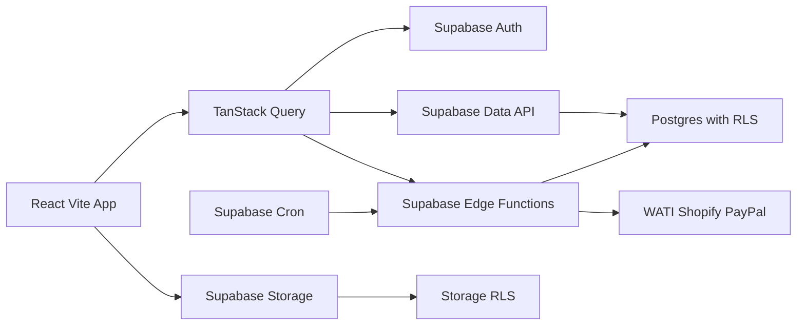

# Food Channels Catering 新系統功能 PRD

## 1. 文件資訊

| 項目 | 內容 |
|---|---|
| 文件版本 | 1.0 |
| 文件日期 | 2026-08-11 |
| 舊系統 | Bubble `fc-order-system` |
| API 來源 | `https://cs.foodchannels-catering.com/version-test/api/1.1/meta/swagger.json` |
| 規格版本 | 宣告為 Swagger 2.0 |
| 分析環境 | Bubble `version-test` |
| 目標技術棧 | React、Vite、Tailwind CSS、shadcn/ui、Supabase、Recharts、Lucide React、TanStack Query |

### 1.1 文件定位

本 PRD 依公開 Swagger 契約逆向整理，描述 API 能證實的資料能力、工作流程入口，以及新系統應具備的功能與驗收標準。

標記規則：

- **已證實**：Swagger 明確記載的 endpoint、欄位、型別或回應。
- **產品需求**：為完成安全且可維護的遷移而定義的新系統行為。
- **待確認**：Swagger 無法證明，必須由 Bubble Editor、Privacy Rules、實際資料或業務人員確認。

本文件不能單獨證明 Bubble 頁面 UI、workflow 內部動作、公式、排程、角色權限與第三方設定。這些項目仍需後續盤點，才能宣稱 100% 功能等價。

## 2. API 基線

### 2.1 規格摘要

| 指標 | 已證實數量 |
|---|---:|
| API paths | 248 |
| API operations | 652 |
| Workflow endpoints | 46 |
| Data API paths | 202 |
| Data types | 101 |
| Definitions | 245 |

規格內使用 `type: "option set"` 等 Bubble 自訂型別，並非標準 Swagger 2.0 schema。使用 code generator 或 validator 前，必須先正規化為 string／enum 並補齊合法值。

所有 101 種 Data API 類型均提供：

- `GET /obj/{type}`：列表與搜尋
- `POST /obj/{type}`：建立
- `GET /obj/{type}/{UniqueID}`：讀取單筆
- `PATCH /obj/{type}/{UniqueID}`：部分更新
- `PUT /obj/{type}/{UniqueID}`：整筆取代
- `DELETE /obj/{type}/{UniqueID}`：刪除

列表 API 共同支援：

| 參數 | 行為 |
|---|---|
| `limit` | 預設 50，最大 100 |
| `cursor` | 預設 0 |
| `sort_field` | 指定排序欄位 |
| `descending` | 控制排序方向 |
| `constraints` | JSON 字串化的 Bubble 查詢條件 |

列表回應包含 `results`、`cursor`、`count` 與 `remaining`。

### 2.2 舊系統認證

Swagger 定義全域 query-string API key：

```text
api_token=<token>
```

25 個 workflow 顯式標記為 `security: []`。這只代表 Swagger 契約未要求 token，不代表執行期一定匿名可用。

新系統不得複製以下不安全設計：

- 不得把 API token 放在 URL。
- 不得讓匿名使用者執行訂單、庫存、付款、成本、採購或通知等副作用。
- 不得在前端保存 Supabase `service_role` 或第三方 secret。
- 不得將舊系統 `user.pw` 搬入業務資料表。

## 3. 產品目標與成功標準

### 3.1 產品目標

1. 在新技術棧重建舊系統可辨識的訂單、商品、套餐、付款、配送、庫存、店舖、排班與通知能力。
2. 保留 Bubble legacy ID 對照，使歷史資料、關聯與稽核可追溯。
3. 將 Bubble Privacy Rules 轉為 Supabase RLS 與後端權限檢查。
4. 將多資料表 workflow 改寫為具驗證、冪等、稽核與錯誤處理的 Edge Functions，原子寫入則由單一 PostgreSQL function／RPC transaction 完成。
5. 讓所有關鍵財務、庫存與配送結果可回讀、可對帳、可重跑。

### 3.2 成功標準

- 101 種舊資料類型均有「遷移、合併、封存或不遷移」的明確 mapping。
- 46 個 workflow 均有對應實作或經產品負責人簽核的替代方案。
- 角色與資料範圍權限通過匿名、本人、跨客戶、跨店舖及管理員測試。
- 歷史資料筆數、關聯、檔案、付款總額及未付金額通過對帳。
- 訂單、付款、庫存、配送與第三方 webhook 的重複請求不產生重複副作用。

## 4. 使用者與權限

### 4.1 可辨識使用者關聯

`user` schema 已證實包含：

- `Role`
- `available_pages[]`
- `Customer → a_customers`
- `shop restro → shopdsrestro`
- `User Name`
- `Email_Noti`
- Bubble authentication email 與 email confirmation 狀態
- `pw`

Swagger 不提供 Role 與 `available_pages` 的合法值，也不提供其優先順序。

### 4.2 產品需求

| 需求編號 | 需求 |
|---|---|
| AUTH-01 | 使用 Supabase Auth 管理登入、session、邀請及密碼重設。 |
| AUTH-02 | `profiles` 保存使用者業務資料，並以 `auth.users.id` 關聯。 |
| AUTH-03 | 舊 Bubble user ID 保存為 `legacy_id`，但不作為新系統主鍵。 |
| AUTH-04 | Role、permission 與 page access 正規化；前端隱藏不得取代後端授權。 |
| AUTH-05 | 客戶帳號只能存取其 customer 範圍。 |
| AUTH-06 | 店舖帳號只能存取其 restro／department 範圍。 |
| AUTH-07 | 司機只能存取指派給自己的配送資料。 |
| AUTH-08 | 付款、成本、角色管理及資料匯出只開放指定權限。 |
| AUTH-09 | 所有 exposed tables 啟用 RLS；授權不可依賴可由使用者修改的 `user_metadata`。 |
| AUTH-10 | 不遷移、不回傳、不記錄 `user.pw`；舊使用者以邀請或強制重設密碼啟用。 |
| AUTH-11 | 停權、角色降級或移除 tenant 時撤銷既有 session；敏感操作即時檢查帳號狀態與權限，不只依賴尚未到期的 JWT claim。 |

## 5. 功能範圍

### 5.1 客戶與 CRM

資料來源包括 `a_customers`、`m_customer`、customer tag、sales partner、channel、communication channel 與 reminder person。

| 需求編號 | 產品需求 |
|---|---|
| CRM-01 | 建立、查詢、更新及封存客戶。 |
| CRM-02 | 維護公司、聯絡人、電話、Email、客戶類型與備註。 |
| CRM-03 | 管理客戶標籤、銷售來源、銷售夥伴及溝通渠道。 |
| CRM-04 | 在客戶詳情顯示其報價、訂單、付款及配送歷史。 |
| CRM-05 | PII 欄位須受 RLS、稽核及 log 遮罩保護。 |
| CRM-06 | `a_customers` 與 `m_customer` 在確認是否同一主體前維持獨立，並支援 mapping。 |

### 5.2 報價與訂單

核心資料：

- `a_order`：65 欄的訂單／報價表頭
- `s_order`：商品／套餐明細
- `quote_file`、`quote_t&c`、`quote_paymentmethod`
- `s_comment`、`nos_ordertag`

`a_order` 已證實包含客戶快照、訂單編號、金額、折扣、運費、Cashdollar、配送、報價狀態、工廠狀態、Shopify/WATI 欄位及多值狀態。

| 需求編號 | 產品需求 |
|---|---|
| ORD-01 | 建立報價並保存客戶、聯絡、地址、價格與條款快照。 |
| ORD-02 | 報價可加入商品、套餐、便當附加項、付款方式及附件。 |
| ORD-03 | 報價轉正式訂單時保留原報價來源及轉換紀錄。 |
| ORD-04 | 訂單明細支援商品、套餐、SKU、數量、單價、總價、加購、Void、排序、備註及配送日。 |
| ORD-05 | 計算小計、折扣、運費、Cashdollar、總額及未付金額，公式版本需可追溯。 |
| ORD-06 | Void 明細不納入有效總額、生產需求與列印。 |
| ORD-07 | 支援提交工廠、標籤列印、配送交接及歷史狀態追蹤。 |
| ORD-08 | 所有狀態轉移由後端驗證，禁止前端任意覆寫。 |
| ORD-09 | 建立與轉單 workflow 必須支援 idempotency key。 |
| ORD-10 | 訂單刪除預設改為封存；具付款、配送或生產紀錄時禁止硬刪除。 |

### 5.3 商品、套餐與便當

核心資料包括 `a_products`、`a_packages`、`s_packages_product`、`s_packages_choiceset`、`cal_package_choice`、產品分類、標籤、食材與 Bento 設定。

| 需求編號 | 產品需求 |
|---|---|
| CAT-01 | 維護商品中英文名稱、SKU、描述、圖片、價格範圍、渠道、分類與狀態。 |
| CAT-02 | 維護套餐名稱、SKU、價格、描述、渠道、choice set 與食材。 |
| CAT-03 | Choice set 定義最大選擇數、可選商品、預設數量與附加價格。 |
| CAT-04 | 下單時保存實際套餐選擇快照，不因日後商品設定變更而改寫歷史訂單。 |
| CAT-05 | 驗證商品 active/status、渠道、封鎖日期及配送日期可售性。 |
| CAT-06 | 便當支援主菜、主食材、欄數、特殊要求、推薦及活動附加項。 |

### 5.4 付款與對帳

核心資料包括 `s_payment`、`s_paymentreport`、付款方式、報價付款方式及 payout workflow。

| 需求編號 | 產品需求 |
|---|---|
| PAY-01 | 記錄訂單付款金額、日期、方式、渠道、provider reference、收據與 payout 日期。 |
| PAY-02 | 付款報表可彙總 invoice、charges、total、net 與關聯付款。 |
| PAY-03 | 付款建立、沖銷及退款須保留不可變稽核記錄。 |
| PAY-04 | 付款異動後以後端交易重算 outstanding。 |
| PAY-05 | 金額使用 PostgreSQL `numeric` 或最小貨幣單位，不使用 float 作財務計算。 |
| PAY-06 | 明確保存 currency、精度、稅項與四捨五入規則。 |
| PAY-07 | 不保存 PAN、CVV 或完整卡片資料。 |
| PAY-08 | 重複 provider event 或 payout 請求不得重複入帳。 |

### 5.5 配送與車隊

核心資料包括 delivery schedule、surcharge、delivery district、shipping method、motorcade、subdriver 及 driver reminder。

| 需求編號 | 產品需求 |
|---|---|
| DEL-01 | 由訂單建立配送排程，保存日期、時段、地址、地區及取貨資料。 |
| DEL-02 | 依配送地區計算基本運費與附加費，並保存計算明細。 |
| DEL-03 | 指派主車隊與副司機，避免同時段衝突。 |
| DEL-04 | 記錄出車、取貨、完成、司機確認及配送狀態。 |
| DEL-05 | 司機僅可查看必要的訂單、地址與聯絡資料。 |
| DEL-06 | 配送照片存入 private Storage bucket，使用短效 signed URL。 |
| DEL-07 | 每次狀態變更記錄 actor、時間、舊值、新值及 request ID。 |

### 5.6 生產、食材與庫存

資料來源包括一般食材、包裝、店舖盤點、生肉、成品肉、調味料、採購、批次與產品食材關聯。

| 需求編號 | 產品需求 |
|---|---|
| INV-01 | 由有效訂單明細展開產品與套餐食材需求。 |
| INV-02 | 支援食材、包裝、店舖、生肉及成品肉盤點。 |
| INV-03 | 入庫、出庫、轉換、損耗與盤點差異以不可變流水記錄。 |
| INV-04 | 庫存流水保存品項、數量、單位、來源、批次、操作者及時間。 |
| INV-05 | 盤點不得直接覆蓋歷史；差異必須產生調整流水。 |
| INV-06 | 調味料與原料成本保存生效日期、單位、幣別及計價方法。 |
| INV-07 | 原料與數量陣列輸入必須檢查長度及一一對應關係。 |
| INV-08 | 庫存 workflow 重試不得重複扣帳或入帳。 |

### 5.7 採購與供應商

| 需求編號 | 產品需求 |
|---|---|
| PUR-01 | 維護供應商、聯絡人、電話、交貨與付款排程。 |
| PUR-02 | 分開處理 Catering 與 Shop 採購；Shop 採購必須指定 restro。 |
| PUR-03 | 採購保存日期、供應商、採購類型、金額、店舖及狀態。 |
| PUR-04 | 定義草稿、送審、核准、收貨、取消與沖銷狀態。 |
| PUR-05 | 採購金額、庫存收貨及付款不得在缺少審計下直接改寫。 |

### 5.8 店舖營運與分析

資料來源包括店舖、部門、每日銷售、付款方式、外送平台、成本、月成本、採購、盤點與產品。

| 需求編號 | 產品需求 |
|---|---|
| SHOP-01 | 維護店舖、部門、付款方式、外送平台、供應商及成本類型。 |
| SHOP-02 | 每日銷售按日期、店舖、部門、付款方式、時段與平台輸入。 |
| SHOP-03 | 支援現金、零用金與付款／配送數據核對。 |
| SHOP-04 | 依書面公式計算 revenue per hour 與平均人時指標。 |
| SHOP-05 | 月度成本保存月份、店舖、類型、金額與 P&L readiness。 |
| SHOP-06 | Recharts 儀表板支援營收、成本、工時、付款渠道與配送平台分析。 |
| SHOP-07 | 圖表資料必須遵守同一套店舖 RLS，不得以聚合繞過資料隔離。 |

### 5.9 排班

| 需求編號 | 產品需求 |
|---|---|
| ROS-01 | 維護員工姓名、電話、店舖、部門、全／兼職及啟用狀態。 |
| ROS-02 | 依店舖、部門、日期、員工與時段建立 roster。 |
| ROS-03 | 自動排班前檢查假期、重疊、跨日與可用時段。 |
| ROS-04 | 計算每日與每週工時，公式與時區必須明確。 |
| ROS-05 | 自動產生後仍允許具權限人員手動調整，並保留變更紀錄。 |
| ROS-06 | 重複執行排班 workflow 不得建立重複班次。 |

### 5.10 檔案、圖片與列印

| 需求編號 | 產品需求 |
|---|---|
| FILE-01 | 報價附件、商品圖片、配送照片與渠道 Logo 分 bucket 或 path 管理。 |
| FILE-02 | 私人附件不得使用永久公開 URL。 |
| FILE-03 | 上傳須限制 MIME、大小與副檔名，並保留 checksum。 |
| FILE-04 | Storage RLS 依 customer、order、restro 或 delivery ownership 限制。 |
| FILE-05 | 標籤列印保存訂單、明細、標籤、數量、排序及備註。 |
| FILE-06 | 必須確認舊 workflow 是建立列印資料、產生檔案或直接送印。 |

## 6. Workflow 功能清單

以下「功能意圖」依 endpoint 名稱與輸入推定；內部規則均待 Bubble Editor 驗證。

### 6.1 訂單、套餐與標籤

| Workflow | 驗證契約 | 功能意圖 |
|---|---|---|
| `create_list_of_package` | Token | 為訂單依套餐與數量建立清單 |
| `add_print_label` | Token | 建立訂單明細標籤資料 |
| `Recur_S_Order` | Token | 遞迴／重複處理訂單明細 |
| `create_package_s_order` | Token | 由套餐商品建立訂單明細 |
| `add_product` | Token | 在新舊訂單間加入／複製商品 |
| `add_T&C` | Token | 在新舊訂單間加入／複製條款 |
| `add_Payment` | Token | 在新舊訂單間加入／複製付款 |
| `AorderStatic` | Token | 更新訂單靜態資料 |
| `addsortAorder` | Swagger 公開 | 補上訂單排序 |
| `adddeliToS` | Token；無 body | 批次加入配送資料 |
| `addDeliDate_S_order` | Swagger 公開 | 為一批明細加入配送日期 |
| `addstatustoSorder` | Swagger 公開；無 body | 批次加入明細狀態 |
| `addCalendarColor_aOrder` | Token | 計算訂單日曆顏色 |
| `add_product_AO` | Swagger 公開 | 將產品清單加入訂單 |
| `Order District Update` | Token | 更新訂單配送地區 |
| `create S_order_bento` | Token | 由訂單與商品建立便當明細 |
| `add-new product Name` | Token；無 body | 批次補上新商品名稱 |

### 6.2 庫存與成本

| Workflow | 驗證契約 | 功能意圖 |
|---|---|---|
| `stocktake_ing` | Swagger 公開 | 依日期執行食材盤點 |
| `chg_rawStock` | Swagger 公開 | 處理原料、包裝與成品肉出入 |
| `Seasoning_chgcost` | Swagger 公開 | 更新調味料成本 |
| `Duplicate_seasoning_cost` | Swagger 公開 | 複製調味料成本 |
| `Add_B_product_ing` | Swagger 公開 | 由訂單加入產品食材資料 |
| `ing_addP` | Swagger 公開 | 將食材關聯至訂單／產品 |
| `Q*ingQ` | Swagger 公開 | 計算產品食材數量 |
| `Shop_stockTake` | Swagger 公開 | 建立店舖盤點 |
| `stocktake_ing_packing` | Swagger 公開 | 依日期執行包裝盤點 |

### 6.3 採購、財務與店舖分析

| Workflow | 驗證契約 | 功能意圖 |
|---|---|---|
| `SupplierPurchase_catering` | Swagger 公開 | 建立 Catering 供應商採購 |
| `SupplierPurchase_shop` | Swagger 公開 | 建立店舖供應商採購 |
| `Payout=payment` | Swagger 公開 | 將 payout 與付款關聯／同步 |
| `add_singleBrand_adsCost` | Token | 加入單一品牌廣告成本 |
| `weeklyrangeStart` | Swagger 公開 | 計算每週成本起始日 |
| `SHOP_monthly_cost` | Swagger 公開 | 處理店舖月成本 |
| `add_shopcostSort` | Token | 補上店舖成本排序 |
| `addDailySales` | Swagger 公開 | 建立店舖每日銷售維度資料 |
| `ADD_revenuePerHr` | Token | 計算每小時營收 |
| `addAvgRmanhr` | Token | 更新平均人時指標 |

### 6.4 配送、通知與排班

| Workflow | 驗證契約 | 功能意圖 |
|---|---|---|
| `add_surcharge` | Token | 將附加費套用至配送排程 |
| `add_Driver_shipout` | Token | 為配送排程加入司機出車 |
| `ZAP_WATI` | Swagger 公開 | 對訂單清單觸發 WATI 流程 |
| `Schedule_sendremind1` | Swagger 公開 | 排程第一階段提醒 |
| `sendWATIreminder1` | Swagger 公開 | 發送第一階段 WATI 提醒 |
| `sendWATIreminder2` | Swagger 公開 | 發送第二階段 WATI 提醒 |
| `daily_sales_noti` | Swagger 公開 | 發送店舖每日營運通知 |
| `assign driver WATI` | Swagger 公開 | 發送司機指派 WATI 通知 |
| `Gen roster of the day (1)` | Token | 產生每日排班第一階段 |
| `Gen roster of the day (2) TimeList` | Token | 產生每日排班時段 |

### 6.5 Workflow 共通產品要求

| 需求編號 | 產品需求 |
|---|---|
| WF-01 | 每個 workflow 必須定義 request schema、required、enum、範圍與關聯存在性。 |
| WF-02 | 成功回應包含 operation ID、異動 ID／筆數及業務結果，不只回傳空 object。 |
| WF-03 | 訂單、付款、庫存等一致性寫入使用單一 PostgreSQL function／RPC transaction；只有無法納入同一資料庫交易的外部操作才設計補償流程。 |
| WF-04 | 所有可重試操作支援 idempotency key。 |
| WF-05 | 外部呼叫使用 timeout、退避重試、outbox 與 dead-letter 機制。 |
| WF-06 | 排程明確定義時區、頻率、取消條件及重疊執行策略。 |
| WF-07 | 三個無 body 的批次 workflow 必須先確認搜尋範圍，禁止無條件全表執行。 |
| WF-08 | 包含陣列與 `item` 參數的 workflow 必須確認 index、批次游標或數量語意。 |

## 7. 第三方整合

### 7.1 API 可辨識整合

| 整合 | API 證據 | 待確認 |
|---|---|---|
| WATI | workflow 名稱與 `Wati_mailed` | endpoint、template、收件人、狀態、重試 |
| Shopify | `Shopify_NewOrder`、order link、提醒欄位 | webhook、API scope、同步方向、去重 |
| PayPal | payment 與 payment method 的 `Paypal ID` | ID 語意、支付／退款流程、webhook |
| Asana | Quote Asana link | 只保存連結或自動建立任務 |
| Zapier | `ZAP_WATI` 名稱線索 | 是否實際使用 Zapier |
| 外送平台 | `shop_food_deli_platform` | 具體廠商及是否有 API |

### 7.2 整合產品需求

- Secret 僅存 Supabase secrets／Vault，不進前端 bundle、資料表或 Git。
- Inbound webhook 驗證簽章、timestamp 與 replay。
- Provider event ID 必須唯一，重送不得重複建立訂單、付款或通知。
- Outbound request 保存 provider request ID、結果、重試次數與最後錯誤。
- WATI 通知需保存 template、語言、同意狀態、message ID 與 delivery status。
- Shopify 同步需定義 source of truth、欄位 mapping、取消／退款及衝突規則。
- PayPal 僅保存必要 transaction/reference ID。

## 8. 資料模型範圍

### 8.1 101 個舊系統資料類型

#### 客戶、CRM、渠道與提醒（11）

`a_customers`、`m_customer`、`ds_customer_tag`、`ds_customer_tag_type`、`s_customer_tag`、`ds_salespartner`、`ds_channel`、`dscommuchannels(quote)`、`dssourceofsales(quote)`、`dsreminderperson(first)`、`dsreminderperson(second)`

#### 報價、訂單與備註（10）

`a_order`、`s_order`、`s_comment`、`nos_ordertag`、`quote_file`、`quote_t&c`、`quote_paymentmethod`、`ds_quote_t&c`、`ds_quote_payment`、`ds_quote_delivery`

#### 商品、套餐、菜單與標籤（22）

`a_packages`、`a_products`、`s_packages_product`、`s_packages_choiceset`、`cal_package_choice`、`dsaoproduct`、`ds_collection`、`ds_cooktype`、`ds_type`、`ds_tags`、`a_label`、`font`、`bento_maintype`、`bento_mainingredients`、`bento_numberofcolumn`、`bento_specialrequest`、`ds_bento_additionalitem`、`ds_bento_eventpart`、`quote_bento_additionalitem`、`quote_bento_eventpart`、`osdriver_menu`、`print_label`

#### 食材、包裝與生產計算（7）

`ds_ingredients`、`s_ingredients_product`、`b_product_ingredients`、`ds_packing`、`cal_control`、`m_cal_to_kg`、`m_calculation%`

#### 配送與車隊（9）

`b_deliveryschedule`、`b_deliveryschedule_surcharge`、`ds_deliverydistrict`、`ds_deliverysurcharge`、`ds_shippingmethod`、`ds_super_motorcade`、`ds_super_motorcade_subdriver`、`ds_driverassignremind`、`m_shippingmethod`

#### 付款、成本與採購（9）

`s_payment`、`s_paymentreport`、`ds_paymentmethod`、`b_costmonthly`、`ds_cost_type`、`b_supplierpurchase`、`b_adscostweekly`、`ds_purchasetype`、`ds__ingredient_supplier`

#### 肉類加工與庫存（11）

`m_rawmeat`、`m_raw_stock`、`m_donemeat`、`m_donemeat_stock`、`m_outdone_order`、`m_outdone_donemeat`、`m_seasoning`、`m_meatseasoning_cost`、`m_monthly_meatprice`、`s_ingredient_stocktake`、`s_packing_stocktake`

#### 店舖營運、銷售、庫存與排班（18）

`shop_dailysales`、`shop_dscost`、`shop_dscost_type`、`shop_ds_holiday`、`shop_ds_new_product`、`shop_dspaymentmethod`、`shopdsrestro`、`shop_ds_restro_depart`、`shop_ds_staff_list`、`shop_dsrestro_period`、`shop_food_deli_platform`、`shop_ingredients`、`shop_monthly_cost`、`shop_roster`、`shop_stocktake`、`shop_supplier_purchase`、`shop_ds_time_slot`、`shopds_purchasetype`

#### 日曆、節慶、訂單狀態與使用者（4）

`dsao_blockdate`、`ds_festival`、`ds_status`、`user`

### 8.2 資料設計要求

- 所有 Bubble Unique ID 保存於 `legacy_id` 並建立唯一索引。
- 關聯轉為 PostgreSQL foreign key，不再依賴無約束字串。
- 金額改用 `numeric`；電話改用字串；時間欄位保存時區。
- 訂單客戶、價格、地址與條款保留交易快照。
- 特殊字元及中英文舊欄位透過固定 mapping 遷移，不直接作為新 schema 命名。
- 主資料被歷史交易引用時採封存，不 cascade delete。
- 所有 exposed tables 預設 RLS；所有常用 foreign key 與 RLS filter 欄位建立索引。

## 9. 新系統架構



### 9.1 前端

- React + Vite
- Tailwind CSS + shadcn/ui
- TanStack Query 管理 server state、cache、loading 與 error
- Recharts 顯示營運與財務圖表
- Lucide React 提供圖示
- 權限路由與操作狀態只作 UX；後端 RLS 為最終授權

### 9.2 後端

- Supabase Auth：使用者與 session
- PostgreSQL：交易與主資料
- RLS：customer、restro、department、driver 與角色隔離
- Edge Functions：驗證、流程編排、第三方 API、webhook 與敏感操作；不可假設多次 Data API 呼叫屬同一 transaction
- PostgreSQL functions／RPC：在單一資料庫 transaction 內完成訂單、付款、庫存等原子多表寫入
- Storage：報價、商品及配送檔案
- Cron + job/outbox tables：排程、提醒與可靠重試

## 10. 非功能需求

### 10.1 安全

- 所有 PII、付款、成本與員工資料遵守最小權限。
- 一般使用者不能修改自己的 role、permission 或 tenant ownership。
- 一般使用者請求 Edge Function 時必須驗證 JWT，並以使用者身分執行受 RLS 保護的資料操作。
- 只有經簽章驗證的 webhook、排程及明確的系統工作可使用 `service_role`；使用時仍須在函式內檢查 tenant、角色與資源範圍。
- 停用帳號、角色降級及 tenant 移除必須撤銷 session；高敏感操作須即時查驗帳號狀態。
- Views 使用 `security_invoker`；特權函式不得放在 exposed schema。
- 高風險操作保存 actor、時間、舊值、新值、來源及 request ID。
- Log、URL、analytics 與 error tracking 不得包含 secret、PII 或支付識別碼。

### 10.2 可靠性

- 寫入 API 回傳穩定 operation ID。
- 外部整合具 timeout、retry、dead-letter 與人工補送。
- 批次工作支援續跑與進度紀錄。
- 關鍵計算可重算並與保存結果比對。

### 10.3 效能

- 列表採 server-side pagination、filter 與排序。
- 常用查詢建立複合或 partial index。
- 圖表使用預先聚合或受控 view，避免前端拉取全量交易。
- 搜尋欄位白名單化並設定合理 page size。

### 10.4 可觀測性

- Edge Function、Cron 與 webhook 使用一致 request ID。
- 記錄執行時間、成功／失敗、重試次數與外部 request ID。
- 付款、庫存、通知及資料遷移具獨立對帳報表。

## 11. 驗收標準

### 11.1 功能驗收

1. 客戶可建立、更新、封存，並查看其訂單、付款及配送歷史。
2. 報價可加入商品、套餐、條款、付款方式與附件並轉成訂單。
3. 套餐選擇超過 choice set 最大數量時，後端拒絕提交。
4. 每筆訂單明細正確關聯訂單，Void 後不納入總額、生產與列印。
5. 付款總額、訂單總額及 outstanding 可依書面公式重算一致。
6. 重複付款 webhook 不會建立第二筆付款。
7. 配送基本運費與 surcharge 明細加總一致。
8. 司機無法存取未指派給自己的配送資料。
9. 盤點差異產生庫存調整流水，不改寫歷史批次。
10. 同一員工重疊時段排班會被拒絕或要求具權限覆核。
11. 跨店舖使用者不能讀取其他店舖的 roster、銷售、成本及庫存。
12. 匿名使用者不能執行舊規格中 25 個具副作用的公開 workflow。
13. 使用者停權、角色降級或移除店舖／客戶關聯後，既有 session 不能繼續執行受限操作。

### 11.2 資料遷移驗收

1. 每種來源 type 與目標 table 均有 mapping、轉換與例外規則。
2. 逐表比對來源筆數、成功筆數、跳過筆數與失敗筆數。
3. 所有 legacy ID 唯一，foreign key 無未處理孤兒資料。
4. 檔案數量、大小及 checksum 一致。
5. 抽樣比對客戶、訂單、明細、付款、配送與庫存完整鏈路。
6. 財務資料按訂單及期間對帳。
7. `user.pw` 不出現在新資料庫、API、log、備份或匯出。

### 11.3 權限驗收矩陣

至少覆蓋：

- 匿名
- 客戶本人與其他客戶
- 同店舖與跨店舖員工
- 司機本人與其他司機
- 財務角色
- 營運管理員
- 系統管理員
- 已停用使用者

## 12. 待確認清單

### 12.1 Bubble 與權限

1. 所有 Role 與 `available_pages` 實際值。
2. 每個 Data Type 的 Privacy Rules。
3. 25 個 `security: []` workflow 是否真的匿名可執行。
4. `user.pw` 的用途及是否仍被任何流程使用。
5. 正式環境與 `version-test` 的 schema／workflow 差異。

### 12.2 訂單與財務

1. 報價、訂單、配送、工廠、列印及 Void 的狀態轉移。
2. 總額、折扣、運費、Cashdollar 與 outstanding 公式。
3. 幣別、稅項、精度與四捨五入。
4. 退款、沖銷、超額付款及 payout 對帳規則。
5. `a_order` 與 `m_outdone_order` 是否為獨立業務線。

### 12.3 庫存與排班

1. 原料、包裝、生肉、成品肉的單位換算及成本方法。
2. 陣列 workflow 的配對、索引及終止條件。
3. 盤點對象、盤點差異與關帳規則。
4. 自動排班兩階段的先後關係、工時公式與衝突規則。

### 12.4 第三方與排程

1. WATI template、語言、收件人、同意、排程及送達追蹤。
2. Shopify、PayPal、Asana、Zapier 的實際帳號、scope、webhook 與同步方向。
3. 所有排程的時區、頻率、重試、取消與補送規則。
4. 舊檔案 URL 的權限、有效期與可否批量下載。

## 13. 實作階段

1. **系統盤點**：取得 Bubble Editor、Privacy Rules、option sets、workflow 步驟、第三方設定及各角色測試帳號。
2. **契約凍結**：建立正式環境 API snapshot、資料字典、狀態矩陣與計算公式。
3. **基礎架構**：建立 React 應用、Supabase local 專案、Auth、migration、RLS 測試與 CI。
4. **核心主資料**：客戶、商品、套餐、店舖、員工及 lookup tables。
5. **交易流程**：報價、訂單、付款、配送、生產與庫存。
6. **營運流程**：採購、每日銷售、成本、排班與儀表板。
7. **第三方整合**：WATI、Shopify、PayPal、Asana／Zapier 與排程。
8. **資料遷移**：試遷移、對帳、修正、全量遷移及增量同步。
9. **平行驗收**：各角色在 Bubble 與新系統執行相同案例，比對結果。
10. **切換與觀察**：凍結舊系統寫入、最終同步、切換、監控與回復方案。

## 14. PRD 結論

Swagger 足以確認新系統至少包含 101 種資料能力及 46 個 workflow 入口，涵蓋 Catering 訂單、商品套餐、付款、配送、肉類加工、庫存、店舖營運、採購、排班與通知。

目前最大的功能等價缺口不是 CRUD，而是 Bubble 未公開的 workflow 內部邏輯、Privacy Rules、option sets、公式、排程及第三方設定。在這些資料完成盤點前，本 PRD 應稱為「API 功能基線」，不能作為 100% 複製完成的唯一驗收依據。
