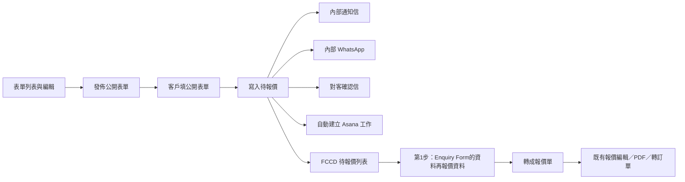

# 公開 Enquiry Form 登記與待報價 PRD

| 項目 | 內容 |
| --- | --- |
| 文件版本 | 2.8 |
| 文件日期 | 2026-09-03 |
| 文件狀態 | 需求草案；尚未實作 |
| 範圍 | Enquiry Form 構建（列表＋編輯）、公開填表、內部通知信、內部 WhatsApp、對客確認信、自動建立 Asana 工作、FCCD 待報價佇列、表單資料展示與修改、轉成報價單 |
| 參考 | 第一份公開表單內容對照：[FC Catering + Lunch Box 餐飲到會+活動策劃網上查詢](https://www.emailmeform.com/builder/form/E9Wuer6Mw0aqat3NHfmd8)（題目／選項／必填／預設勾選以該頁為準；產品 UI 不把 24 題寫死在元件）；`QUOTE_EDITOR_PRD.md`、`QUOTE_LIST_AND_PDF_PRD.md`；現行 `QuoteEditorPage`、`QuotesListPage`、`OrderNotificationSettings`、`CustomerSelfServicePage` |

## 1. 目標與流程

同事在 FCCD 用**表單構建器**維護公開 Enquiry Form（題目、題型、選項、必填、對應報價欄），**產品不把某一次官網表單的 24 題寫死在程式裡**。**第一份**已發佈預設表單的內容必須對照現行 [EmailMeForm](https://www.emailmeform.com/builder/form/E9Wuer6Mw0aqat3NHfmd8)（附錄 A），以種子資料載入。客戶填已發佈的公開表單後，系統寫入一筆尚未成為報價單的待報價紀錄，寄內部通知（電郵＋內部 WhatsApp）、寄**對客確認信**（已收到資料、稍後專人回覆），並自動在 Asana 建立一筆工作（連結寫回該待報價）。同事在「待報價」用接近現有報價單詳情／編輯器的畫面查看。轉成報價後，編輯器**步驟一**為「客戶查詢資料」（列出表單文字／選項），**步驟二／三**維持原來的報價資料與加入貨品；可改後轉成正式報價單。之後走既有報價流程（加貨品、PDF、再轉訂單）。

客戶不會因此開 FCCD 帳號，也不會在提交當下收到報價 PDF。提交寫進 FCCD，**不**再送到 EmailMeForm。

### 1.1 名詞

| 名詞 | 定義 |
| --- | --- |
| 表單定義 | 同事在構建器保存的一份 Enquiry Form：標題、說明、題目清單、發佈狀態、公開 slug。 |
| 題目 | 表單內一欄。題型限：單選、多選、輸入框、文本框、日期、數字輸入框。 |
| 對應報價欄 | 題目可選綁定到報價基本資料（姓名、電郵等）；未綁定的只存在「Enquiry Form 的資料」。 |
| 公開表單 | **免登入、獨立頁**（不進 FCCD 內部殼層／選單）。已發佈定義在匿名頁上的渲染結果。建議預設路由 `/quote-inquiry`，多份表單用 `/quote-inquiry/:slug`。 |
| 待報價紀錄／inquiry | 一次成功提交；綁定**該次使用的表單定義版本**與答案 payload。尚未轉成報價單。 |
| 待報價列表 | 只列出尚未轉成報價單的公開表單件。 |
| 轉成報價單 | 將 inquiry 提升為正式 Catering 報價（建議 `quote_status = Draft`）。**不是**現有「轉成訂單」。 |
| 客戶查詢資料 | 有 Enquiry 來源時的**步驟一**；依該次提交的表單定義列出對應文字或選項。人手新建報價不顯示此步驟。 |
| Asana 工作 | 表單錄入成功後自動建立的 Asana task；permalink 寫入 `asana_link`。 |

### 1.2 與現行系統的差距

1. 現行 Catering 報價在 `orders`（`document_type = 'quote'`）。詳情 `/quotes/:id` 唯讀、`/quotes/:id/edit` 編輯。轉換按鈕是「轉成訂單」，沒有「轉成報價單」。
2. 側欄「待報價」現行是所有未結束報價，不是「表單尚未轉報價」佇列。
3. FCCD 沒有表單構建器，也沒有自建公開登記表單。官網現用 EmailMeForm。
4. 報價步驟沒有獨立的「客戶查詢資料」，Enquiry 答案被塞進報價資料步驟裡。
5. 沒有「公開表單新建成功 → 通知同事」。
6. 沒有「公開表單新建成功 → 對客確認已收到」。
7. Asana 現行只是報價上的 `asana_link` 手動貼 URL（見 `QUOTE_LIST_AND_PDF_PRD.md` 第 3.4 節），系統不會建立 Asana 工作。本需求要在**表單錄入成功時自動建 task**，並把 permalink 寫入同一套 `asana_link`，待報價與轉成後的報價列表都能開。

## 2. 範圍

### 2.1 包含

- 內部 Enquiry Form **列表頁**與**編輯頁**（新增、複製、排序題目、發佈／停用）。
- 題型：單選、多選、輸入框、文本框、日期、數字輸入框。
- 公開填表：**免登入獨立頁**（與 `/self_service_search` 同級，不包內部 Auth 殼層）；題目可選對應報價欄；**每題可單獨勾選是否公開必填**；依已發佈定義動態渲染與驗證。
- 提交後寫入待報價、寄內部通知（電郵＋內部 WATI `fccd_enquiry_internal_v1`）、寄對客確認信、自動建立 Asana 工作；信、WhatsApp 或 Asana 失敗可從詳情重試。
- FCCD「待報價」列表改為本佇列；Dashboard 計數與前五筆對齊。
- 待報價詳情／編輯：現有報價單版面；步驟一「客戶查詢資料」，步驟二「報價資料」，步驟三「加入貨品」。
- 轉成報價單後沿用既有報價編輯／PDF／轉訂單。
- **第一份表單必須對照現行 EmailMeForm 實作**（附錄 A）：上線時空庫自動建立並發佈為預設公開表單；題目、選項文字、必填、提示、條款預設勾選與該頁一致。之後可在構建器改。公開頁仍依定義動態渲染，不把 24 題寫死在元件。

### 2.2 不包含

- 客戶帳號註冊、登入、客戶工作區。
- 用本表單直接產生正式訂單。
- 對客 WATI、提交當下寄報價 PDF、對客報價確認（那是既有報價流程的「發送確認」）。對客信只承認「已收到表單」。內部 WhatsApp 見第 5.3 節。
- 改現有報價計價、PDF、轉訂單、工場規則。
- 繼續把資料送到 EmailMeForm 或其 webhook。
- 條件邏輯（選 A 才顯示 B）、分頁／多 step wizard、檔案上傳、簽名、付款收款、把選項金額自動寫入運費。
- 可視化拖放版面到像素級（第一期：題目列表排序即可）。
- 完整 CMS／多語後台。
- Asana 雙向同步（改 FCCD 不回寫 Asana 題目；不讀取 Asana 完成狀態）。不在報價列表「一鍵建 Asana」（人手新建報價仍用貼連結）。不因轉成報價單再新建第二個 task。

### 2.3 導覽與選單

對齊現行業務選單（`businessPrimaryNav`／`businessCategoryNav`／`secondaryNav`，見 [`src/lib/nav.ts`](src/lib/nav.ts)）。公開填表頁不進內部選單。

**到會 → 報價單 → 三級選單**（`nav=catering.quotes`，現行 `secondaryNav.quotes`：所有報價、PDF 頁面設定）新增／調整如下，與現有項並列：

| 三級項 | 路由 | 說明 |
| --- | --- | --- |
| 所有報價 | `/quotes?nav=catering.quotes` | 既有報價列表，不變 |
| 待報價 | `/quotes/pending?nav=catering.quotes` | **本需求的新佇列**（表單尚未轉報價） |
| Enquiry 表單 | `/quotes/enquiry-forms?nav=catering.quotes` | 構建器列表；編輯頁由列表進入，不另佔選單 |
| PDF 頁面設定 | `/quotes/pdf-pages?nav=catering.quotes` | 既有，不變 |

建議順序：所有報價、待報價、Enquiry 表單、PDF 頁面設定。樣式二若同樣用 `secondaryNav.quotes`，三級項一致。

**營運跟進 → 到會 → 待報價**（現行 `followUpCateringNav` 的 `pendingQuote`，文案「待報價」）：改連到**同一份新待報價列表**，例如 `/quotes/pending?nav=follow-up.catering`。不再連 `/quotes?tab=pending`（那是所有未結束報價的 preset）。Dashboard「待報價」計數、前五筆、點擊入口與此佇列相同。

`/quotes/pending` 現行會導向 `/quotes/recent-open`，實作時取消該 redirect，改為本列表。所有報價頁若仍提供「未結束報價」篩選，**不得**再用「待報價」當標籤。

構建器與待報價列表權限沿用 `quotes`（查看）／報價編輯（改表單定義須管理權，實作時可拆 `quotes.enquiry_forms`）。選單 context 必須帶 `nav=`，讓三級高亮正確。

## 3. Enquiry Form 構建器

內部頁路由：`/quotes/enquiry-forms`、`/quotes/enquiry-forms/:id/edit`。選單位置見第 2.3 節（到會 → 報價單 → Enquiry 表單）。需報價相關 page access（查看列表 vs 管理編輯，實作時對齊現有 `quotes.*` 權限模式）。

### 3.1 列表頁

1. 列出所有表單定義，欄位至少：名稱／標題、狀態（草稿／已發佈／已停用）、題目數、公開連結（已發佈才有）、更新時間。
2. 操作：新增、編輯、複製、發佈／停用。第一期刪除僅允許沒有提交紀錄的草稿；已有待報價或報價引用的表單只能停用，不可硬刪，以免舊詳情無法還原題目。
3. 可搜尋標題。**第一次部署／空庫必須已有附錄 A 那一份預設表單**（見 3.6），不應出現「完全沒有表單」才叫同事從零建 24 題。若同事刪掉所有草稿且種子被停用，空狀態才提示新增或重新載入種子。
4. 同一時間允許多份已發佈表單（不同 slug）。可指定**一份預設表單**供 `/quote-inquiry` 使用；其餘用 `/quote-inquiry/:slug`。未指定預設且沒有已發佈表單時，公開頁顯示「暫不接受查詢」，不可 500。第一份種子表單預設就是這份預設公開表單。

### 3.2 編輯頁

1. 表頭可編：內部名稱、公開標題、公開說明、送出按鈕文案、公開 slug、是否預設公開表單、成功頁短訊、**對客確認信主旨／正文**（選填，空則用第 5.2 節預設文案）、**Asana 專案**（選填；空則用全域預設專案，見第 6 節）。
2. 題目以列表展示，可新增、刪除、上移／下移（或拖曳排序）。新增時先選題型。**每一題在列表上即可勾選「必填」**（不必點進題目也能改）；選中後仍可在題目設定裡改同一開關。
3. 選中一題後編輯其設定（見 3.3、3.4、3.5）。未保存離開須提示。
4. 預覽：編輯頁提供「預覽公開樣式」（不必發佈）；預覽提交不可寫入待報價。
5. 發佈前至少一題，且 slug 在已發佈表單中唯一。發佈後公開頁立即用新定義。
6. **已發佈後再改題目並保存**：新提交用新定義。舊提交仍綁定提交當下的定義快照（題目標題、題型、選項、對應欄），詳情永遠按快照渲染，不因後來改題而錯位。

### 3.3 題型

第一期只准這六種。公開頁與第 1 步「Enquiry Form 的資料」用同一套控件。

| 題型 | 公開控件 | 答案 | 額外設定 |
| --- | --- | --- | --- |
| 單選 | radio | 一個選項值 | 選項清單（標籤、值、排序）；可選預設選中一項 |
| 多選 | checkbox | 零或多個選項值 | 選項清單；可設預設勾選；必填時預設「至少一項」；可選「必須全選」（條款用） |
| 輸入框 | 單行 text | 字串 | 提示文字；可選格式：一般／電郵／電話（電郵須校驗格式） |
| 文本框 | textarea | 字串 | 提示文字 |
| 日期 | datepicker | 日期 | 不可選過去日期可選（預設不限制） |
| 數字輸入框 | number | 數字 | 可選最小／最大值 |

每題共通設定：

- 題目標題（構建器內此欄必填）、說明／提示（選填）、**公開必填**（見 3.5）、是否在公開頁顯示（內部隱藏題第一期不做，全部顯示）。
- **預設值**：輸入／文本／數字／日期的預填；單選預設一項；多選可預設勾若干項（條款兩項自動勾選即用此設定）。
- **對應報價欄**（選填，見 3.4）。
- 穩定 `field_key`（系統產生，複製表單時可新 key；提交 payload 用 key，展示用當下快照標題）。

單選／多選選項：可新增、刪、排序；標籤給客戶看。刪選項不影響舊提交快照裡已保存的值。

### 3.4 對應報價欄

題目可綁定零或一個：

| 對應報價欄 | 建議題型 | 寫入 |
| --- | --- | --- |
| （不對應） | 任何 | 只留 Enquiry Form 的資料 |
| 客人姓名 | 輸入框 | `customer_name_snapshot` |
| 稱謂 | 單選或輸入框 | 不寫既有報價欄；詳情可與姓名並排顯示 |
| 公司名稱 | 輸入框 | `company_name_snapshot` |
| 主聯絡電話 | 輸入框（電話） | `contact_number_a_snapshot` |
| 電郵地址 | 輸入框（電郵） | `email_snapshot` |
| 送貨地址 | 輸入框或文本框 | `shipping_address_snapshot` |
| 送貨日期 | 日期或輸入框 | 日期題直接寫 `delivery_at`；輸入框僅當能解析為單一日期才寫，原文仍在 Enquiry Form 的資料 |
| 送貨時間 | 單選或輸入框 | `delivery_time`（可為自訂文字，不必先對 dictionary） |
| 人數 | 數字輸入框 | 內部可見人數顯示／備註前綴「人數：」，兩邊一致 |
| 報價描述 | 文本框或輸入框 | `quote_description_snapshot`；列表描述同源 |

規則：

1. 同一表單內，同一對應欄最多綁一題。
2. 未對應的題（到會形式、預算、條款等）**只存在 Enquiry Form 的資料**，不自動改貨品、運費、付款、品牌。
3. 公開表單**沒有品牌題**也可以；品牌在轉報價時由同事選。
4. 種子表單須把姓名、電話、電郵、地址等綁好，轉報價才有身份資料。

### 3.5 公開必填（可逐題選擇）

公開表單**哪些題要必填，由構建器逐題勾選**，不在程式寫死。附錄 A 的「必填」欄只是種子預設，同事可改完再發佈。

1. 每一題有獨立「必填」開關，預設關閉（種子表單依附錄 A）。六種題型都適用。
2. 勾選必填後：公開頁題目標示 `*`（或同等必填標示）；送出時該題空白／未選則擋下並指出哪一題。
3. 多選另可選「必須全選」（條款用）。未勾必填時，客戶可完全不選；勾了必填且未開「必須全選」時，至少選一項即可。
4. 改必填並發佈後，**新提交**用新規則。舊提交快照保留當時的必填設定，不回溯擋舊資料。
5. 公開必填與「轉成報價單」驗證分開：即使公開把姓名改成選填，轉報價仍要姓名，以及電郵或電話至少一個（第 9 節）。
6. 預覽須反映當下勾選的必填標示；預覽送出仍不可寫入待報價。

### 3.6 第一份預設表單（對照 EmailMeForm）

第一期上線時，FCCD **必須帶出一份已發佈的預設 Enquiry Form**，內容對照現行官網表單，而不是空白構建器：

來源：<https://www.emailmeform.com/builder/form/E9Wuer6Mw0aqat3NHfmd8>（對照日 2026-09-03，完整欄位見附錄 A）。

1. 遷移或空庫種子：自動建立 1 份表單定義、24 題、全部選項、必填、提示、條款兩項預設勾選；設為已發佈、預設公開表單；建議 slug `quote-inquiry`（對應 `/quote-inquiry`）。
2. **內容對齊該頁**：題目標題（含括號說明）、題型、必填、選項文字（含錯字如「周未」「外藉」「Continous」）、提示文字、數字上下限、條款預設全勾。送出按鈕種子文案用該頁的 `Submit`（可在構建器改成中文）。
3. **行為對齊該頁**：必填擋空白；電郵校驗；人數 1–10000；條款取消任一項不能送；連點只一筆。不對齊 EmailMeForm 的外觀主題、兩欄排版、Logo、iframe 寬度。
4. **不是寫死 UI**：公開頁仍讀表單定義渲染。種子可以是 migration／seed JSON，不可在 React 裡 hardcode 24 個欄位元件。
5. 之後同事可在構建器改題、停用、另建第二份表單。改完發佈即影響新提交；舊提交仍用快照。
6. 不繼續把資料 POST 到 EmailMeForm。官網何時改連 FCCD 公開 URL 不在本 PRD 實作（第 12 節）。

## 4. 公開填表（免登入獨立頁）

1. **不需登入即可開啟與提交。** 路由掛在與 `/self_service_search` 相同層級（`App.tsx` 中**不**包 `AuthProvider`／內部 layout）。未登入不得被導去 `/login`。
2. **獨立頁面**：沒有 FCCD 內部側欄、頂欄、到會／報價單選單。版面是給客戶看的單頁表單（標題、說明、題目、提交），不是內部殼層裡的一個 tab。已登入同事用同一 URL 打開時，仍顯示這份公開頁，不切回內部 nav。
3. 不進內部 nav（第 2.3 節）。官網或 WhatsApp 可直接連公開 URL。樣式可參考 `CustomerSelfServicePage`，但必須是獨立路由，不能嵌在 `/quotes/*` 權限牆後面。
4. 渲染**當下已發佈定義**（預設表單或 slug），依題目排序輸出控件。**必填以構建器逐題勾選為準**（第 3.5 節）；另驗證格式、數字範圍、多選「至少一項／必須全選」、日期。未勾必填的題可留空。
5. 預設勾選／預填依定義；客戶可改。條款類若該題勾了必填且「必須全選」+ 兩項預設勾選，即進入頁面已勾、取消則不能送。若同事把該題改為非必填，則允許不勾。
6. 成功頁用該表單設定的短訊；不可暗示已產生報價單或帳戶。確認頁不顯示可再送的完整表單，除非「再填一筆」。成功／失敗頁同樣免登入、同樣獨立頁。
7. 失敗保留已填、可重試。一次送出一筆待報價（幂等鍵，防連點與重整重送）。
8. 防濫用：頻率限制；honeypot／CAPTCHA 可選。公開 API 只准建立待報價，不可讀他人資料、不可改定義、不可轉報價。匿名 session 不可取得內部待報價列表。

每次成功提交保存：提交時間、表單定義 ID、**定義快照**、答案 payload、來源標記、內部電郵狀態、內部 WhatsApp 狀態、對客確認信狀態、IP／UA（內部可摺疊）。

## 5. 郵件與內部 WhatsApp 通知

先寫入待報價，再寄內部電郵、內部 WhatsApp、對客確認信（可並行，亦可與 Asana 並行）。客戶成功頁只代表「我們已收到查詢」，不表示任何一封信或 WhatsApp 已寄出。任一通道失敗不回滾待報價、不在公開頁顯示技術錯誤，也不擋其他通道。電郵用 Resend，From 為現行系統地址（`system@foodchannels-delivery.com`）。**不做對客 WATI。**

內部電郵、內部 WhatsApp、對客信都只在**新建待報價成功**時自動寄一次；幂等重送不重寄。詳情「重寄內部通知」會重試內部電郵與內部 WhatsApp；對客確認另鈕。允許名單／staging allowlist 若啟用，對客信仍須能寄到該次填寫的電郵（測試環境可另開允許清單，見第 12 節）。

### 5.1 內部通知信

1. 收件人用 `enquiry_internal_email_recipients()`（`email_noti` 使用者）。
2. 信件：表單標題、已對應的姓名／公司／電話／電郵／地址／日期／人數（有則顯示）、報價描述摘要、待報價詳情連結。未對應題不必全部貼上。不可在信件中放置 IP。
3. 名單為空時：待報價仍建立，內部信狀態為尚未通知或失敗（實作時擇一並在 UI 說明）。

### 5.2 對客確認信

客戶提交後寄一封**已收到資料**的確認信，告知稍後有專人回覆。不是報價單、不是 PDF、不含 FCCD 內部連結、不逐題貼上全部答案。

1. **收件人**：對應「電郵地址」的值。沒有有效電郵則略過，狀態為「無電郵」，不可視為失敗。
2. **預設主旨**：我們已收到你的查詢
3. **預設正文**（可在表單編輯頁覆寫；支援帶入稱謂、姓名、表單標題）：

   您好{稱謂}{姓名}：

   多謝你填寫「{表單標題}」。我們已收到你的資料，稍後會有專人回覆你。

   如資料有誤或想補充，請回覆本電郵或致電與我們聯絡。

4. 頁尾聯絡方式為 Food Channels Catering（WhatsApp／電話／sales 電郵，與訂單確認信一致）。電話用純文字，不用 `tel:` 連結，避免郵件客戶端插入「…」聯絡晶片。
5. 詳情顯示對客信狀態：無電郵／尚未寄出／已寄出／失敗；失敗可重寄到同一電郵（重寄前可改基本資料裡的電郵後再寄）。
6. 此信**不**代替之後報價「發送確認」。轉成報價單、出 PDF 後仍走既有對客流程。

### 5.3 內部 WhatsApp（WATI）

模板名稱／broadcast：`fccd_enquiry_internal_v1`（可用 `WATI_ENQUIRY_INTERNAL_TEMPLATE_NAME`／`WATI_ENQUIRY_INTERNAL_BROADCAST_NAME` 覆寫）。`WATI_ENQUIRY_INTERNAL_ENABLED=false` 可關掉。收件人為 `order_first_notification_recipients` 電話，不是填表客戶。參數依序對應 `{{1}}`–`{{11}}`：表單、ENQ 單號、姓名、公司、電話、電郵、地址、日期、人數、描述、待報價連結；空白送 `-`，不可含換行。WATI 與電郵狀態分開記錄；模板審核中或發送失敗不擋內部電郵與對客信。詳情「重寄內部通知」會一併重試。

## 6. 自動建立 Asana 工作

現行報價只支援手動貼 `asana_link`。本需求在**待報價新建成功**時呼叫 Asana API 建立一個 task，成功後把 permalink 寫入該筆的 `asana_link`（與現有報價列表「Asana Link」同一欄，轉成報價單後沿用，不另建 task）。

### 6.1 何時建立

1. 僅在新建待報價成功後自動建立一次。幂等重送、同一提交重試**不**再建第二個 task。
2. 該筆已有 `asana_link` 時，自動流程跳過。
3. 詳情提供「重試建立 Asana」（僅當尚未有連結或上次失敗）。不可用來複製出第二個 task。

### 6.2 寫入內容

1. **標題**：可辨識為 Enquiry，至少含姓名（有稱謂則加上）、公司（有則加）。例如 `Enquiry｜陳大文｜ABC 公司`。沒有姓名時用表單標題 + 提交時間。
2. **描述／notes**：對應欄摘要（電話、電郵、地址、日期、時段、人數、報價描述）、表單標題、FCCD 待報價詳情連結。未對應題不必全部貼上。
3. **專案**：該表單設定的 Asana 專案；未設則用全域預設（環境變數或系統設定，見第 12 節）。專案未設定時：待報價仍建立，Asana 狀態為失敗並可在設定後重試。
4. 到期日：若對應「送貨日期」能解析為日期，可寫入 Asana due on（時區香港）。無法解析則不寫 due。
5. 第一期不做：指定 assignee、自訂欄位對應、子任務、附件。

### 6.3 失敗處理

1. **先寫入待報價，再建立 Asana**（可與內部信、對客確認信並行）。客戶成功頁不依賴 Asana。
2. 失敗不回滾待報價、不給客戶看錯誤。詳情顯示 Asana 狀態：尚未建立／已建立（可點連結）／失敗（摘要 + 重試）。
3. API token、workspace、專案 GID 放伺服器密鑰／設定，不進前端。公開提交 API 不可直接打 Asana。

### 6.4 與既有報價 Asana 欄的關係

1. 待報價詳情與列表可顯示／開啟 Asana Link，規則對齊 `QUOTE_LIST_AND_PDF_PRD.md`（新分頁、`noopener`）。
2. 轉成報價單時**複製同一 `asana_link`**，不新建、不清空。同事仍可之後在報價編輯手動改連結。
3. 改表單答案或基本資料**不**回寫 Asana task 內容（單向、只在錄入時建立）。

## 7. 待報價列表

1. 只顯示公開表單進來、尚未轉成報價單的紀錄。轉成後進既有報價列表。
2. `/quotes` 各 preset 只顯示已轉成的報價單。到會 → 報價單 → 待報價、營運跟進 → 到會 → 待報價、Dashboard 待報價，三者進同一新列表（第 2.3 節）。跟進中報價仍用 `/quotes`（所有報價）。
3. 列表欄位用**對應報價欄**取值，沒有則 `—`。待報價使用獨立查詢單號（`ENQYYYYMMDD-xxxxxx`），**不是**報價單號 `FCCQ…`：

   | 順序 | 欄位 | 顯示 |
   | --- | --- | --- |
   | 1 | 查詢單號 | `enquiry_submissions.reference_code`，例如 `ENQ20260903-884c8c` |
   | 2 | 建立時間 | 提交時間，香港時區 |
   | 3 | 客戶 | 稱謂＋姓名、公司、電話；來源標記為表單標題或「Enquiry Form」 |
   | 4 | 日期 | 對應「送貨日期」的答案原文 |
   | 5 | 描述 | 對應「報價描述」摘要；可加第一個未對應多選題的摘要（若有） |
   | 6 | 人數 | 對應「人數」 |
   | 7 | 內部通知 | 尚未通知／已通知／通知失敗 |
   | 8 | 內部 WhatsApp | 尚未通知／已通知／通知失敗 |
   | 9 | 對客確認 | 無電郵／尚未寄出／已寄出／失敗 |
   | 10 | Asana | 有連結則顯示可點「Asana Link」；尚未建立或失敗顯示對應狀態 |
   | 11 | 操作 | 進入詳情。第一期無 PDF／複製／轉成訂單 |

4. 搜尋至少：單號、姓名、公司、電話、電郵、地址、描述。權限：查看用 `quotes`；改答案與轉報價用報價編輯權限。

## 8. 步驟一：客戶查詢資料，之後才是原報價步驟

詳情（`/quotes/:id`）與編輯（`/quotes/:id/edit`）都用現有多步驟報價編輯器。有 Enquiry 來源的文件，步驟為：

1. **步驟一：客戶查詢資料** — 依表單快照列出對應文字或選項（唯讀）
2. **步驟二：報價資料** — 原報價第 1 步（品牌、客戶、運送、日期、備註、跟進欄等，見 `QUOTE_EDITOR_PRD.md` 第 3 節）
3. **步驟三：加入貨品** — 原報價第 2 步
4. 訂單另加 **收款記錄** 為下一步，邏輯不變

人手新建、沒有表單提交的報價**不顯示**客戶查詢步驟，維持原來的兩步（或訂單三步）。轉成報價單後若仍有表單快照，步驟一維持同一內容；轉成後區塊預設唯讀（見第 12 節）。

### 8.1 尚未轉報價時

1. 頁首顯示「待轉報價」與查詢單號（`ENQ…`，不是報價單號）；第 2 步貨品／金額可空；無 PDF、複製、轉成訂單。
2. 有「轉成報價單」、內部通知／重寄、對客確認信／重寄、Asana 狀態／連結／重試。
3. 同事在其後的報價資料補品牌、地區、運送方式、出車時段、內部備註。表單選項上的運費文字**不自動改報價運費**。

### 8.2 客戶查詢資料

1. 依該次**定義快照**逐題渲染，控件與題型一致，標籤用快照標題。
2. 可編輯（須報價編輯權限）。保存答案後，有對應報價欄的題覆寫其後報價資料的對應欄。
3. 只改報價資料（品牌、地區、運費等）**不**回寫首次提交副本。
4. 可展開查看首次提交不可變副本。現行可編答案與快照題目對齊。
5. 僅查看權限：整頁唯讀，無保存／重寄內部信／重寄對客信／重試 Asana／轉單。

## 9. 轉成報價單

新動作，不是 `convert_quote_to_order`。

1. 按鈕「轉成報價單」。確認摘要：客戶、日期、表單標題、品牌。
2. 成功：`Draft`、產生品牌報價單號、離開待報價列表、進一般報價列表；步驟一仍是客戶查詢資料，步驟二／三為原報價邏輯；**沿用已建立的 Asana 連結**，不另建 task。只可轉一次；第一期不可逆。
3. 轉成前：姓名必填（對應欄或基本資料）；電郵或電話至少一個；品牌必填（同事補）。若報價規則要求送貨日期而日期題無有效值，須同事補日期。失敗不產生半套報價。
4. 之後 PDF／轉訂單沿用既有報價 PRD。轉成後「客戶查詢資料」預設唯讀（見第 12 節）。報價列表可保留來源徽章與 Asana Link。

## 10. 權限、安全與資料

1. 構建器：須登入；管理權限才能改定義與發佈。
2. 公開：匿名只准對已發佈表單建立提交。
3. 待報價詳情連結未登入先登入再回來。
4. 定義快照、答案、聯絡資料與報價 snapshot 同等或更嚴。
5. 資料模型由實作決定（表單定義表 + 題目 + 提交），產品規則：定義可改；舊提交按快照；未轉成前不是報價單。
6. Asana personal access token 與專案 GID 僅伺服器端；失敗日誌不可把 token 寫進客戶可見錯誤。

## 11. 驗收情境

1. 構建器可新建表單，加入六種題型各至少一題，排序、必填、多選預設勾選、輸入框電郵格式、數字上下限、日期、對應報價欄；發佈後公開頁依定義渲染，不依賴程式內寫死的 24 題。
2. 停用或沒有預設表單時，公開頁友善提示，不 500。
3. 空庫／第一次部署後，無需人手建表即有一份已發佈預設表單；公開頁 24 題的標題、選項、必填、提示、條款預設勾選與 <https://www.emailmeform.com/builder/form/E9Wuer6Mw0aqat3NHfmd8> 一致。條款兩項進頁已勾、取消任一項不能送；連點只一筆待報價。構建器打開該表單可看到同樣 24 題，且公開頁不是寫死元件。
4. 改已發佈表單的題目標題後，舊待報價詳情仍顯示提交時的標題與選項；新提交用新標題。
5. 內部信含對應欄摘要與詳情連結；內部 WhatsApp 用 `fccd_enquiry_internal_v1` 發給內部電話；對客信寄到填寫的電郵，內容為已收到、稍後專人回覆，不含 PDF 與內部連結。寄信或 WhatsApp 失敗客戶仍看到成功頁，詳情可分別重寄。無電郵則對客信略過、不標失敗。WATI 失敗不擋電郵。
6. 錄入成功後 Asana 出現一筆工作，FCCD 該筆有可點連結；連點送出不會建兩筆 Asana。Asana API 暫時失敗時客戶仍看到成功，詳情顯示失敗並可重試，重試成功後只有一筆 task。
7. 未選品牌不能轉報價；補品牌後有單號、離開待報價佇列，報價上仍是同一個 Asana Link。選項上的「+$50」不自動改運費。
8. 日期題無值或輸入框日期無法解析時，轉報價若缺送貨日期則擋住。
9. 查看權限不能改構建器、不能轉單、不能重寄、不能重試 Asana。
10. 開啟來自 Enquiry 的已轉報價，步驟一為「客戶查詢資料」（列出對應文字／選項），步驟二／三為原來的報價資料與加入貨品；人手新建報價沒有此步驟。
11. 到會 → 報價單三級可見「待報價」與「Enquiry 表單」；點前者進新佇列，點後者進構建器列表。營運跟進 → 到會 → 待報價進同一新佇列，不再打開 `/quotes?tab=pending` 的所有未結束報價。
12. 構建器題目列表可逐題勾選必填並發佈；公開頁只對已勾選的題顯示 `*` 並擋空白。把種子的「公司」維持選填、「姓名」改成選填後，公開可空姓名送出，但轉報價仍因缺姓名被擋。
13. 未登入訪客可直接打開公開表單 URL 並填寫送出，不會被導向 `/login`，頁面也不出現 FCCD 側欄／頂欄。已登入職員打開同一 URL 仍看到獨立公開頁，不會進內部編輯器。

## 12. 待確認

未確認時用括號內預設。

1. 內部信用現有訂單通知名單，或另建 inquiry 名單。（預設：沿用現有名單。）
2. 三級選單文案（待報價／Enquiry 表單）與權限 key 是否拆 `quotes.enquiry_forms`。（預設：文案如第 2.3 節；權限沿用 `quotes`。）
3. 轉成報價後「Enquiry Form 的資料」鎖定或仍可改。（預設：鎖定唯讀。）
4. 公開 path、官網何時改連 FCCD。（預設：`/quote-inquiry`；官網切換不在本 PRD 實作。）
5. 輸入框是否要獨立「電郵」題型，或僅用格式選項。（預設：輸入框 + 格式=電郵。）
6. 多份已發佈表單是否都進同一待報價佇列。（預設：是，列表可篩選來源表單。）
7. Asana workspace／預設專案 GID、token 存放位置、task 是否指定 assignee 或 section。（預設：一個全域專案 + 選填每表單覆寫專案；不指定 assignee；due 僅在送貨日期可解析時寫入。）
8. 對客確認信預設文案是否要改、Reply-To 用哪個客服電郵。（預設：第 5.2 節文案；Reply-To 沿用現有對客信聯絡電郵。）

## 附錄 A：第一份表單完整規格（對照 EmailMeForm）

實作第一份預設表單時，**以下欄位、選項、必填、提示必須與來源頁一致**（2026-09-03 抓取）。來源：<https://www.emailmeform.com/builder/form/E9Wuer6Mw0aqat3NHfmd8>。選項文字原樣（含「周未」「外藉」「Continous」、雙空格）。校正請之後在構建器改，不要在種子裡「順便改對」。種子是資料，不是寫死 UI。

### A.0 表單層設定

| 項目 | 種子值 |
| --- | --- |
| 內部名稱 | FC Catering Enquiry |
| 公開標題 | FC Catering + Lunch Box 餐飲到會+活動策劃網上查詢 |
| 公開說明 | 榮獲ISO 9001食品到會 及 香港Q嘜優質服務認證 (since 2009) |
| 送出按鈕 | Submit |
| slug | `quote-inquiry` |
| 預設公開表單 | 是 |
| 發佈狀態 | 已發佈 |
| 成功頁短訊 | 我們已收到你的查詢，稍後會有專人回覆。（來源頁無公開成功文案；用此預設，可在構建器改） |

### A.1 題目總表

括號說明在來源頁有的寫在標題第二行（例如「(可選多於一項)」）；種子標題可含同一括號。對應報價欄是 FCCD 附加，來源頁沒有。

| # | 題目 | 題型 | 必填 | 對應報價欄 | 提示／規則 |
| --- | --- | --- | --- | --- | --- |
| 1 | 姓名 | 輸入框 | 是 | 客人姓名 | |
| 2 | 稱謂 | 單選 | 是 | 稱謂 | 見 A.2 |
| 3 | 公司/機構名稱 | 輸入框 | 否 | 公司名稱 | |
| 4 | 聯絡電話 | 輸入框（電話） | 是 | 主聯絡電話 | |
| 5 | 電郵地址 | 輸入框（電郵） | 是 | 電郵地址 | 電郵格式 |
| 6 | 送貨地址 | 輸入框 | 是 | 送貨地址 | |
| 7 | 有興趣了解的到會形式（可選多於一項） | 多選 | 是 | （不對應） | 至少一項 |
| 8 | 活動性質（可選多於一項） | 多選 | 否 | （不對應） | |
| 9 | 活動對象（可選多於一項） | 多選 | 否 | （不對應） | |
| 10 | 你預計的活動地點（可選多於一項） | 多選 | 否 | （不對應） | |
| 11 | 預算活動人數 | 數字輸入框 | 是 | 人數 | 最小 1、最大 10000 |
| 12 | 預算活動日期 | 輸入框 | 是 | 送貨日期 | 提示：指定日期 / 預算月份均可。必須用輸入框，不可改成日期題（否則不能填月份） |
| 13 | 活動訂餐頻率 | 多選 | 否 | （不對應） | |
| 14 | 菜式 (可選多於一項) | 多選 | 否 | （不對應） | |
| 15 | 預算活動時段 | 單選 | 是 | 送貨時間 | |
| 16 | 送餐地區及方式（訂滿$2800可免地面交收運費） | 單選 | 是 | （不對應） | 選項含 +$50 等文案；**不**自動寫入報價運費 |
| 17 | 參與人手（可選多於一項） | 多選 | 否 | （不對應） | |
| 18 | 活動策劃（可選多於一項） | 多選 | 否 | （不對應） | |
| 19 | 環保餐具 | 多選 | 是 | （不對應） | 至少一項；無預設勾選 |
| 20 | 付款方式 | 單選 | 否 | （不對應） | 不自動建付款紀錄 |
| 21 | 預算的彈性 | 單選 | 否 | （不對應） | |
| 22 | 初步食物到會預算 (人均/總計)（方便出報價） | 輸入框 | 是 | （不對應） | 提示：Budget Idea 預算範圍 eg. $15000-20000 |
| 23 | 特別需要或留言 | 文本框 | 否 | 報價描述 | |
| 24 | 了解條款及政策 | 多選 | 是 | （不對應） | **預設兩項都勾選**；必填規則=必須全選。來源頁選項無超連結；條款 URL 若要加，在構建器當選項說明，待確認官網條款頁 |

### A.2 完整選項（順序與文字必須一致）

**2 稱謂：** 先生；小姐；女士；太太

**7 有興趣了解的到會形式：** 正餐 到會  (大盤)；小食 到會 (大盤)；經濟飯盒 (正餐)；高級飯盒 (正餐)；下午茶餐盒；水果餐盒

**8 活動性質：** 朋友聚會；公司開幕禮；產品發佈會；雞尾酒會；生日會；私人聚會；工作坊；公司慶祝；商務訂餐；NGO院舍；學校團購；展會送餐；拍攝片場；地盤工地

**9 活動對象：** 同事；管理層；客戶；重要客戶；朋友；同學；院友；老師；外藉人士；其他對象

**10 你預計的活動地點：** 自己公司 Company Room；餐廳 Restaurant；院舍內 Inside Building；學校 School；酒店 Hotels；戶外場地 Outdoor；其他場地 Others

**13 活動訂餐頻率：** 單次活動 Single Event；連續幾天活動 a Few Days；持續需要 Continous；不定時需要 Not Regular；未知 Not yet decided

**14 菜式：** 中餐 Chinese；西餐 Western；港式 HK Style；節慶 Festival；日式 Japanese；東南亞 Asian；素食 Vegetarian；軟餐/糊餐/碎餐 Minced；清真  Halal；無所謂 Any；其他要求 Others

**15 預算活動時段：**

1. 平日早上(大約10-11am)
2. 平日中午(大約11-2pm)
3. 平日下午(大約2-5pm)
4. 平日晚上(大約5-7pm)
5. 平日晚上(大約7-9pm)
6. 周未早上(大約10-11am)
7. 周未中午(大約11-2pm)
8. 周未下午(大約2-5pm)
9. 周未晚上(大約5-7pm)
10. 周未晚上(大約7-9pm)
11. 未決定/想查詢特定時間

**16 送餐地區及方式：**

1. 新界區/九龍區 地面車邊交收 (+$50)
2. 港島區 地面車邊交收 (+$100)
3. 免費地面車邊交收送貨 (訂滿$2800)
4. 新界區/九龍區 送貨上門 (+$250)
5. 港島區 送貨上門 (+$350)
6. 侍應+食物一齊到場 ($1200/4小時)
7. 未確定送貨方式

**17 參與人手：** 自有人手 Self Manpower；侍應到場 Waiter on Site；活動助理 Helper；流程主任 Rundown Supervisor；現場司儀 MC；遊戲節目主持 Game Host；不定時需要 Not Regular；未知 Not yet decided

**18 活動策劃：** 自行安排 Self Arrangement；影相背景牆  Backdrop；現場佈置裝飾 Decoration；博客或媒體到場 Blogger  & Media；活動場地選擇 Venue Advice；專業品酒師 Sommelier；VIP禮品 (+logo) Premium；派對魔術表演 Party Magic Show；現場扭氣球 Balloon Twisting；面部 / 身體彩繪 Artist；不需要

**19 環保餐具：** 必須要環保餐具；外表優先, 可用塑膠；現場侍應服務, 用正式餐具；無所謂, 兩款都可以

**20 付款方式：** 在送餐前以銀行轉帳；在送餐前用信用卡付款 (+3%手續費)；需要分期付款，先付6成按金確認訂單，尾數在送餐當日付款；需要其他方法，請與客服聯絡；未確定

**21 預算的彈性：** 初步想法, 未有確定；必須 預算範圍內；活動性質關係, 越平越好!；食品質素最重要, 可要更好建議；價錢佔70%以上評分 + 平衡產品品質；私人活動, 預算有彈性

**24 了解條款及政策（預設皆勾選）：**

1. 謹此聲明活動內所有參與的人士都年滿 18 歲或以上
2. 本人確認已經細閱、明白及同意網上購物條款及細則及私隱政策，及個人資料的收集及使用
