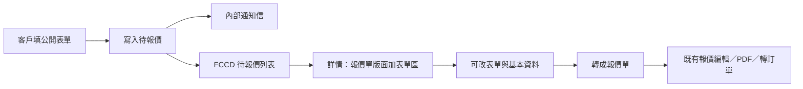

# 公開 Email Form 登記與待報價 PRD

| 項目 | 內容 |
| --- | --- |
| 文件版本 | 1.0 |
| 文件日期 | 2026-09-03 |
| 文件狀態 | 需求草案；尚未實作 |
| 範圍 | 客戶公開登記表單、內部通知信、FCCD 待報價佇列、表單資料展示與修改、轉成報價單 |
| 參考 | `QUOTE_EDITOR_PRD.md`、`QUOTE_LIST_AND_PDF_PRD.md`；現行 `QuoteEditorPage`（`/quotes/:id` 唯讀詳情與 `/quotes/:id/edit`）、`QuotesListPage`、內部電郵名單 `OrderNotificationSettings`、公開頁 `CustomerSelfServicePage` |

## 1. 目標與流程

客戶在公開頁填寫查詢／登記表單後，系統寫入一筆**尚未成為報價單**的待報價紀錄，並寄內部通知給同事。同事在 FCCD「待報價」列表處理該筆：詳情版面接近現有報價單詳情，另加一塊 Email Form 原文資料，可修改後轉成正式報價單。轉成之後走既有報價流程（加貨品、PDF、再轉訂單），本文件不重寫那些規則。

本需求描述的是 **FCCD 自建公開表單**。客戶不會因此開 FCCD 帳號，也不會在提交當下收到報價 PDF 或對客確認信。

### 1.1 名詞

| 名詞 | 定義 |
| --- | --- |
| 公開表單／Email Form | 未登入客戶填寫的查詢／登記頁，例如建議路由 `/quote-inquiry`。 |
| 待報價紀錄／inquiry | 表單成功提交後產生、**尚未轉成報價單**的內部紀錄。 |
| 待報價列表 | 只列出尚未轉成報價單的公開表單件。語意與現行「所有未結束報價」不同。 |
| 轉成報價單 | 將 inquiry 提升為正式 Catering 報價（`document_type = 'quote'`，建議 `quote_status = Draft`）。**不是**現有「轉成訂單」。 |
| 轉成訂單 | 既有 `convert_quote_to_order`；只適用已轉成的報價單。見 `QUOTE_EDITOR_PRD.md`。 |
| Email Form 資料區 | 詳情頁上逐欄展示客戶提交原文（含未映射欄位）的區塊，可編輯。 |

### 1.2 與現行系統的差距

1. 現行 Catering 報價存在 `orders`（`document_type = 'quote'`）。詳情在 `QuoteEditorPage`：`/quotes/:id` 唯讀、`/quotes/:id/edit` 編輯。畫面上的轉換按鈕是「轉成訂單」，沒有「轉成報價單」。
2. 側欄「待報價」現行指向 `/quotes?tab=pending`，列出**所有未結束報價**（`quote_status` 為空或非 `Done Deal`／`Case Closed`），不是「表單尚未轉報價」的佇列。Dashboard「待報價」計數與前五筆沿用同一語意。
3. FCCD 沒有自建公開登記表單。匿名公開頁目前只有 `/self_service_search`（查已有訂單／加單），與本需求無關。
4. 報價單詳情沒有獨立的「客戶表單原文」區塊；客戶聯絡資料以 snapshot 欄位保存，沒有完整原始 payload。
5. 內部通知信現行服務訂單／報價確認等流程，**沒有**「公開表單新建成功 → 通知同事」這一步。

本需求要補的是：公開表單、內部信、獨立待報價佇列、表單原文展示與修改、轉成報價單。

## 2. 範圍

### 2.1 包含

- 未登入可填的公開登記表單與提交成功／失敗回饋。
- 提交後寫入待報價紀錄，並寄內部通知信；寄信失敗可從詳情重寄。
- FCCD「待報價」列表改為本佇列；Dashboard 待報價計數與前五筆對齊。
- 待報價詳情：以現有報價單詳情為版面基準，加上可編輯的 Email Form 資料區。
- 將待報價轉成正式報價單，之後沿用既有報價編輯／PDF／轉訂單。

### 2.2 不包含

- 客戶帳號註冊、登入、客戶工作區。
- 用本表單直接產生正式訂單。
- 對客戶自動回信、WATI、或提交當下寄出報價 PDF。
- 更改現有報價計價、PDF 版面、轉訂單、工場或對客確認規則。
- 沿用或改造任何既有第三方表單 webhook（明確排除）。
- 批量轉報價、匯出、公開表單多語內容管理後台（第一期用固定中文文案即可）。

## 3. 公開表單

### 3.1 入口與頁面

1. 未登入可開啟、可提交。建議 FCCD 公開路由 `/quote-inquiry`（最終 path 實作時可調整，但必須**不**出現在內部 primary nav）。
2. 視覺與匿名使用方式可參考 `CustomerSelfServicePage`：獨立公開頁，不是內部殼層的登入後畫面。
3. 頁面須說明這是查詢／報價登記，提交後由同事跟進；不可暗示已產生正式報價單或已建立帳戶。
4. 提交成功顯示確認頁（或同頁成功狀態）：感謝文字 + 已收到查詢。確認頁不可再顯示可重複送出的完整表單，除非使用者明確選擇「再填一筆」。
5. 提交失敗（驗證、網路、伺服器）須可理解錯誤訊息，保留已填內容，允許重試。
6. 同一客戶操作的**一次送出**只可建立一筆待報價。連點送出、重新整理後的瀏覽器重送，不得產生重複件。建議以提交 token／幂等鍵處理。

### 3.2 客戶側欄位

下列為第一期建議清單，標為**待確認**（見第 10 節）。實作前若業務提供最終欄位，以確認後的清單為準。

| 欄位 | 客戶側必填 | 規則 |
| --- | --- | --- |
| 姓名 | 是 | 文字；對應報價基本資料「客人姓名」。 |
| 電郵 | 是 | 須符合有效電郵格式；對應 `email_snapshot`。 |
| 電話 | 是 | 文字；對應主聯絡電話。 |
| 活動／送餐日期 | 是 | 日期；對應送貨／活動日期。 |
| 公司 | 否 | 文字；對應公司名稱。 |
| 人數 | 否 | 正整數或可解析的人數文字。 |
| 地址 | 否 | 文字；對應送貨地址。 |
| 時段 | 否 | 文字或預設時段選項；對應送貨時間。 |
| 查詢內容 | 否 | 多行文字；對應報價描述／客戶備註來源。 |
| 品牌偏好 | 否 | 可選既有品牌／渠道。有填則帶入待報價；沒填則轉成報價單時由同事必選。 |

客戶側電郵與電話在建議清單中皆為必填。轉成報價單的**最低門檻**仍是：姓名，以及電郵或電話至少一個（避免內部改欄後無法轉單）。若公開表單最終改為電郵／電話擇一必填，須同步改本表與第 7.2 節。

### 3.3 系統記錄（不對客戶顯示）

每次成功提交至少保存：

1. 提交時間（香港時區可顯示；儲存用 timestamptz）。
2. 完整原始 payload（鍵值原樣），供詳情「Email Form 資料」區展示未映射欄位，以及之後表單欄位調整時仍能回看。
3. 來源標記，用以區分公開表單件與人手新建報價。
4. 內部通知狀態：未寄／已寄／失敗，以及最近一次嘗試時間與錯誤摘要。
5. 來源 IP、User-Agent：僅內部除錯／防濫用，不出現在客戶確認頁，詳情頁可摺疊顯示。

### 3.4 防濫用

1. 第一期至少做提交頻率限制（同一 IP／同一電郵在短時間內的上限，具體數字實作時訂）。
2. Honeypot 或 CAPTCHA 可選，不阻擋第一期上線，但公開 endpoint 不得免認證即可被任意灌資料而無節流。
3. 公開提交 API 不可使用登入後的 staff RLS 寫入路徑；須有獨立、最小權限的寫入方式。

## 4. 內部通知信

### 4.1 何時寄

1. 僅在**新建待報價成功**時自動寄一次。
2. 同一提交的重試、幂等重送、payload upsert **不**重寄。
3. 內部使用者在詳情按「重寄通知」可再寄；重寄須有權限（與報價編輯或通知設定權限對齊，實作時確認）。

### 4.2 收件人與寄件

1. **建議**沿用現有內部名單 `private.order_email_notification_recipients()`（設定頁 `OrderNotificationSettings`／`/orders/settings/email-notifications`）。若業務要獨立 inquiry 名單，見第 10 節。
2. 寄信走現有 Resend，From 為現行系統地址（`system@foodchannels-delivery.com`）。
3. 不在範圍：WATI、對客自動回信。

### 4.3 信件內容

信件至少包含：

- 標題可辨識為新的公開表單待報價（中文即可）。
- 客戶姓名、公司（有則顯示）、電話、電郵、活動／送餐日期、人數（有則顯示）、查詢內容摘要。
- 可點的 FCCD 待報價**詳情**連結（登入後開啟該筆）。連結必須指向同一筆紀錄，不因後續編輯而失效。

不可在信件中放置完整原始 payload 以外的敏感除錯資料（IP 可省略）。

### 4.4 失敗處理

1. **先寫入待報價，再寄信。** 客戶成功頁只代表「我們已收到查詢」。
2. 寄信失敗不可讓客戶看到失敗，亦不可回滾已寫入的待報價。
3. 詳情須顯示通知狀態：尚未通知／已通知／通知失敗。失敗時顯示可理解摘要，並提供重寄。
4. 允許名單為空時：待報價仍建立，狀態為尚未通知或失敗（實作時選一種並在 UI 說明），避免靜默丟信又無法追查。

## 5. 待報價列表

### 5.1 顯示範圍

1. 本列表是獨立佇列：只顯示**公開表單進來、尚未轉成報價單**的紀錄。
2. 轉成報價單後立刻離開本列表，改出現在既有報價列表（見 `QUOTE_LIST_AND_PDF_PRD.md`）。
3. 既有 `/quotes` 全部、High Chance、大單、30 日以內、即將送貨等 preset **只顯示已轉成的報價單**。未轉換的表單件不混入這些列表。
4. 內部 nav「待報價」改為進入本佇列，不再等於「所有未結束報價」。Dashboard「待報價」計數與「待報價・前五筆」使用同一過濾條件。
5. 現行「所有未結束報價」跟進工作仍由 `/quotes` 及其 preset 承擔，不因本需求消失。若 nav 文案造成混淆，見第 10 節。

### 5.2 欄位與操作

對齊現有報價列表能對得上的部分；沒有的資料顯示 `—`，不可發明假單號或假金額。

| 順序 | 欄位 | 顯示規則 |
| --- | --- | --- |
| 1 | 建立時間 | 提交／建立時間，香港時區；可排序。 |
| 2 | 客戶 | 姓名、公司（有則顯示）、電話；來源標記「公開表單」。 |
| 3 | 活動／送餐日期 | 有則顯示；無則 `—`。 |
| 4 | 描述／留言 | 查詢內容摘要；過長截斷，詳情看全文。 |
| 5 | 通知狀態 | 尚未通知／已通知／通知失敗。 |
| 6 | 操作 | 進入詳情。第一期不做 PDF、複製、轉成訂單。 |

不顯示報價單號、總額、報價狀態下拉（Low Chance 等），因為尚未成為報價單。

### 5.3 搜尋與權限

1. 文字搜尋至少涵蓋姓名、公司、電話、電郵、留言。
2. 開啟列表與詳情需要現行報價查看權限（`quotes`）。編輯表單資料、轉成報價單需要報價編輯權限。
3. 列表條件可放在 URL query，重整後仍在同一佇列。

## 6. 詳情：現有報價單詳情 + Email Form 資料

### 6.1 版面基準

1. 以現行 `/quotes/:id` 唯讀詳情為視覺與資訊架構基準：頁首、基本資料、貨品／金額區、備註等區塊仍在，讓同事不必學第二套詳情頁。
2. 路由建議與報價詳情同一套識別（同一筆 ID 在轉成前後不變），或使用同等 inquiry 詳情路由；通知信與列表連結必須穩定。
3. 有編輯權限時，提供「編輯」進入可改畫面（可為同頁切換或 `/edit`），規則對齊 `QUOTE_EDITOR_PRD.md` 的未保存離開提示。

### 6.2 尚未轉報價時的差異

1. 頁首不顯示正式報價單號；改顯示狀態「待轉報價」。
2. 貨品、金額、付款可為空；空狀態顯示 `—` 或「尚未加入貨品」，不可阻擋查看基本資料與表單區。
3. **不提供** PDF、複製報價、轉成訂單。
4. **提供**「轉成報價單」（見第 7 節）以及通知狀態／重寄。
5. 同事可補表單沒有的營運欄位：品牌、地區、運送方式、送貨／出車時段、內部備註等，規則對齊 `QUOTE_EDITOR_PRD.md` 第 3 節基本資料。尚未轉報價時，品牌可暫空；轉成當下若仍為空則必填。

### 6.3 Email Form 資料區

1. 詳情須有獨立區塊，標題明確（例如「Email Form 資料」或「客戶登記表單」）。
2. **逐欄展示客戶提交原文**，包含當時有值但未映射到報價基本資料的鍵。欄位標籤優先用表單顯示名稱；未知鍵顯示原始 key。
3. 此區可編輯（須報價編輯權限）。保存的是 inquiry 上的表單資料，並**同步預填**對應的報價基本資料欄：

   | 表單欄 | 同步到 |
   | --- | --- |
   | 姓名 | 客人姓名 |
   | 電郵 | 電郵地址 |
   | 電話 | 主聯絡電話 |
   | 公司 | 公司名稱 |
   | 活動／送餐日期 | 送貨日期 |
   | 地址 | 送貨地址 |
   | 時段 | 送貨時間 |
   | 人數 | 內部可讀位置（例如備註前綴「人數：」或獨立顯示欄，實作時擇一並在詳情兩邊一致） |
   | 查詢內容 | 報價描述或客戶備註（實作時擇一；列表「描述／留言」須同源） |
   | 品牌偏好 | 品牌／渠道 |

4. 同步方向：改 Email Form 資料區並保存時，覆寫對應基本資料欄。同事若只改基本資料區（品牌、地區等營運欄），**不可**回寫進「客戶提交原文」的歷史副本。
5. 系統須同時保留一份**首次提交不可變副本**（原始 payload），即使之後編輯表單區，仍可展開查看「當初客戶填了什麼」。編輯後的值是現行表單資料；原始副本只讀。
6. 保存成功後，列表欄位、通知信已發出內容不必追溯改寫；連結仍指向同一筆。

### 6.4 權限與唯讀

1. 僅有查看權限：整頁唯讀，含表單區；不顯示轉成報價單、重寄、保存。
2. 有編輯權限：可改表單區與基本資料、保存、重寄、轉成報價單。

## 7. 轉成報價單

### 7.1 動作定義

這是新動作，**不是** `convert_quote_to_order`。

1. 按鈕文案：「轉成報價單」。
2. 轉成前可先確認摘要（客戶、日期、品牌）。
3. 成功後：
   - 進入既有報價生命週期：建議 `quote_status = Draft`；依品牌規則產生報價單號（對齊現行 `create_quote`／編號規則）。
   - 可於既有編輯器加入貨品、出 PDF、之後再「轉成訂單」。
   - 此筆離開待報價列表，出現在一般報價列表。
   - 詳情仍可看到 Email Form 資料區與首次提交副本。
4. 同一 inquiry 只可轉成一次。已轉成後按鈕改為進入該報價（或隱藏並以狀態列連到報價）。
5. 第一期**不可逆**。不提供轉回待報價；不刪除因此產生的報價單號。

### 7.2 轉成前驗證

1. 姓名必填。
2. 電郵或電話至少一個有值。
3. 品牌必填（表單已選或同事補選）。
4. 驗證失敗停留在詳情／編輯頁，指出缺什麼；不得產生半套報價。
5. 轉成必須是一次完成的寫入：狀態從待報價變為報價、單號產生、離開佇列，不可只改了列表卻沒有單號。

### 7.3 轉成後與既有報價 PRD 的交接

1. 基本資料、貨品、PDF、複製、跟進狀態、轉成訂單，全部沿用 `QUOTE_EDITOR_PRD.md` 與 `QUOTE_LIST_AND_PDF_PRD.md`。
2. 轉成後詳情可繼續顯示 Email Form 資料區。該區轉成後要鎖定或仍可改，見第 10 節；未確認前預設：**轉成後表單區唯讀**，基本資料仍按既有報價編輯規則修改。
3. 公開表單來源標記在報價列表可保留小徽章，方便辨識，但不是待報價佇列的一員。

## 8. 權限、安全與資料

1. 公開表單：匿名可寫入**僅限建立待報價**；不可讀取他人 inquiry、不可改既有報價、不可呼叫轉成報價單。
2. 內部列表／詳情／轉單：沿用報價模組 page access（查看 vs 編輯）。
3. 詳情連結不可未登入開啟客戶個資；未登入應進登入頁，登入後再回到該筆。
4. 原始 payload 與聯絡資料視為客戶個資，RLS／權限須與報價 snapshot 同等或更嚴。
5. 資料模型由實作決定（獨立 inquiry 表，或 `orders` 上可區分的待轉狀態皆可），但產品規則不變：未轉成前不是報價單；轉成後才進入既有 quote 生命週期；原始 payload 必須可還原展示。

## 9. 驗收情境

1. 客戶打開公開頁、填必填欄、送出一次（含連點）：只有一筆待報價；看到成功頁；沒有 FCCD 帳號、沒有對客信。
2. 內部收件人收到一封信，連結打開即為該筆詳情；列表與 Dashboard 待報價數字含此筆。
3. 寄信服務暫時失敗：客戶仍看到成功；詳情顯示通知失敗；重寄後變已通知。
4. 詳情看得到表單原文；同事改姓名／日期並保存後，基本資料與列表同步；仍可展開首次提交副本。
5. 未選品牌時按轉成報價單被擋住；補品牌後成功，出現報價單號，待報價列表不再有此筆，`/quotes` 看得到 Draft 報價。
6. 該報價之後可加貨品、出 PDF、轉成訂單，行為與人手新建報價一致。
7. 未轉成的表單件不出現在 High Chance／大單等報價 preset；已轉成的報價不留在待報價佇列。
8. 只有查看權限的使用者不能保存、不能轉單。

## 10. 待確認

實作前由業務確認；未確認時採用括號內預設。

1. 公開欄位最終清單；品牌是否給客戶選。（預設：第 3.2 節建議清單，品牌為選填。）
2. 內部信用現有訂單通知名單，或另建 inquiry 名單。（預設：沿用 `order_email_notification_recipients`。）
3. nav「待報價」是否改名或另開選單，以免與「跟進中報價」混淆。（預設：沿用「待報價」四字，但語意改為本佇列。）
4. 轉成報價後 Email Form 資料區鎖定或仍可改。（預設：鎖定唯讀。）
5. 公開路由最終 path 與是否需要嵌入官網 iframe／獨立網域。（預設：FCCD `/quote-inquiry`。）
6. 人數、查詢內容寫入報價的哪個 snapshot 欄位。（預設：人數進內部可見備註或獨立顯示；查詢內容進報價描述，與列表「描述／留言」同源。）
