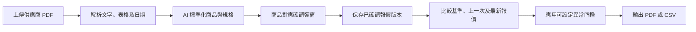

# 凍貨供應商 PDF 報價分析 PRD

## 0. 文件資訊

| 項目 | 內容 |
| --- | --- |
| 文件版本 | 2.0 |
| 文件日期 | 2026-09-01 |
| 狀態 | 核心流程已實作並完成 test-project 驗證；production provider、OCR 與業務驗收待核對 |
| 所屬模塊 | 凍貨／凍肉 |
| 主要使用者 | Admin、Super Admin、Factory；報告檢視可按權限開放給 Accounting |
| 目標 | 以通用引擎處理二十多家供應商的 PDF 報價，保存版本、比較價格、追蹤走勢、標記異常並輸出 PDF／CSV 報告 |
| 本期範圍 | PDF 上傳、AI 輔助解析及對應、人工確認、報價歷史、實際入貨價對照、異常門檻、PDF／CSV 報告 |
| 非目標 | 自動下單、直接改寫現有入貨紀錄、讓 AI 自行確認商品或價格 |

### 0.1 2026-09-01 現行實作

1. `/frozen/supplier-quotes` 已提供 private PDF 上傳、SHA-256 去重、parse run、進度、重試、PDF／座標 evidence 預覽、候選逐行人工對應、日期／供應商身份確認及原子發布。
2. pipeline 先以 PDF.js layout extraction、欄位／表格規則及 supplier profile 產生 deterministic candidates；AI 只處理 coverage 不足的安全 layout blocks，並須回傳可驗證的 page／block／cell evidence。
3. AI adapter 保持 provider-neutral，支援 structured OpenAI Responses 及 Chat Completions 類 provider；現行新部署方向為 xAI／Grok，secret 只存在 server-side。provider timeout、quota、無設定、成本超限或格式錯誤時 fail closed，deterministic parsing 與人工審核仍可使用。
4. 文件狀態包含 uploading、processing、review、ocr_required、parse_failed、confirmed；重試建立新的 parse run，不覆蓋既有 audit evidence。
5. 確認操作要求供應商、正式報價日期、生效日期及每個選取行的商品／variant mapping 完整；發布只替換未確認候選，不改寫已確認 line、原料主檔、入貨或庫存流水。
6. test project 已驗證匿名拒絕、非 PDF 拒絕、相同 SHA idempotency、權限、原子發布、malformed PDF retry、AI disabled／configured modes 及清理 smoke data。Production 是否已套用相同 migration、function version、secret 與 feature flag 必須另行核對。
7. 文字型 PDF 已有可執行流程；掃描／圖片 PDF 仍進入 `ocr_required`，在 OCR runtime 正式驗收前不得由 AI 猜測內容。

## 1. 背景與問題

目前有二十多家供應商，報價格式並不一致，不能每新增一家供應商就開發一套專用程式。已盤點的三份報價涵蓋三種代表性格式：

| 供應商 | 代表格式與風險 |
| --- | --- |
| A-Mart | 35 頁；中英文多欄產品目錄；欄位為 Product Name、Origin、Size、Packing、Price；有 TBA、暫缺及同品多規格／多包裝 |
| Euro Foodstuff | 37 頁；有商品編號；同一份 PDF 內有多種表格版面；有品牌、英文／中文名稱、規格及多種價格單位 |
| 泰豐 | 11 頁；中文雙欄表格；欄位為產品資料、單位、價格、備註；沒有穩定商品編號；有切片／切粒／免治、最低訂購量、加工及包裝條件 |

第一版應建立一套通用報價引擎，供應商差異以資料設定及已確認的商品別名保存，而不是以程式碼分支保存。

## 2. 產品目標

使用者可以：

1. 上傳任意供應商的 PDF 報價。
2. 由系統識別供應商、日期、欄位及商品候選。
3. 只勾選實際要追蹤的商品。
4. 在確認彈窗中把 PDF 商品對應到現有凍肉商品及規格。
5. 比較同一供應商、同一商品、同一規格的原始報價、上一次報價及最新報價。
6. 同時查看 PDF 報價歷史和實際入貨價歷史，但不混淆兩種價格來源。
7. 以可設定門檻標記大幅漲跌。
8. 選擇輸出 PDF、CSV 或 PDF + CSV 報告。

## 3. 使用流程



### 3.1 上傳報價

使用者需要填寫或確認：

- 供應商；如 PDF 能識別公司名稱，系統預填但不可直接視為確認。
- 報價日期。
- 生效日期，可與報價日期不同。
- 是否作為該供應商／商品的第一個基準版本。
- 備註。

系統保存：

- 原始 PDF。
- 原始檔名、MIME type、檔案大小及 SHA-256。
- 上傳者及上傳時間。
- PDF 內文日期、檔名日期及 metadata 日期候選。
- 使用者最後確認的正式報價日期。
- 解析引擎、解析器版本及 AI 模型版本。

日期衝突時不可自動選擇。例如檔名、PDF 內文及 metadata 出現不同月份，必須在確認畫面提示並由使用者決定。

### 3.2 解析及 AI 輔助

採用受控 Agent workflow，不讓模型直接修改正式資料：

1. 先用固定程式抽取 PDF 文字、頁碼、表格及可辨識的價格。
2. 優先載入該供應商已確認的解析 profile。
3. 如格式未知或版面改變，AI 分析欄位、商品行及條件文字。
4. AI 只輸出結構化候選資料及信心分數。
5. 程式驗證數值、單位、貨幣、頁碼及原文證據。
6. 高信心結果可預選；中低信心結果必須人工確認。
7. 使用者確認後才保存正式報價 line。
8. 經確認的欄位、商品別名及規格對應可保存回 supplier profile，供下次使用。

AI 不得：

- 猜測 PDF 沒有提供的價格。
- 將 TBA、暫缺或空白轉成 0。
- 自行確認商品對應。
- 自行確認報價日期。
- 自行提交正式報價版本。
- 直接改寫 `raw_meat_stock_movements` 或現有入貨紀錄。

AI 候選結果至少包含：

```json
{
  "sourcePage": 5,
  "sourceText": "原始 PDF 行文字",
  "supplierItemCode": "可選",
  "productName": "供應商商品名稱",
  "productNameZh": "供應商中文名稱",
  "origin": "產地",
  "sizeText": "規格原文",
  "packingText": "包裝原文",
  "quotedPrice": 0,
  "currency": "HKD",
  "priceUnit": "kg",
  "availability": "quoted",
  "conditions": [],
  "suggestedRawMeatItemId": "可選",
  "matchConfidence": 0.0,
  "matchReason": "建議原因"
}
```

### 3.3 商品對應確認彈窗

解析結果先全部列出，但只有確認的商品才進入價格比較。

每行顯示：

- 勾選框。
- PDF 頁碼及原文。
- 供應商商品編號，如有。
- 英文／中文商品名稱。
- 產地、規格、包裝。
- 原始價格、貨幣及單位。
- AI 建議的凍肉商品。
- 對應信心及原因。
- 目前歷史報價數量。
- 是否存在規格差異。

使用者可：

- 確認建議對應。
- 另選現有凍肉商品。
- 調整規格／價格單位。
- 將行標記為新商品待建立。
- 跳過不需要追蹤的商品。
- 標記為無法對應，稍後處理。

同名但不同規格、包裝、加工方式或價格單位必須視為不同 variant，不能只按商品名稱合併。

### 3.4 保存版本

保存後，報價文件狀態為 `confirmed`，但不會改寫：

- `raw_meat_items` 主檔。
- `raw_meat_stock_movements` 實際入貨紀錄。
- `meat_price_versions` 月度銷售／成本版本。

已確認的 PDF 報價 line 才可進入後續比較。

## 4. 報價比較規則

### 4.1 比較鍵

PDF 報價的唯一比較鍵為：

```text
supplier_id
+ raw_meat_item_id
+ normalized_spec_fingerprint
+ price_unit
+ currency
```

`normalized_spec_fingerprint` 至少包括：

- 供應商商品編號，如有。
- 供應商原始商品名稱及別名。
- 產地。
- 重量／尺寸／級別。
- 包裝。
- 加工方式。
- 其他會影響價格的條件。

### 4.2 基準、上一次及最新

- 基準報價：最早一個已確認版本。
- 上一次報價：按正式報價日期及確認時間排序的前一個版本。
- 最新報價：目前最新已確認版本。
- 新增商品：沒有上一個相同比較鍵。
- 暫缺／TBA：保存狀態，但不計算漲跌。
- 規格變更：另開 variant，或標記為不能直接比較。
- 同日多份報價：以確認時間較晚的版本作為同日最新，但保留兩份文件。

價格變動：

```text
price_delta = latest_price - previous_price
change_rate = price_delta / previous_price * 100
```

若上一價格為 0 或單位不可換算，改為「無法計算」並要求人工處理。

### 4.3 PDF 報價和實際入貨價分開

系統需要提供兩條獨立歷史：

1. PDF quoted price：供應商文件中的報價版本。
2. Actual inbound price：現有生肉入貨紀錄中的實際入貨價。

兩者可在報告並排顯示，但不能自動互相覆蓋。PDF 報價未必等於實際成交價，實際入貨也可能受加工、包裝、運費及損耗條件影響。

## 5. 異常門檻

### 5.1 可設定項目

- 百分比上漲門檻。
- 百分比下跌門檻。
- 固定金額上漲門檻，可選。
- 固定金額下跌門檻，可選。
- 是否把規格／包裝變更列為異常。
- 是否把新商品、暫缺及 TBA 列入待處理清單。

門檻優先順序建議為：

```text
系統預設 → 供應商設定 → 商品／規格設定
```

MVP 可先實作全局及供應商層級；商品／規格覆蓋作為後續擴展。建議初始百分比門檻為 ±10%，但必須能由設定頁修改，不把 10% 寫死在程式碼。

### 5.2 異常結果

異常至少保存：

- 比較的兩個 quote line。
- 舊價、新價、差額及變動率。
- 當時套用的門檻。
- 觸發原因。
- 已讀／未讀／已處理狀態。
- 處理備註及處理人。

## 6. 泰豐及其他供應商的價格條件

供應商條件要與商品單價分開保存。例子：

- 泰豐：真空／入碟包裝另加 HK$3。
- 泰豐：加工損耗及淨重條件可能另加 5%。
- 泰豐：不同地區有最低訂貨額及運費。
- 商品最低訂購一包／一箱／一條。
- 可散出、預訂、加工方式及地區配送限制。

條件保存為 line-level 或 document-level condition，包含：

- 條件原文。
- 條件類型。
- 適用範圍。
- 可解析的金額／百分比／數量。
- 是否已由使用者確認。

報告預設顯示「原始報價」及「條件」，只有當條件可明確換算時，才額外顯示「估算實際成本」。

## 7. 報告

### 7.1 畫面報告

篩選：

- 供應商。
- 報價日期範圍。
- 商品。
- 上漲／下跌／不變／異常。
- 是否包含實際入貨價。

摘要：

- 已確認商品數。
- 上漲數。
- 下跌數。
- 不變數。
- 新增／暫缺／TBA 數。
- 異常數。

明細欄位：

- 商品及規格。
- 供應商商品編號。
- 原始報價及日期。
- 上一次報價及日期。
- 最新報價及日期。
- 差額及變動率。
- 實際入貨平均價及最近入貨日期。
- 價格條件。
- 異常狀態。
- PDF 頁碼及文件連結。

### 7.2 輸出格式

使用者可選：

- PDF。
- CSV。
- PDF + CSV。

CSV 必須包含原始值及標準化值，至少包括：

```text
供應商、報價日期、生效日期、商品、商品編號、規格、產地、包裝、
原始價格、貨幣、價格單位、原始報價、上一次報價、最新報價、
差額、變動率、實際入貨平均價、異常狀態、PDF 頁碼、條件備註
```

## 8. 建議資料模型

### 8.1 `supplier_quote_documents`

保存每一份 PDF 版本：

- `supplier_id`
- `original_filename`
- `storage_bucket`
- `storage_path`
- `sha256`
- `mime_type`
- `quote_date`
- `effective_date`
- `detected_dates jsonb`
- `status`
- `parser_profile_id`
- `parser_version`
- `ai_model_version`
- `raw_extraction jsonb`
- `created_by`
- `confirmed_by`
- `confirmed_at`

### 8.2 `supplier_quote_profiles`

保存供應商解析設定，不保存為程式碼：

- 供應商識別規則。
- 頁首／頁尾規則。
- 表格欄位對應。
- 商品編號及名稱欄位。
- 價格及單位解析規則。
- 條件文字規則。
- 版本及啟用狀態。
- 最後確認人及時間。

### 8.3 `supplier_quote_lines`

保存每份文件的商品候選及確認結果：

- `document_id`
- `source_page`
- `source_text`
- 供應商商品編號及原始名稱。
- 產地、規格、包裝及加工方式。
- 原始價格、貨幣及價格單位。
- 可用／TBA／暫缺狀態。
- `raw_meat_item_id`，確認前可為 null。
- `normalized_spec_fingerprint`
- AI 信心及匹配原因。
- `selection_status`
- 條件 JSON。

### 8.4 其他資料

- `supplier_quote_aliases`：供應商商品編號／名稱／規格與凍肉商品的已確認對應。
- `supplier_quote_conditions`：供應商及商品價格條件。
- `supplier_quote_thresholds`：全局及供應商異常門檻。
- `supplier_quote_alerts`：異常結果及處理狀態。
- `get_supplier_raw_meat_price_history` RPC：按供應商、商品、日期返回逐筆實際入貨價，而非只有加權平均。

## 9. 權限與安全

建議新增頁面及 action permission：

- `frozen.supplier_quotes`
- `frozen.supplier_quotes.upload`
- `frozen.supplier_quotes.review`
- `frozen.supplier_quotes.export`
- `frozen.supplier_quotes.settings`

建議：

- Admin／Super Admin：上傳、確認、修改設定及匯出。
- Factory：按權限檢視及確認業務需要的商品。
- Accounting：檢視及匯出報告。
- 其他角色：預設不可見。

PDF 及解析結果屬供應商價格資料，必須使用 private Storage、短效 signed URL 及 server-side／Edge Function 代理。AI service 只接收必要的抽取文字／頁面，不在瀏覽器暴露 API key。

## 10. 現有架構可重用部分

目前已存在：

| 現有能力 | 可重用內容 |
| --- | --- |
| 凍貨路由 | `/frozen` 及多個凍肉子頁，可新增 `supplier-quotes` 子頁 |
| 商品主檔 | `raw_meat_items`，包含 SKU、中文／英文名稱、啟用狀態 |
| 供應商關聯 | `raw_meat_item_suppliers`，可作為商品匹配候選範圍 |
| 實際入貨資料 | `raw_meat_stock_movements`，包含 supplier、item、movement date、inbound unit price、quantity、total |
| 供應商入貨報表 | 已有供應商及日期篩選、加權平均價及 CSV 匯出模式 |
| 趨勢元件 | 現有 `MonthlyTrendChart` 可作為報價走勢 UI 的基礎 |
| 權限系統 | `app_pages`、`role_page_permissions` 及 `usePageAccess` |
| Storage | 已有 private bucket 及 signed URL 使用模式 |
| 測試 | Vitest + jsdom，適合新增 parser normalization、比較及 UI 測試 |

## 11. 可行性驗證

### 11.1 資料可行性：PASS

現有 `raw_meat_stock_movements` 已保存：

- `supplier_id`
- `raw_meat_item_id`
- `movement_at`
- `inbound_unit_price`
- `inbound_quantity_kg`
- `inbound_total_amount`

資料遷移報告顯示：

- `raw_meat_stock_movements` 已匯入 2,430 條。
- `raw_meat_items` 已匯入 15 個。
- 已建立 24 個原始生肉／供應商關聯。
- 歷史原始入貨量合計 146,896.935 kg。
- 歷史原始入貨金額合計 HKD 5,539,519.99。

因此可以建立「供應商＋商品＋日期」的實際入貨價格歷史。需要新增逐筆歷史 RPC，因現有 `report_supplier_raw_meat_purchases` 只輸出日期範圍內的加權平均。

### 11.2 現有 UI／路由可行性：PASS

凍貨已有獨立路由、導航及 page access 機制。新增報價比較頁不需要改變現有凍肉庫存流程，只需新增頁面、導航項目、權限 migration 及報表元件。

### 11.3 Storage 可行性：PASS WITH DESIGN CHANGE

現有 `attachments` 表主要是 Bubble attachment migration registry：

- 寫入權限偏向 service role。
- 必填 `deterministic_key`、`source_url_hash` 等來源遷移欄位。
- 不適合作為前端直接上傳的業務文件表。

建議新增 `supplier_quote_documents` 作為業務文件主表，使用新的 private bucket，例如 `supplier-quotes-private`，由 server／Edge Function 負責上傳、hash、解析及 signed URL。可保留可選的 `attachment_id`，但不要強行把新業務文件塞入 migration-specific attachments registry。

### 11.4 PDF 解析及 AI 可行性：PASS WITH RUNTIME DEPENDENCY

三份 PDF 已證明通用解析需要：

- 文字型 PDF 抽取。
- 多欄／雙欄表格處理。
- 商品編號及無商品編號兩種匹配方式。
- 中英文及中文商品名稱標準化。
- 多規格、多包裝、多價格單位。
- TBA、暫缺、最低訂購及條件文字。

現行 repo 已有 `supplier-quote-ingest` Edge Function、PDF layout extraction、deterministic parser、provider-neutral AI adapter、結構化驗證、人工 review UI、private Storage 及原子確認 RPC。Test project 已完成 migration、權限、idempotency、retry、AI disabled／enabled smoke 驗證；production 仍須核對實際 function version、server-side secret、feature flag、timeout、檔案大小及成本限制。

MVP 可先支援文字型 PDF；掃描／圖片型 PDF 進入 `ocr_required` 狀態，待 OCR runtime 完成後再處理，不阻塞整個報價版本保存。

### 11.5 歷史價格可行性：PASS WITH SCOPE CLARIFICATION

現有資料是實際入貨價格，不是 PDF 報價版本。兩種歷史必須分開保存及顯示：

- PDF quoted price history：本 PRD 新增。
- Actual inbound price history：由現有 `raw_meat_stock_movements` 讀取。

若某筆歷史沒有 `inbound_unit_price`、供應商、商品或日期，則不能用於價格比較，必須顯示資料不足。

### 11.6 CSV 可行性：PASS

現有供應商入貨報表已能在瀏覽器產生 UTF-8 BOM CSV。新報價報告可沿用此模式，但需擴充欄位，並由 server／report builder 產生 PDF。

### 11.7 整體判定

**方案可行，沒有需要推翻現有凍肉模塊的架構阻塞。**

現行已建立或仍須完成的能力：

1. 報價文件、parse run、profile、line、alias、condition、threshold、alert migrations：核心已建立，production migration 狀態待核對。
2. Private quote Storage、上傳／解析服務、通用 parser、AI adapter 及結構化驗證：已建立並通過 test-project smoke。
3. 凍貨報價比較頁、PDF evidence、確認 modal、CSV／print report：已建立；真實使用者流程待驗收。
4. 逐筆實際入貨價歷史及價格比較：已建立資料能力；缺 supplier／item／date／price 的 legacy rows 仍只能標記資料不足。
5. Page／action permissions、匿名拒絕及確認 RPC：已測；每個 production 角色仍須跑 permission matrix。
6. OCR／掃描 PDF：仍待 runtime、成本及品質驗收。

主要外部依賴是 PDF／OCR runtime 和 AI provider；它們是部署及成本設計項目，不是資料模型不可行。

## 12. 分期實作與現況

| Phase | 2026-09-01 狀態 | 說明 |
| --- | --- | --- |
| Phase 0 | **完成** | 三種 redacted fixture 已驗證多欄、混合表格與雙欄格式；保留可重跑測試。 |
| Phase 1 | **已實作並在 test project 驗證** | 資料模型、private bucket、hash dedupe、上傳、狀態及日期／身份確認均已建立。 |
| Phase 2 | **已實作並在 test project 驗證** | Deterministic extraction、AI fallback、evidence、review、alias／profile suggestion 及 atomic confirmation 已建立。 |
| Phase 3 | **主要 UI／資料能力已實作** | 基準／上次／最新、實際入貨價、門檻、狀態、CSV／print report 已有；production 歷史資料完整度及 alert workflow 仍須驗收。 |
| Phase 4 | **部分完成** | 趨勢／報告與格式變更 evidence 已有部分能力；掃描 PDF OCR runtime 仍未完成，保持 `ocr_required`。 |

### Phase 0：資料盤點及 POC

- 對現有 `raw_meat_stock_movements` 做只讀分組，找出同一供應商／商品的多日期、多價格實例。
- 用三份已提供 PDF 驗證通用 extraction JSON。
- 確認 production PDF parser／OCR runtime。
- 確認 AI provider、成本上限及資料保護方式。

### Phase 1：資料模型及上傳

- 新增 quote tables、private bucket、status flow、hash dedupe。
- 新增供應商報價頁、上傳流程及日期確認。
- 保存原始 PDF，不寫入正式入貨資料。

### Phase 2：解析及確認

- 實作固定文字／表格抽取。
- 實作 AI 結構化候選及信心分數。
- 實作商品對應確認彈窗。
- 保存 supplier profile 及 alias。

### Phase 3：比較及異常

- 實作基準、上一次、最新比較。
- 實作 PDF 報價及實際入貨價雙歷史。
- 實作門檻設定、alert 及處理狀態。
- 實作逐筆實際入貨價歷史 RPC。

### Phase 4：報告及擴展

- PDF、CSV、PDF + CSV 選擇輸出。
- 趨勢圖及條件／異常摘要。
- OCR 及掃描 PDF。
- 格式變更偵測及 profile 審核。

## 13. 驗收標準

### 核心功能

- 新增供應商不需要新增 TypeScript parser 分支或重新部署前端。
- 三種現有 PDF 格式都能產生可審核的候選行。
- 使用者只選定部分商品時，未選商品不進入正式比較。
- 每一筆確認 line 都可追溯到 PDF 文件、頁碼及原文。
- 不能把不同規格／包裝誤合併。
- PDF 報價歷史不可改寫舊版本。
- 實際入貨價歷史不會被 PDF 報價覆蓋。
- 異常門檻可修改，並保留當時套用的門檻值。
- 報告可選 PDF、CSV 或 PDF + CSV。

### AI 安全與品質

- AI 不能寫入正式 confirmed quote line，除非 UI 確認流程已完成。
- TBA／暫缺／空白價格不可轉成數字 0。
- AI 低信心結果不可自動確認。
- AI 結果必須有頁碼、原文及 parser／model version。
- AI 服務失敗時，文件仍可保存為 draft／parse_failed，並可重新處理。

### 數據及計算

- 相同 supplier、item、spec、unit、currency 才可直接比較。
- 上一價格為 0 或單位不可比時顯示無法計算。
- PDF 報價與實際入貨價顯示不同來源標籤。
- 價格變動率及門檻計算由固定程式完成，不能由 AI 回傳結果直接取代。

## 14. 主要風險與處理

| 風險 | 處理方式 |
| --- | --- |
| PDF 版面改變 | 優先 profile，變更時轉入 AI／人工審核；保留 parser version |
| 商品名稱相似 | 使用規格 fingerprint、供應商 code、產地及加工方式；低信心必須確認 |
| 價格單位不一致 | 保留原始單位；只有明確可換算時才計算每公斤價 |
| 報價條件被忽略 | 條件獨立保存並在報告顯示，不自動混入單價 |
| AI 幻覺或漏行 | 強制 source page／source text；數字 validation；人工確認 |
| 供應商價格敏感 | private Storage、server-side secrets、最少化送入模型的內容 |
| OCR 成本及延遲 | MVP 先處理文字型 PDF；OCR 另排 phase |
| 舊資料欄位不完整 | 只有 supplier、item、date、price 齊全的實際入貨記錄才進比較 |

## 15. 反覆修改的原因與最終規格

| 修改範圍 | 為什麼曾重覆調整 | 現行最終規格 |
| --- | --- | --- |
| Parser 策略 | 單靠供應商專用 parser 無法擴展至二十多種格式；全交 AI 又不可驗證、成本不穩定。 | 先建立 layout IR 與 deterministic candidates；只把低 coverage blocks 交 AI；新供應商優先用 profile／alias，不為每家新增硬編碼分支。 |
| AI provider | OpenAI connectivity 曾遇 quota，之後驗證 DeepSeek，再統一新部署方向至 xAI／Grok；若把 provider 寫死會反覆重做 pipeline。 | Provider-neutral adapter、model／provider／prompt version 全部入 audit；key 只在 server；任何 provider 失敗都 fail closed，人工 review 不受影響。 |
| AI evidence | 早期只要求 source text，不足以證明雙欄 PDF 的行列位置，可能把左右欄合併。 | 每個 AI candidate 必須引用既有 page、block、cell；回傳 evidence 不存在或數字無法驗證即拒絕，不得發布。 |
| 發布與 retry | 解析重試若直接 upsert lines，可能刪除人工已確認行或留下半批候選。 | 每次嘗試建立 immutable parse run；publication 在單一 transaction 原子替換未確認候選，保留 confirmed lines 與文件 audit。 |
| 重覆上傳 | 同一 PDF 改檔名或重送會建立重覆文件、重覆 AI 成本與重覆報價。 | 以 SHA-256 + parser／idempotency key 去重；相同檔案返回既有 document，不新增 run，除非使用明確 retry。 |
| 供應商／日期判定 | 檔名、PDF 內文、metadata 可能互相衝突；AI 自選日期會污染價格時間線。 | 顯示全部候選與來源，供應商 identity、報價日期、生效日期由人確認；生效日不得早於報價日。 |
| 掃描 PDF | 沒有文字層時讓通用 AI 猜測圖片內容，無法保證完整性與成本。 | 在正式 OCR runtime、頁面 evidence 與品質門檻驗收前保持 `ocr_required`；不得自動確認或以 0 補價格。 |
| TBA／暫缺／單位 | 空白、TBA、每箱／每公斤曾容易被標準化成 0 或錯誤可比單價。 | 保存原值、availability、price unit 與 conditions；只有 supplier、item、variant、unit、currency 可比才計算變動，否則顯示不可計算。 |
| 門檻與 alert | 固定 ±10% 不能涵蓋所有供應商／品類，且重新計算會改變歷史解釋。 | UI 目前預設上漲／下跌各 10%，但門檻可配置；alert 保存當時門檻與結果，歷史版本不得因之後設定改變而被覆寫。 |

## 16. 尚待環境／業務確認事項

1. Production 現行 xAI／Grok function version、secret、feature flag、timeout／cost ceiling，以及 OCR 的部署位置與啟用門檻。
2. 是否需要將報價條件換算成估算實際成本，還是只顯示原始報價及條件。
3. Production 異常門檻是否沿用目前 UI 預設的上漲／下跌各 10%，或按供應商／品類設定不同值。
4. Factory 是否有權確認 PDF 商品對應，或只限 Admin／Super Admin。
5. 首次上傳是否需要自動將實際入貨歷史作為 PDF 報價比較的參考欄位。

