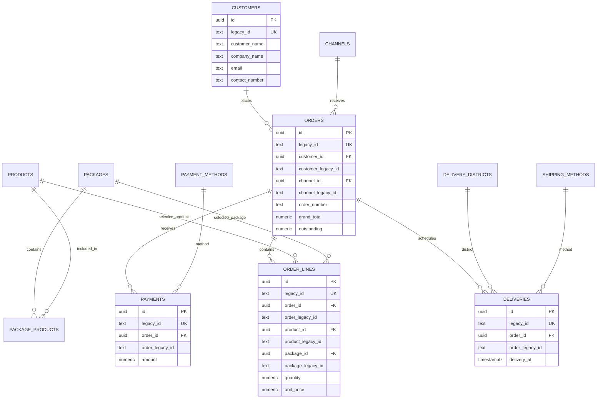

# Bubble → Supabase Schema 草案

> 状态：仅供评审，不执行数据库变更。
> 数据来源：Food Channels Catering production Bubble Data API。
> SQL 草案：`docs/sql/001_core_catering_schema.draft.sql`

## 1. 范围

第一份草案只覆盖已能通过 Swagger 与实际数据确认的核心 Catering 关系：

- `A_Customers` → `customers`
- `A_Products` → `products`
- `A_Packages` → `packages`
- `S_Packages_Product` → `package_products`
- `A_Order` → `orders`
- `S_Order` → `order_lines`
- `S_Payment` → `payments`
- `B_delivery schedule` → `deliveries`
- `DS_Channel` → `channels`
- `DS_Payment Method` → `payment_methods`
- `DS_delivery district` → `delivery_districts`
- `DS_Shipping Method` → `shipping_methods`

肉类、Shop、库存 ledger、报价附件及用户权限会在核心链确认后拆成后续草案，
不会在本文件中凭名称猜测最终结构。

## 2. ID 与关系规则

Bubble ID 示例：

```text
1682415351846x527153848631156700
```

它不是合法 UUID，因此每个实体采用双轨 ID：

```sql
id uuid primary key default gen_random_uuid(),
legacy_id text not null unique
```

每个 Bubble 引用字段采用：

```sql
customer_id uuid references customers(id),
customer_legacy_id text
```

迁移步骤：

1. 原始 Bubble 引用写入 `customer_legacy_id`。
2. 以 `customers.legacy_id` 查找目标记录。
3. 将目标 UUID 写入 `customer_id`。
4. 输出无法解析的 legacy ID。
5. 孤儿为零后才收紧 `NOT NULL`。
6. `customer_legacy_id` 可继续保留作审计，或在签核后移入受限历史表。

## 3. ERD



## 4. Bubble 字段映射

### 4.1 `A_Customers`

| Bubble 字段 | Supabase 字段 | 类型 |
|---|---|---|
| `_id` | `legacy_id` | `text unique` |
| `Customer Name` | `customer_name` | `text` |
| `Company Name` | `company_name` | `text` |
| `Email` | `email` | `text` |
| `Contact No.` | `contact_number` | `text` |
| `Remark` | `remarks` | `jsonb` |
| `Created Date` | `bubble_created_at` | `timestamptz` |
| `Modified Date` | `bubble_modified_at` | `timestamptz` |

### 4.2 `A_Order`

| Bubble 字段 | Supabase 字段 | 类型／说明 |
|---|---|---|
| `_id` | `legacy_id` | `text unique` |
| `A_customer` | `customer_legacy_id` → `customer_id` | legacy → UUID |
| `ORDER_Channel` | `channel_legacy_id` → `channel_id` | legacy → UUID |
| `ORDER_Order Number` | `order_number` | `text` |
| `(Quote) Status` | `quote_status` | 暂存 `text` |
| `Delivery_Status` | `delivery_status` | 暂存 `text` |
| `ORDER_Grand total` | `grand_total` | `numeric(14,2)` |
| `ORDER_折扣(-)` | `discount_amount` | `numeric(14,2)` |
| `ORDER_運費(+)` | `shipping_fee` | `numeric(14,2)` |
| `ORDER_oustanding` | `outstanding` | `numeric(14,2)` |
| `Delivery_Date` + `Delivery_Time` | `delivery_at` | 需确认时区与合并规则 |
| 客户／地址／联系字段 | `*_snapshot` | 保留交易快照 |

### 4.3 `S_Order`

| Bubble 字段 | Supabase 字段 |
|---|---|
| `_id` | `legacy_id` |
| `Order` | `order_legacy_id` → `order_id uuid` |
| `Product` | `product_legacy_id` → `product_id uuid` |
| `Package` | `package_legacy_id` → `package_id uuid` |
| `Quantity` | `quantity numeric(14,3)` |
| `Unit Price` | `unit_price numeric(14,2)` |
| `Total Price` | `total_price numeric(14,2)` |
| `Void` | `is_void boolean` |

### 4.4 `S_Payment`

| Bubble 字段 | Supabase 字段 |
|---|---|
| `_id` | `legacy_id` |
| `Order` | `order_legacy_id` → `order_id uuid` |
| `Payment Method` | `payment_method_legacy_id` → `payment_method_id uuid` |
| `Amount` | `amount numeric(14,2)` |
| `Payment Date` | `payment_at timestamptz` |
| `Payout date` | `payout_at timestamptz` |
| `Paypal ID` | `paypal_reference text` |

### 4.5 `B_delivery schedule`

| Bubble 字段 | Supabase 字段 |
|---|---|
| `_id` | `legacy_id` |
| `A_order` | `order_legacy_id` → `order_id uuid` |
| `DS_delivery district` | `district_legacy_id` → `district_id uuid` |
| `Delivery Date_A_order` | `delivery_at timestamptz` |
| `Basic_district deli fee` | `basic_fee numeric(14,2)` |
| `Basic+surcharge total` | `total_fee numeric(14,2)` |

## 5. 多对多与数组

Bubble 数组不能直接存成 UUID array 作为最终关系。

例如：

```text
A_Packages N ── N A_Products
```

通过：

```text
packages 1 ── N package_products N ── 1 products
```

`package_products` 同时保留：

- `package_id uuid`
- `package_legacy_id text`
- `product_id uuid`
- `product_legacy_id text`

其他数组关系采用相同原则，先验证数组内容确实是 Bubble ID，再建立 junction。

## 6. 迁移顺序草案

```text
01 channels
02 payment_methods
03 delivery_districts
04 shipping_methods
05 customers
06 products
07 packages
08 package_products
09 orders
10 order_lines
11 payments
12 deliveries
13 UUID 关系解析
14 孤儿引用报告
15 数量及金额对账
16 FK / NOT NULL 收紧
```

## 7. UUID 解析示例

```sql
update orders as source
set customer_id = target.id
from customers as target
where target.legacy_id = source.customer_legacy_id
  and source.customer_id is null;
```

孤儿检查：

```sql
select
  legacy_id as order_legacy_id,
  customer_legacy_id
from orders
where customer_legacy_id is not null
  and customer_id is null;
```

只有孤儿报告清零或获得书面例外签核后，才能执行：

```sql
alter table orders
  alter column customer_id set not null;
```

## 8. RLS 草案

所有 public 表创建后立即启用 RLS：

```sql
alter table customers enable row level security;
alter table orders enable row level security;
alter table order_lines enable row level security;
alter table payments enable row level security;
alter table deliveries enable row level security;
```

本草案不建立宽松 policy。正式 policy 必须等待 legal entity、brand、site、
department、driver、customer account 及角色范围确认。

## 9. 验收条件

- 每个来源类型有 source count、success、skip、fail。
- 每个目标实体 `legacy_id` 唯一。
- 所有 UUID FK 可追溯到原始 Bubble ID。
- 孤儿引用为零，或每笔有已签核处理方式。
- `orders.grand_total`、付款总额及 outstanding 完成对账。
- Void order line 不计入金额及生产。
- 文件数量、大小及 checksum 另行对账。
- `user.pw` 不进入数据库、日志、备份或导出。

## 10. 待确认

- `A_Order` 同时表示 quote 与 order，是否拆表或使用 `document_type`。
- Quote 转 Order 的状态转换规则。
- Delivery Date 与 Delivery Time 的合并及时区规则。
- Outstanding、折扣、运费、Cashdollar 的正式公式。
- Product 与 Package 同时为空或同时存在时的合法性。
- Payment refund、void、overpayment 的处理方式。
- 历史订单的客户／价格／地址／条款快照完整性。
- Bubble Privacy Rules 到 Supabase RLS 的映射。
