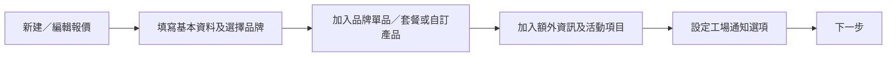

# 新建／編輯報價單 PRD（基本資料與加入貨品）

| 項目 | 內容 |
| --- | --- |
| 文件狀態 | 草案，供確認後開發 |
| 範圍 | Catering 報價的新建／編輯第一步、貨品選取、自訂產品、額外資訊、活動項目及進入下一步 |
| 參考 | 使用者提供截圖 1–9；既有 `orders`、`order_lines`、套餐、額外資訊及活動項目資料結構 |

## 1. 目標與流程

使用者可建立新報價或編輯既有報價：先填寫客戶與送貨基本資料、選擇品牌，再加入該品牌可用的單品與套餐，完成報價內容後按「下一步」前往後續確認／輸出流程。列表中的「編輯」操作必須開啟此多步驟編輯器的第一步（基本資料），而不是直接開啟 PDF 預覽或貨品頁。

本 PRD 只定義截圖所示的第一步。下一步後的頁面內容、報價轉訂單、PDF 產出由相應 PRD 定義；本頁必須先保存有效草稿／編輯資料，才可離開。

## 2. 新建與編輯共用規則

1. 「新建報價」建立一份 draft quote；在首次保存前不可產生正式報價單號，或以暫存號顯示，實際編號規則待確認。
2. 使用者從報價列表點擊「編輯」後，開啟本頁的**第 1 步：基本資料**（截圖 1）；載入既有報價、貨品、額外資訊、活動項目、備註及工場選項，保留其已保存資料。
3. 只允許編輯報價文件；已轉為正式訂單的資料不可由本頁反向覆寫，除非另有明確權限與流程。
4. 頁面頂部顯示報價編號、客戶名稱、地區、送貨日期／時段及 Asana Link（有資料時）；右上固定顯示即時計算的總額。
5. 尚有未保存修改時，離開頁面、返回列表或切換品牌前須提示使用者保存或放棄變更。

## 3. 基本資料區

依截圖 1 分成左右兩欄，支援以下欄位：

| 欄位 | 必填 | 規則 |
| --- | --- | --- |
| 報價編號 | 系統 | 已有報價顯示唯讀；新建時依編號規則處理。 |
| 品牌 | 是 | 下拉選擇品牌。品牌決定可選單品、套餐、額外資訊、活動項目、品牌 logo 及報價模板。 |
| 客人姓名 | 是 | 文字輸入／選擇既有客戶；選定既有客戶時可帶入公司、電話、電郵、地址。 |
| 公司名稱 | 否 | 文字輸入。 |
| 聯絡電話 | 是 | 主聯絡電話；可加第二聯絡電話。 |
| 電郵地址 | 是 | 須符合有效電郵格式。 |
| 客戶標籤 | 否 | 顯示／編輯客戶標籤；需使用既有客戶標籤規則。 |
| 運送方式 | 是 | 下拉選擇，例如車邊交收；選項由運送方式主檔提供。 |
| 送貨地址 | 依運送方式 | 送貨時必填；自取／車邊交收的要求待確認。 |
| 地區 | 是 | 下拉或地址帶入後可覆寫；用於送貨安排與收費。 |
| 送貨時間 | 是 | 送貨日期 Datepicker 加送貨時段下拉選單。 |
| 出車時間 | 是 | 下拉選擇出車時段。 |
| 客戶備註 | 否 | 顯示於送貨單／客戶相關文件的備註，需在 UI 清楚標示用途。 |
| 包裝備註 | 否 | 顯示於工場版面／工場文件的備註。 |
| Sales Partner | 否 | 下拉選擇有效 Sales Partner。 |
| 內部備註 | 否 | 僅內部人員可見，顯示於訂單／報價內部頁面，不輸出至客戶 PDF。 |
| Order Tag | 否 | 可多選既有報價／訂單 Tag；所選 Tag 需保存。 |

### 3.1 編輯入口與客戶資訊清除

1. 已有報價進入此頁時，頁首須顯示報價單號、客戶名稱、地區及送貨日期／時段；欄位預先填入現有 snapshot 值，與截圖一致。
2. 頁面右下方提供「清空客戶資訊」按鈕（截圖 1）：僅清空客戶姓名、公司名稱、電話、第二電話、電郵、客戶標籤及送貨地址等客戶資料欄位；**不可**清空報價編號、品牌、貨品、額外資訊、活動項目、金額、日期／時段、內部備註或工場設定。
3. 點擊「清空客戶資訊」前需顯示確認，避免誤刪；確認後只清空畫面未保存資料，需在按「下一步」或明確儲存時才寫回。
4. 「下一步」為此編輯器第 1 步的前進入口。按下後先驗證並保存第 1 步，再帶著相同報價 ID 進入第 2 步「加入貨品」；不可建立第二份報價或改變原報價 ID。

### 3.2 品牌變更

1. 選擇品牌後，貨品、套餐、額外資訊與活動項目的搜尋及推薦結果，只可顯示該品牌可用內容。
2. 若變更品牌而目前已有不屬於新品牌的項目，系統需顯示明確確認：取消變更、保留兼容項目並移除不兼容項目，或清空所有貨品後變更。最終規則需與資料模型確認；不得靜默刪除資料。
3. 品牌變更後，價格、運費、模板及稅務／折扣計算（如適用）必須重新計算。

## 4. 第 2 步：加入單品與套餐

### 4.1 加入貨品頁面

1. 基本資料保存／驗證後進入「加入貨品」視圖（截圖 2），頁首顯示所選品牌及報價摘要。
2. 使用者可輸入單品食物搜尋文字、套餐搜尋文字，並按「搜尋便當產品」開啟選取側邊欄／大型覆蓋面板。
3. 只可選取與所選品牌匹配的單品及套餐；可同一次多選，再按「確認全部加入到訂單」一次加入。
4. 已選貨品表格欄位依序為：排序、SKU、產品、數量、單價、總數、行編輯、刪除。
5. 行總數 = 單價 × 數量；報價總額為所有有效貨品、活動項目、運費及折扣的合計，並即時更新。
6. 使用者可調整數量、單價（須有價格編輯權限）、排序及刪除行項目。數量必須大於 0；刪除前需確認或提供可撤銷提示。

### 4.2 搜尋／選取側欄

1. 側欄／覆蓋面板參考截圖 4，提供：名稱／SKU 搜尋、價格範圍、主食、主要食材、特殊要求、烹煮方式及套餐／類型等可用篩選。
2. 搜尋結果每列顯示 SKU、產品名稱、主食、價錢、價格範圍、格數、主要食材、特殊要求、烹煮方式及選取狀態。
3. 側欄上方顯示「已選取」清單；下方／其後顯示「推介」商品。推介商品必須同時符合品牌可用性，並依既有推薦排序／設定展示。
4. 每個結果可選取、取消選取，並可開啟編輯／詳情；已選取項目需有明確狀態，避免重複加入。
5. 選取完成後，使用者按確認才寫入報價；取消／關閉面板時不改變現有報價。

### 4.3 行備註

1. 每一個餐品／套餐行提供展開／收起控制（截圖 3）。
2. 展開後顯示該行備註輸入區，允許輸入此餐品專用的說明，例如客製要求。
3. 行備註必須保存到該報價行，不可覆寫產品主檔資料；它是否顯示於工場單、送貨單或客戶 PDF，需由文件模板規則決定。

### 4.4 自訂產品

1. 點擊「自訂產品」開啟截圖 5 的彈窗。
2. 使用者輸入產品名稱及單價，兩者必填；單價必須為大於或等於 0 的有效金額。
3. 點擊「加入」後，建立只屬於此報價的行項目並加入貨品表格；不建立或修改全域產品主檔、不產生 SKU。
4. 自訂產品可修改名稱、單價、數量、備註及刪除，並參與總額計算。

## 5. 第 2 步：額外資訊與活動項目

### 5.1 額外資訊

1. 貨品表格下方顯示已加入的額外資訊文字，每條獨立顯示並提供移除按鈕。
2. 點擊「新增額外資訊」開啟截圖 7 的選取彈窗，提供 `Search 額外資訊 item` 搜尋與 `Add` 加入按鈕。
3. 搜尋結果來自有效的額外資訊模板；可多選／多次加入，按「確定」後套用至本報價。
4. 額外資訊不計入金額，會依模板／文件設定顯示在客戶報價、工場文件或兩者。

### 5.2 活動項目

1. 下方獨立的「活動報價」表格欄位為排序、活動報價描述、價錢與刪除操作（截圖 6）。
2. 點擊「新增活動項目」開啟截圖 8 的選取彈窗，提供 `Search 活動報價 item` 搜尋與 `Add` 加入按鈕。
3. 選擇模板後加入活動項目；可加入多項、刪除已加項目及調整排序。項目價錢會計入總額。
4. 若需要自訂活動項目名稱與價錢，必須另行定義；本期截圖只明確要求從既有活動項目模板選取。

## 6. 第 2 步完成與下一步

1. 頁面末端提供「不傳送至工場」及「不通知工場有更改」核取方塊（截圖 9）。
2. 「不傳送至工場」：本報價／日後轉出的訂單不建立或發送工場處理資料。它只可由具工場控制權限的使用者選取。
3. 「不通知工場有更改」：儲存修改時不發送工場變更通知，但仍保存內容。此選項不會自動改變「已傳送至工場」狀態。
4. 選擇「不傳送至工場」時，「不通知工場有更改」應停用或清除，因為沒有工場資料可通知。
5. 在第 2 步按「下一步」時，系統驗證所有必填欄位、品牌相容性及貨品數量／金額。驗證成功後先原子保存報價與其子項目，再進入尚待確認的第 3 步；失敗時留在原頁並將錯誤標示於對應欄位。
6. 所有未儲存的新增、修改、移除均不得在「下一步」失敗時留下部分資料。

## 7. 資料、權限與驗收

### 7.1 資料與權限

| 項目 | 需求 |
| --- | --- |
| 報價主資料 | 使用 `orders` 的 quote 文件與客戶／送貨 snapshot；新增地區、送貨時段、Asana Link／工場控制欄位時需確認現有欄位或 migration。 |
| 貨品與套餐 | 使用品牌／渠道可用的 products、packages 及其關聯；報價行使用 `order_lines` snapshot。 |
| 行備註 | 保存至對應 `order_lines` 備註欄位或新增明確欄位。 |
| 額外資訊 | 使用報價專用額外資訊模板與報價 snapshot；現有 `order_bento_additional_items` 可作資料模型候選，需確認其業務名稱與內容欄位。 |
| 活動項目 | 使用活動項目模板與報價 snapshot；現有 `order_bento_event_parts` 可作資料模型候選。 |
| 編輯權限 | 只有具報價建立／編輯權限者可修改資料、加減貨品及按下一步。價格編輯、工場控制及刪除操作應可設獨立權限。 |

### 7.2 驗收標準

1. 使用者從列表點擊編輯後會開啟第 1 步基本資料頁，既有資料正確帶入；清空客戶資訊只影響指定客戶欄位，且需確認後才生效。
2. 使用者可新建及編輯報價，填寫第 3 節欄位，必填欄位缺漏時不能進入下一步。
3. 第 1 步按下一步後，使用同一報價 ID 進入第 2 步，且不重複建立報價。
4. 選擇品牌後，只能搜尋及加入該品牌的單品、套餐、推薦商品、額外資訊及活動項目；變更品牌不會靜默遺失不兼容項目。
5. 使用者可在側欄多選單品／套餐，確認後一次加入；每行可修改數量、允許時修改單價、刪除及輸入／保存行備註。
6. 自訂產品可用名稱及單價加入，且只屬於該報價，不污染全域產品資料。
7. 額外資訊可搜尋、加入及移除，且不計入總額；活動項目可搜尋、加入、移除，且正確計入總額。
8. 選取「不傳送至工場」或「不通知工場有更改」時，行為符合第 6 節且受權限保護。
9. 按下一步會原子保存所有有效報價資料；任一驗證或儲存失敗時不得留下部分貨品、額外資訊或活動項目。

## 8. 開發前待確認事項

1. 報價的新建時何時產生正式報價編號？是否容許未完成資料先存草稿？
2. 哪些欄位在不同運送方式下為必填，地區如何由地址帶出／覆寫？
3. 品牌變更時，使用者是否可保留不屬於新品牌的既有行，還是必須全部移除？
4. 推介商品的來源及排序規則是甚麼？是否按品牌、Tag、歷史選取或人工配置？
5. 行備註分別在哪些文件（客戶 PDF、工場單、送貨單）顯示？
6. 額外資訊與活動項目的完整主檔、是否有品牌限制、是否允許自訂及是否可重複加入？
7. 「不傳送至工場」與「不通知工場有更改」在報價階段、轉為訂單時及已傳送工場後的確切規則是甚麼？
8. 「下一步」的下一個頁面是付款／條款設定、預覽還是其他流程？
