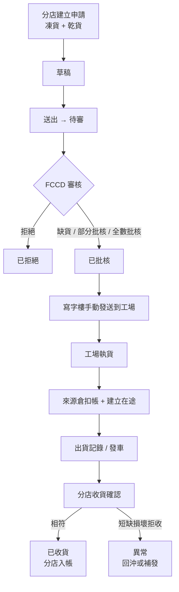

# 分店凍貨／乾貨訂貨與 Shop HR PRD

| 項目 | 內容 |
| --- | --- |
| 文件版本 | 1.2 |
| 文件日期 | 2026-09-03 |
| 文件狀態 | Phase 1 與 Phase 2 主要業務規則已確認，可進入 OpenSpec／實作規劃 |
| 所屬模塊 | 餐廳／分店營運、凍貨、乾貨、工場、人力資源 |
| 主要使用者 | Shop Manager、Shop HR、寫字樓審核、工場、Accounting、Admin／Super Admin |
| 目標 | 讓旗下餐廳向中央廚房訂凍貨與乾貨；FCCD 保存存貨與出貨記錄；訂貨先待審、審核後才發送到工場。後續再補齊 Shop Manager 與 Shop HR 的人事能力 |
| 參考 | `docs/API_FUNCTIONAL_PRD.md` §5.8 TRF、§5.11 ROS；`docs/SITEMAP.md` 餐廳訂貨；`docs/architecture/functional-catalog.md` F-FROZEN／F-FACTORY／F-RESTAURANT；`docs/PERMISSION_SITEMAP.md` |

| 版本 | 日期 | 修訂 |
| --- | --- | --- |
| 1.0 | 2026-09-03 | 初稿。 |
| 1.1 | 2026-09-03 | 收錄業務確認：第一批只將軍澳、寫字樓審核、先批再手動傳工場、無截單但必填送貨日期、下單不顯示價格、一次出完、現有主檔加「分店可訂」、不停舊 `meat_orders`、Shop HR 獨立角色、打卡先做網頁。補充乾貨現況盤點。MPF 改為待確認。 |
| 1.2 | 2026-09-03 | 確認 Phase 2 要做 MPF 紀錄；乾貨庫存不足或無即時結餘時工場警示但仍可出貨。 |

### 0.1 已確認決策（2026-09-03）

| 主題 | 決定 |
| --- | --- |
| 第一批店舖 | 只將軍澳店；資料模型仍按多店設計，但本期權限與驗收只開這一家。 |
| 審核 | 寫字樓人員審核；店長不可批核。 |
| 傳工場 | 先批核，再由寫字樓**手動**發送到工場；批核不會自動發送。 |
| 截單 | **沒有**每日截單鐘點。 |
| 送貨日期 | 下單必填送貨日期（香港日曆）。 |
| 價格 | 分店下單頁不顯示成本或轉撥價。 |
| 出貨 | 一張申請一次出完，不允許分批。 |
| 目錄 | 用現有凍貨／乾貨主檔，加「分店可訂」標記；不另建第二套商品。 |
| 舊凍肉店舖單 | **不停** `meat_orders`；新補貨與舊路徑並行。店舖訂貨數量報告暫維持讀舊表。 |
| Shop HR | **獨立系統角色**，不是 Shop Manager 的子權限包。 |
| 打卡 | Phase 2 先做**網頁**打卡，不接考勤機、不強制定位。 |
| MPF | **要做**。Phase 2 記錄強積金供款（手記，非法定計算／申報）。見 §11.3。 |
| 乾貨庫存不足 | **警示但仍可出**。工場看到上次盤點不足、為零或未盤點時要警示，不阻擋出貨。 |

## 1. 背景與問題

FCCD 以「到會＋荃灣中央廚房＋分店」運作。分店（例如將軍澳、中露點及其他旗下餐廳）日常要向中央廚房補凍貨、乾貨及半成品，這是**內部補貨**，不是供應商採購，也不是到會客戶訂單。

現行系統已有：

| 已有能力 | 現況 | 缺口 |
| --- | --- | --- |
| 餐廳每日銷售、採購、盤點、月度支出 | `/restaurant/*` 已上線 | 採購是店舖對外買入，不是向 FCCD 訂貨 |
| 餐廳員工主檔 | `/restaurant/staff` 只有姓名、電話、店舖、部門、僱傭類型、啟用 | 沒有假期申請、更表實作、打卡、MPF 紀錄 |
| 假期／更表時間 | settings 字典，只管理「假期類別」與「更表時段」 | 不是真實請假紀錄或排班 |
| 凍貨存貨與出貨 | 生肉／製成品存貨、`meat_orders`、出貨單、工場板 | `meat_orders` 以凍肉客戶為主，不是餐廳自助訂貨＋審核流 |
| 店舖訂貨數量報告 | `reports.shop_order_quantities` 聚合 `meat_orders` | 只讀匯總，沒有下單頁 |
| 乾貨／廚房食材 | `/kitchen/ingredients`、包裝與盤點 | 沒有分店申請、審核、出倉、在途、收貨 |
| 角色 `Shop manager` | 系統角色已存在，主要看餐廳營運頁 | 沒有獨立 Shop HR 角色或人事工作區 |
| Sitemap「餐廳訂貨」 | 已列入產品樹 | 頁面與資料模型未實作 |

`docs/API_FUNCTIONAL_PRD.md` 已定義內部補貨 TRF-01～TRF-07，以及排班 ROS-01～ROS-06（當時標為待定）。本 PRD 把這些需求收斂成可實作的產品規格，並補上審核後才傳工場、以及後續 Shop HR。

## 2. 產品目標

使用者可以：

1. 餐廳在一個頁面同時訂**凍貨**與**乾貨**（可含半成品），指定數量、單位、送貨日期及備註。
2. 送出後進入**待審**；FCCD 可全數批核、部分批核、拒絕或標記缺貨。
3. 只有已批核的申請才**發送到工場**；工場看到執貨／出貨工作，而不是未審草稿。
4. FCCD 對每一筆出貨寫入**存貨扣減**與**出貨記錄**（批次、實發量、操作者、車次／時間）。
5. 分店收貨時確認實收；短缺、損壞、拒收要留下異常，並可回沖或補發。
6. 之後在同一分店工作區擴充 **Shop Manager** 營運與獨立角色 **Shop HR** 人事：同事列表、同事假期、更表、網頁打卡、MPF 紀錄。

## 3. 範圍與分期

### 3.1 Phase 1（本期必做）：分店訂凍貨／乾貨

- 餐廳訂貨頁（建立、草稿、送審、查看本店申請）。
- FCCD 待審／審核頁（批核、部分批核、拒絕、缺貨）。
- 審核後發送到工場；工場執貨與出貨。
- FCCD 存貨出貨記錄（來源倉扣帳、在途、出貨單據）。
- 分店收貨確認與數量差異。
- 權限、RLS、審計、列表／詳情頁。
- 與現有凍貨存貨、廚房食材主檔、工場板、店舖訂貨數量報告對齊或銜接。

### 3.2 Phase 2（已鎖定方向，本期不實作）：Shop HR ＋ Shop Manager

- Shop Manager：本店同事、更表、假期覆核、訂貨與日常營運入口。
- Shop HR（獨立角色）：同事列表、同事假期、網頁打卡／出勤、MPF 供款紀錄。
- 更表與打卡的工時可回寫現有「銷售工時／銷售薪酬」報告口徑（實作時再對帳）。

### 3.3 不包含

- 到會客戶下單、報價轉單、Shopify 訂單。
- 分店向外部供應商採購（沿用 `/restaurant/daily-purchases`）。
- 完整總帳、薪資自動出糧、強積金法定計算引擎、稅務申報。
- 自動補貨建議（Sitemap「主動訂貨（低庫存）」仍屬跟進／第二階段）。
- 客戶自助、司機代收、考勤機／定位打卡（Phase 2 只做網頁打卡）。
- 更改現有生肉／製成品成本公式或供應商 PDF 報價流程。

## 4. 名詞

| 名詞 | 定義 |
| --- | --- |
| 分店／餐廳 | `restaurants` 主檔中的實體店；一張申請只屬一間店。 |
| 內部補貨申請 | 分店向中央廚房要貨的文件，不是 `orders` 到會訂單，也不是供應商採購。 |
| 凍貨 | 可由分店訂購的生肉、製成品或其他凍倉品項；來源為凍貨主檔且標記「分店可訂」。 |
| 乾貨 | 可由分店訂購的食材、包裝或其他乾貨倉品項；來源為廚房／乾貨主檔且標記「分店可訂」。 |
| 待審 | 分店已送出、FCCD 尚未完成審核的狀態。 |
| 發送到工場 | 已批核申請寫入工場工作視圖，供執貨／列印／出貨；未審核不得出現。 |
| 存貨記錄 | 中央廚房來源倉的不可變庫存流水（入、出、在途、回沖、盤差）。 |
| 出貨記錄 | 一次實際發貨的單據：實發量、批次、操作者、車次／出發時間、在途狀態。 |
| Shop Manager | 分店營運角色；管本店訂貨、收貨、同事與更表（Phase 2 完整化）。 |
| Shop HR | 獨立系統角色；管同事資料、假期、網頁打卡、MPF 紀錄（Phase 2）。 |
| 送貨日期 | 分店下單時必填的希望送到日期；沒有截單鐘點。 |
| 同事 | 餐廳員工，現有 `restaurant_staff`；與登入帳號可關聯但不是同一實體。 |

## 5. 角色與權限意圖

沿用現有 `canAccess`／`canManage` 及 page key／action key 模型。新增 page keys，不把寫入只做在前端。

| 角色 | Phase 1 | Phase 2 |
| --- | --- | --- |
| Shop Manager | 建立／送出將軍澳店申請、查看本店狀態、確認收貨；**不可審核** | 本店同事、更表、假期申請覆核 |
| Shop HR（獨立新角色） | 預設不開放訂貨審核或中央庫存 | 同事列表、假期、網頁打卡；預設只看獲授權店舖 |
| Factory | 只處理**已手動發送工場**的執貨／出貨 | 不處理人事 |
| 寫字樓（Admin／獲授權營運） | 審核待審單；批核後再手動發送到工場；管理可訂目錄 | 可覆核跨店人事設定 |
| Accounting | 只讀申請、出貨與收貨差異（可另開報表權限） | 只讀工時與 MPF 匯出 |
| Company User | 依 page rows；不可審核或改庫存 | 依授權 |

約束：

1. Shop Manager **不可**批核申請。審核權只給寫字樓（`shop.replenishment.review`）。
2. 工場**不可**把待審申請執貨或扣倉。
3. 分店使用者只能看本店申請與本店庫存收貨；不能看其他店數量，也不能看中央倉即時結餘的完整明細（可顯示「可訂／暫缺」而不顯示實際公斤數，除非另授權）。
4. 所有狀態變更必須 server-side RPC／RLS 強制，並寫審計。

建議 page keys（實作時再落入 migration）：

| Key | 用途 |
| --- | --- |
| `restaurant.replenishment` | 餐廳訂貨列表／詳情 |
| `restaurant.replenishment.create` | 建立／編輯草稿／送審 |
| `restaurant.replenishment.receive` | 分店收貨 |
| `shop.replenishment.review` | FCCD 待審與批核 |
| `shop.replenishment.catalog` | 可訂目錄維護 |
| `factory.shop_replenishment` | 工場分店執貨／出貨 |
| `shop.hr`、`shop.hr.staff`、`shop.hr.leave`、`shop.hr.mpf`、`shop.hr.attendance` | Phase 2 |
| `shop.manager.roster` | Phase 2 更表 |

## 6. Phase 1 使用流程



狀態只允許下列轉換。取消只能由草稿或待審（審核前）發生；已出貨後用回沖，不刪單。

```text
draft ──submit──► pending_review ──approve──► approved ──send_factory──► sent_to_factory
        │                    │
        │                    └──reject──► rejected
        └──cancel──► cancelled
pending_review ──cancel──► cancelled

sent_to_factory ──picking──► picking ──ship──► in_transit ──receive──► received
in_transit ──exception──► exception
received / rejected / cancelled / exception 為終態或需補發單另開
```

部分批核：申請頭進入 `approved`，被拒行標記 `line_rejected`／`out_of_stock`，已批行才進入工場。

## 7. Phase 1 畫面

列表遵循 `docs/UI_TABLE_STANDARD.md`：每頁 15 筆、表頭固定、伺服器分頁、桌面表／手機卡。

### 7.1 餐廳訂貨 `/restaurant/replenishment`

對應 Sitemap「餐廳訂貨」。第一批只開將軍澳；Shop Manager 只見本店。

**列表欄位：** 申請編號、店舖、建立者、送貨日期、凍貨項數、乾貨項數、狀態、審核者、工場發送時間、出貨／收貨狀態、操作。

**篩選：** 狀態、送貨日期範圍、關鍵字（編號／品項）。

**新建／編輯（草稿）：**

| 欄位 | 規則 |
| --- | --- |
| 店舖 | 必填；Shop Manager 鎖定本店（本期＝將軍澳） |
| 送貨日期 | 必填；香港日曆。**無截單鐘點**；不可早於今天 |
| 價格 | 不顯示成本、售價或轉撥價 |
| 備註 | 選填 |
| 明細 | 至少一行；可混凍貨與乾貨 |
| 品項 | 只可選「分店可訂」且啟用的目錄 |
| 數量 | 必須 > 0；遵守品項小數位與單位 |
| 單位 | 預填目錄單位；轉換只允許已核准單位表 |
| 行備註 | 選填，例如「急」「不要代用品」 |

操作：保存草稿、送審、撤回待審（僅 `pending_review` 且無人開始審核）、複製為新草稿。已批核後不可改量，只能由 FCCD 開調整／補發。

### 7.2 FCCD 待審 `/shop/replenishment/review`（或 `/frozen`／營運下的待審列表）

給寫字樓審核者（Admin／獲授權營運）。Shop Manager 不可進入。

- 待審佇列預設只顯示 `pending_review`。
- 可一次批核整張，或逐行改「核准數量」。
- 核准數量不可大於申請量；0 視為該行拒絕或缺貨，須選原因。
- 批核後停留在 `approved`，**必須再按「發送到工場」**才會出現在工場佇列。
- 拒絕整張必須填原因，分店可見。

### 7.3 工場分店執貨

工場現有板以到會 `deliveries`／`meat_orders` 為主。分店補貨**另開佇列或明確分組**，避免和工作餐單混在一起。

工場可見：店舖、送貨日期、已核准行、倉區（凍房／乾貨倉）、建議批次、列印執貨單。

工場不可見：未發送工場的申請、被拒行、成本價（除非另授權）。

操作：開始執貨 → 輸入實發量 → 確認出貨。實發量不可超過核准量，除非有「超發」權限（本期預設不開放超發）。上次盤點不足、為零或未盤點時顯示警示，**不阻擋出貨**。

### 7.4 FCCD 存貨與出貨記錄

FCCD 要能追溯每一筆中央倉進出，不可只改結餘。

**存貨記錄（沿用不可變流水原則，INV-03／INV-04）：**

- 出倉：來源倉（凍房或乾貨倉）扣減，關聯申請行、批次、操作者、時間。
- 在途：出倉後、分店確認前。
- 分店入帳：收貨確認後寫入分店庫存，不覆蓋盤點歷史。
- 回沖：拒收、短少確認或取消在途時產生反向流水，不刪原紀錄。

凍貨優先寫入現有 `raw_meat_stock_movements`／`prepared_meat_stock_movements`（或同等 RPC），並帶補貨申請參照。

乾貨現況見 §9.1：中央廚房只有食材／包裝**盤點快照**，沒有出入倉流水。本期必須新增乾貨出倉／在途／回沖流水；**不可**把出貨量直接寫進或覆蓋 `ingredient_stocktake_events`／`packing_stocktake_events`。盤點仍是定期盤點，可作工場「上次盤點數」參考，不是即時結餘。

**出貨記錄：**

| 欄位 | 說明 |
| --- | --- |
| 出貨編號 | 系統產生 |
| 申請編號 | **一張申請一次出完**；不可分批出貨 |
| 店舖、出發時間、車次／司機（可空） | 物流追蹤 |
| 操作者 | 工場帳號 |
| 行：品項、核准量、實發量、批次、倉區 | 實發量寫入存貨流水 |
| 狀態 | picking／shipped／in_transit／received／exception |

出貨記錄頁供 FCCD 查詢與匯出；分店只看自己的在途與已收。

### 7.5 分店收貨

Shop Manager（或獲授權店舖同事）對 `in_transit` 確認：

- 每行實收數量、收貨人、時間。
- 相符 → `received`，分店庫存入帳。
- 短缺／損壞／拒收 → `exception`，必須填原因；系統建立待處理異常，由 FCCD 決定補發或回沖。

## 8. Phase 1 功能需求

延續並具體化 TRF-01～TRF-07。

| 編號 | 需求 | 優先 |
| --- | --- | --- |
| REP-01 | 分店可建立補貨申請，指定店舖、**送貨日期**、備註，以及凍貨／乾貨明細（品項、數量、單位、行備註）。下單不顯示價格。 | P0 |
| REP-02 | 同一張申請可混合凍貨與乾貨；系統按倉區拆給工場執貨，但不要求分店開兩張單。 | P0 |
| REP-03 | 只有「分店可訂」且啟用的品項可被加入；下架後既有行保留快照名稱／單位，不可再新增。 | P0 |
| REP-04 | 送審後進入待審；草稿可刪或取消；待審可在審核開始前撤回。 | P0 |
| REP-05 | FCCD 可全數批核、部分批核、拒絕或標記缺貨；部分批核逐行保存核准量與原因。 | P0 |
| REP-06 | 未批核不得發送到工場；工場佇列不得出現 `draft`／`pending_review`／`rejected`。 | P0 |
| REP-07 | 發送到工場是批核之後的**另一次手動動作**；批核不得自動發送。 | P0 |
| REP-08 | 執貨時按乾貨倉或凍房扣減來源庫存，並建立在途；扣帳與出貨記錄同一交易，失敗則全滾回。 | P0 |
| REP-09 | 出貨記錄保存批次、實發數量、操作者、車次及出發時間。 | P0 |
| REP-10 | 分店收貨確認實收數量、時間及收貨人；預設實收＝實發，可改。 | P0 |
| REP-11 | 短缺、損壞、拒收或數量差異建立異常，並可回沖或另開補發申請。 | P0 |
| REP-12 | 申請、批核、執貨、在途、已收貨、取消及異常狀態均可在列表與詳情追蹤，含操作者與時間。 | P0 |
| REP-13 | 工作流重試不得重複扣帳、重複出貨或重複入帳（冪等 key）。 | P0 |
| REP-14 | 庫存不足、上次盤點為零或未盤點時工場**必須警示，但仍可出貨**。乾貨沒有即時結餘時同樣處理。不阻擋出貨、不把出貨寫成假盤點。 | P0 |
| REP-15 | FCCD 可維護可訂目錄（凍貨／乾貨、單位、最低訂量、排序、暫缺）。 | P1 |
| REP-16 | **不停**舊 `meat_orders`。店舖訂貨數量報告本期繼續讀舊表；新補貨報告可另開，不強制切換。 | P1 |
| REP-17 | 跟進頁可顯示本店或全公司的待審／未收貨補貨（沿用現有 follow-up 模式）。 | P2 |
| REP-18 | 分店不可看見其他店申請與中央倉完整結餘明細。 | P0 |
| REP-19 | 所有寫入經 RLS／RPC 檢查 page access；匿名拒絕。 | P0 |
| REP-20 | 列表、篩選、空／錯／權限狀態符合 UI 表格標準；手機可完成送審與收貨。 | P0 |

## 9. Phase 1 資料模型（建議）

不把補貨寫進到會 `orders`。`meat_orders` **繼續存在、繼續可新增**；新補貨用獨立文件並行。

| 實體 | 用途 |
| --- | --- |
| `shop_replenishment_orders` | 申請頭：店舖、申請人、送貨日期、狀態、審核者、發送工場時間、備註 |
| `shop_replenishment_lines` | 行：品項類型（frozen_raw／frozen_prepared／dry／packing）、品項 ID、申請量、核准量、實發、實收、單位快照、行狀態 |
| `shop_replenishment_events` | 狀態與審核審計 |
| `shop_shipments`／`shop_shipment_lines` | 出貨記錄；一申請一張出貨單 |
| `shop_shipment_exceptions` | 收貨異常 |
| 現有凍貨 movement | 凍貨出倉／回沖 |
| **新**乾貨 movement | 乾貨倉出倉／在途／回沖（現況沒有此表，必須新增） |
| 分店入庫流水 | 收貨入店舖庫存；不覆蓋 `restaurant_stocktake_events` |
| 現有主檔 + `shop_orderable` | 凍貨 `raw_meat_items`／`prepared_meat_items`、乾貨 `ingredients`（含包裝盤點旗標） |

品項快照：下單時複製名稱、單位、倉區，避免主檔改名導致歷史單失真。

編號規則：建議 `SR-YYYYMMDD-####`（Shop Replenishment），與到會訂單號碼分開。

### 9.1 乾貨現況（已查程式）

中央廚房乾貨**不是**獨立倉存系統，現況如下：

| 資料 | 用途 | 能否當分店訂貨來源 |
| --- | --- | --- |
| `ingredients` | 廚房食材主檔：名稱、SKU、單位、成本、啟用；可用 `is_ingredient_stocktake`／`is_packing_stocktake` 標成食材或包裝盤點 | **可以**。本期在此加「分店可訂」，作為乾貨／包裝可訂目錄 |
| `packing_materials` | 舊包裝名稱表，功能已收斂到 `ingredients` 的包裝盤點旗標 | 不作為訂貨主檔 |
| `ingredient_stocktake_events`／`packing_stocktake_events` | 某日某品項的**盤點快照**（點算數量） | 只能參考「上次盤了多少」；**不是**即時結餘，也不能當出貨單 |
| `restaurant_ingredients` | 分店自己對外買貨的食材名單（跟供應商採購） | **不是**中央廚房乾貨倉，訂貨目錄不用這張表 |
| 乾貨出入倉流水 | **不存在** | 出貨給將軍澳時必須新建 movement，否則 FCCD 沒有存貨出貨記錄 |

結論：乾貨目錄用現有 `ingredients` +「分店可訂」。出貨必須新建乾貨流水。工場用最近一次盤點量作參考：不足、為零或未盤點時**警示但仍可出**。不把出貨回寫成一筆假盤點。

## 10. 營運規則

| 規則 | 狀態 | 內容 |
| --- | --- | --- |
| 適用店舖 | **已確認** | 第一批只將軍澳。表結構預留多店，但不開其他店入口。 |
| 截單 | **已確認** | 無每日截單。 |
| 送貨日期 | **已確認** | 必填；不可早於今天。 |
| 審核人 | **已確認** | 寫字樓審核；店長不可批。 |
| 批核後發送 | **已確認** | 先批、再手動發工場。 |
| 價格 | **已確認** | 分店下單不顯示任何價格。 |
| 分批出貨 | **已確認** | 一次出完。 |
| 目錄 | **已確認** | 現有凍貨／`ingredients` 加「分店可訂」。 |
| 與 `meat_orders` | **已確認** | 不停舊單；報告暫不切換。 |
| 乾貨庫存不足 | **已確認** | 警示但仍可出。 |
| MPF | **已確認** | Phase 2 要做供款紀錄（手記）。 |
| 最低訂量 | 可後補 | 目錄可設；第一期可空。 |
| 代用品 | 維持假設 | 工場不可擅自換貨。 |

## 11. Phase 2：Shop Manager ＋ Shop HR

本期只定產品邊界與需求方向，不開實作任務。現有員工主檔、假期類別、更表時段是主檔，不是本模組完成態。

```text
餐廳工作區
├─ 營運（現有）每日銷售／採購／盤點／支出／訂貨
├─ Shop Manager
│  ├─ 同事列表（本店）
│  ├─ 更表
│  └─ 假期覆核（本店）
└─ Shop HR（獨立角色）
   ├─ 同事列表（授權店）
   ├─ 同事假期
   ├─ 更表（可與 Manager 共用資料）
   ├─ 網頁打卡／出勤
   └─ MPF 紀錄
```

### 11.1 同事列表

延伸 `restaurant_staff`，不是另做一套員工。

| 編號 | 需求 |
| --- | --- |
| HR-01 | 維護同事姓名、電話、店舖、部門、全／兼職、入職／離職、啟用狀態。 |
| HR-02 | 可關聯公司登入帳號（現有 employee login），但沒有帳號的同事仍可存在。 |
| HR-03 | Shop Manager 只看本店；Shop HR／Admin 按授權看多店。 |
| HR-04 | 停用同事不得刪除歷史假期、MPF、打卡與更表。 |

### 11.2 同事假期

現有 `restaurant.settings.holidays` 只是假期**類別**。

| 編號 | 需求 |
| --- | --- |
| HR-05 | 同事可申請或由主管代記假期：同事、類別、日期範圍、日數、狀態（申請／批准／拒絕／取消）。 |
| HR-06 | 與更表衝突時警示；是否自動抽走班次待確認。 |
| HR-07 | 批准後可供工時／薪酬報告使用；未批准不計已放假。 |

### 11.3 MPF 紀錄

香港強制性公積金供款紀錄。Phase 2 **要做**。只做手記／匯入與審計，不做法定自動計算或電子申報。

| 編號 | 需求 |
| --- | --- |
| HR-08 | 按同事、月份保存供款紀錄：僱員部分、僱主部分、工資基數、狀態、備註、憑證附件。 |
| HR-09 | 可手輸入或匯入，保留誰改了什麼；不做自動計算引擎。 |
| HR-10 | 僅 Shop HR、Accounting、Admin 可見。 |

### 11.4 更表

對齊 ROS-01～ROS-06，使用已有更表時段字典。

| 編號 | 需求 |
| --- | --- |
| HR-11 | 依店舖、部門、日期、同事與時段建立更表。 |
| HR-12 | 檢查假期、重疊、跨日與可用時段。 |
| HR-13 | 計算每日／每週工時；時區固定 Asia/Hong_Kong。 |
| HR-14 | 自動排班若做，必須可手動改並留變更紀錄；重跑不得複製班次。第一期可只做手動更表。 |

### 11.5 打卡

| 編號 | 需求 |
| --- | --- |
| HR-15 | 同事可在系統打上班／下班（及休息開始／結束，若業務需要）。 |
| HR-16 | 記錄時間、店舖、來源（**網頁**）、操作者；不接實體機、不強制定位或店內網絡。 |
| HR-17 | Shop Manager／Shop HR 可看本店出勤、補打卡（需原因與審計）。 |
| HR-18 | 打卡與更表可對照異常（遲到、缺勤、未打卡）；公式待確認後才寫進薪酬報告。 |

### 11.6 Phase 2 非目標

- 自動出糧、IR56、強積金電子申報。
- 跨店任意調班而不經授權。
- 用假期類別頁冒充請假流程。
- 在 Phase 1 訂貨上線前先做完整 HR（可並行設計，不可阻擋訂貨）。

## 12. 與現有模組的邊界

```text
分店訂貨申請 ──審核──► 工場執貨 ──► 中央倉存貨流水
       │                    │
       │                    └──► 出貨記錄 ──► 分店收貨 ──► 分店庫存
       │
       └──✗ 不到會 orders / Shopify / 報價
       └──✗ 不寫入 restaurant_supplier_purchases
       └──✗ 不直接改 restaurant_stocktake_events 歷史

Shop HR / 更表 / 打卡
       └── 延伸 restaurant_staff、holidays 類別、roster_times
       └── 可被 reports.shop_sales_working_hours / sales_salary 消費
       └── 不參與工場列印或中央倉扣帳
```

| 現有模組 | 關係 |
| --- | --- |
| `/restaurant/daily-purchases` | 對外採購；補貨不走此頁 |
| `/restaurant/inventory` | 盤點；收貨入帳是另一條流水，盤點差異另計 |
| 凍貨生肉／製成品存貨 | 中央凍倉事實來源；補貨出貨必須留 movement |
| `/factory` | 到會生產板保留；分店補貨另組 |
| `report_shop_order_quantities` | 繼續讀 `meat_orders`；新補貨另計，本期不強制切換 |
| `/restaurant/staff` 與假期／更表設定 | Phase 2 的主檔，不在 Phase 1 重做 |

## 13. UX 與實作約束

1. 中文為預設 UI；新字串走 `src/i18n.ts`。
2. 遵循 `docs/UI_DEVELOPMENT_STANDARD.md` 與 `docs/DESIGN_SYSTEM.md`：全寬、狀態色、權限隱藏寫入按鈕。
3. 純函式放 `src/lib/`，頁面元件不在 `App.tsx` 匯出業務函式。
4. 新增 action 必須有 SQL／RPC 強制，不可只靠 nav 隱藏。
5. 私人附件（收貨異常照片、MPF 憑證）走 private bucket，不可公開 URL。
6. 時區一律 Asia/Hong_Kong 營業日。
7. 測試只覆蓋本需求相關頁、RPC、權限與狀態機；不因此重跑全量當開發迴圈。

## 14. 驗收（Phase 1）

1. 將軍澳 Shop Manager 可建立混合凍貨＋乾貨申請並送審；其他店資料不可見；下單看不見價格。
2. 待審單在工場不可見；寫字樓批核後仍不可見，**手動發送**後工場才可見已核准行。
3. 部分批核後，被拒行不出貨，已核准行可執貨。
4. 出貨後中央倉結餘減少，出貨記錄與存貨流水量一致；重試同一出貨不重複扣帳。
5. 分店確認實收後店舖庫存增加；短少建立異常且可回沖。
6. 拒絕／取消有原因與審計；已出貨單不能當草稿刪除。
7. Accounting 無審核權限時不能批核或扣倉。
8. 匿名與缺 page key 的帳號讀寫均被拒絕。

Phase 2 驗收在該期 PRD 修訂後另列。

## 15. 尚餘問題

實作前可再核對，不阻擋 Phase 1 開規格：

1. 將軍澳在 `restaurants` 主檔要用哪一筆（名稱／代號）綁第一批權限。
2. 寫字樓審核要掛在現有 Admin，還是另開「營運審核」權限給指定同事。

## 16. 建議下一步

1. 以本 PRD 開 OpenSpec change（例如 `add-shop-replenishment`），產出 design／delta specs／tasks 後再實作 Phase 1。
2. Phase 2（Shop HR／更表／打卡／MPF）另開 change，避免與訂貨狀態機綁在同一實作批次。
