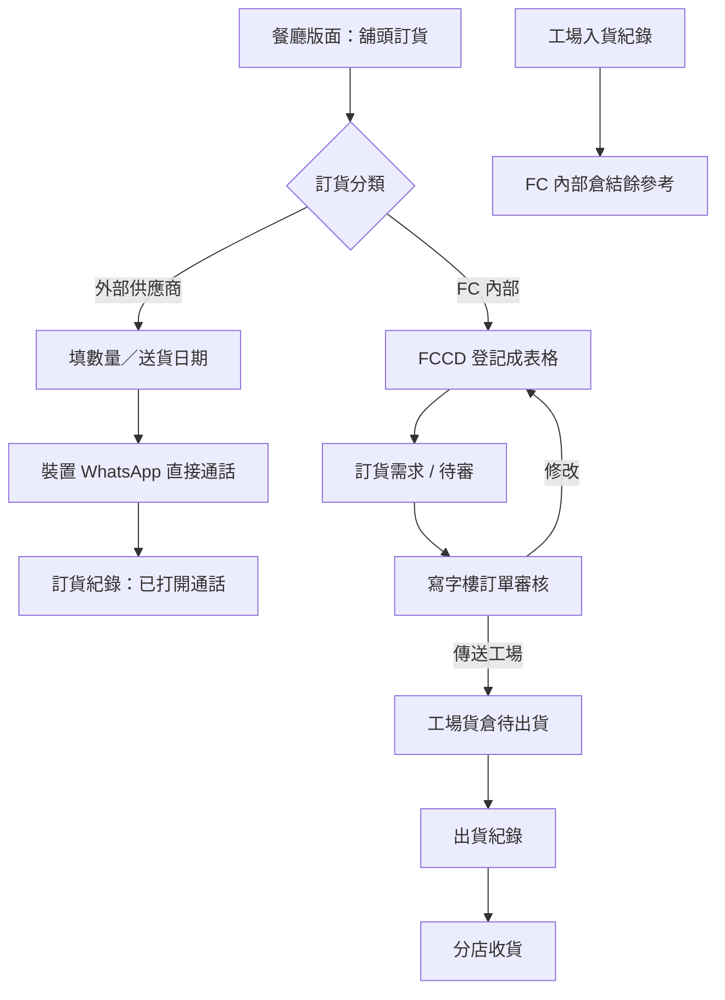

# 分店凍貨／乾貨訂貨與 Shop HR PRD

| 項目 | 內容 |
| --- | --- |
| 文件版本 | 2.6 |
| 文件日期 | 2026-09-03 |
| 文件狀態 | Phase 1 規則已齊。主頁、應徵、員工、打卡入口、生日日曆已對截圖。打卡明細、新增活動表單與其餘 HR 內頁仍待補。疫苗接種記錄不做。 |
| 所屬模塊 | 餐廳版面、餐廳訂貨、凍貨、乾貨、工場貨倉、人力資源 |
| 主要使用者 | 餐廳同事／Shop Manager、寫字樓審核、工場、Shop HR、Accounting、Admin／Super Admin |
| 目標 | 旗下餐廳用獨立餐廳版面做每日營運與訂貨；外部供應商用 WhatsApp 直接通話，FC 內部在 FCCD 登記後經 Admin 修改或傳送工場；工場貨倉可入貨與出貨。後續再補 Shop HR。 |
| 參考 | `docs/API_FUNCTIONAL_PRD.md`；`docs/SITEMAP.md`；`docs/reference/restaurant-supplier-catalog.csv` |

| 版本 | 日期 | 修訂 |
| --- | --- | --- |
| 1.0 | 2026-09-03 | 初稿。 |
| 1.1 | 2026-09-03 | 第一批只將軍澳、寫字樓審核、先批再手動傳工場、無截單、不顯示價格、一次出完、現有主檔加「分店可訂」、不停舊 `meat_orders`、Shop HR 獨立角色、網頁打卡。 |
| 1.2 | 2026-09-03 | Phase 2 要做 MPF；乾貨庫存不足警示但仍可出。 |
| 1.3 | 2026-09-03 | 整理二級頁：供應商列表、訂貨需求（外部 WhatsApp／自己倉登記）、訂貨紀錄、供應商電話簿；舖頭訂貨 URL；訂單審核可改單或傳工場；工場貨倉入＋出貨；獨立餐廳版面含現有每日銷售等營運頁。 |
| 1.4 | 2026-09-03 | 外部供應商訊息改走現有 WATI 管道（新範本，核准後才可發送）。外部可訂品項來源維持未定。 |
| 1.5 | 2026-09-03 | 依《餐廳供應商產品清單》確認分類為 **FC 內部** 與 **外部供應商**。可訂目錄以該清單為準，不再在「餐廳食材 vs 另維簡表」之間懸空。Excel 檔尚未能讀取。 |
| 1.6 | 2026-09-03 | 已讀清單：欄位為編號／貨品名稱／單位／供應商名稱。FC 內部＝`FC_凍肉`（14）＋`FC_乾貨`（131）；外部 13 家共 271 項。匯出 `docs/reference/restaurant-supplier-catalog.csv`。 |
| 1.7 | 2026-09-03 | 清單供應商對現有 FCCD `suppliers`：13／15 可對上（含別名與停用淘大）。`FC_凍肉`／`FC_乾貨` 都掛 `FC-總部`。浚峰、益力多無主檔。 |
| 1.8 | 2026-09-03 | 淘大啟用；新建浚峰企業有限公司、益力多公司。清單 15 間全部有 `suppliers.id`。 |
| 1.9 | 2026-09-03 | 確認 WATI 收件人＝該筆外部供應商電話簿號碼（不是客人／工場／到會內部名單）。寫字樓審核用現有 Admin／Super Admin。沒電話的供應商之後提供；沒號碼不能發 WATI，仍可下單。 |
| 2.0 | 2026-09-03 | **更正：** 外部訂貨不走 WATI。點擊後調起裝置 WhatsApp，對該供應商電話**直接通話**。到會客人通知仍用現有 WATI，與此無關。 |
| 2.1 | 2026-09-03 | Phase 2 資訊架構對齊舊 **FC Shop App (New)** 選單。**不做疫苗接種記錄。** 舖頭報數沿用 Phase 1 每日銷售。假期／更表／MPF 舊 App 選單沒有獨立入口，待確認是否仍做、或藏在員工詳情。 |
| 2.2 | 2026-09-03 | 應徵名單依舊 App 截圖定流程與欄位：申請見工 → 即將見工日曆 → 詳情（電話／WhatsApp）→ 結果（無出現／不聘用／試工／聘用）→ 聘用後補入職資料並可送出到員工名單。舊表單的疫苗記錄欄不做。 |
| 2.3 | 2026-09-03 | 員工名單依舊 App 截圖：篩狀態／店／部門／職位、卡片（全職兼職＋姓名綽號＋職位）、詳情基本資料、年假／病假餘額、MPF 交表日期、改狀態、評語、照片、電話／WhatsApp、顯示薪金開關。疫苗記錄欄不做。 |
| 2.4 | 2026-09-03 | 本月打卡：先選店＋組別卡（報數／廚房／店長／水吧），再看該月每日列表；無紀錄顯示「沒有打卡記錄」。有紀錄的一天與打卡動作頁仍待截圖。 |
| 2.5 | 2026-09-03 | 員工生日日曆：月曆、搜尋、條上顯示 `姓名 - 綽號`，資料來自員工「生日日期」月日（忽略年份）。 |
| 2.6 | 2026-09-03 | 主頁是儀表不是空殼：MPF 交表提醒（滿 60 日才需供款）、店務活動篩選＋月曆、「新增活動」、主頁「打卡」鈕、本日各店組打卡狀態。 |

### 0.1 已確認決策

| 主題 | 決定 |
| --- | --- |
| 第一批店舖 | 只「TKO 桂花小幸 將軍澳」；資料模型預留多店。 |
| 餐廳版面 | **獨立工作區**（與工場版面、司機送貨同級），餐廳同事主要在這裡操作。 |
| 訂貨雙通道 | **外部供應商**→WhatsApp 直接通話；**FC 內部**→在 FCCD 登記成表格，走審核／工場貨倉。 |
| 審核 | 現有 **Admin／Super Admin** 審核；可修改申請或傳送工場。店長不可批。不另開審核角色。 |
| 傳工場 | 先處理／修改，再**手動**傳送工場；不會自動發送。 |
| 截單 | 沒有每日截單。下單必填送貨日期。 |
| 價格 | 舖頭訂貨不顯示成本或轉撥價。 |
| 出貨 | 自己倉申請一次出完。 |
| 目錄 | 以《餐廳供應商產品清單》為餐廳可訂主檔，按供應商分成 **FC 內部**／**外部供應商**。FC 內部品項再對應現有凍貨／`ingredients` 以便扣倉；對不上的先登記名稱與單位，不強迫先改廚房主檔。 |
| 外部聯絡 | **不接 WATI**。打開裝置 WhatsApp，對電話簿號碼**直接通話**。沒有電話不能打，之後再補。 |
| 舊凍肉店舖單 | 不停 `meat_orders`。 |
| 貨倉 | 工場「貨倉存貨」可做**入貨紀錄**與**出貨紀錄**。乾貨不足警示但仍可出。 |
| Shop HR | 獨立角色；Phase 2。選單對齊舊 FC Shop App。**不做疫苗接種記錄。** 打卡先做網頁。MPF 要做（手記）。常用聯絡人≠供應商電話簿。 |

## 1. 背景與問題

分店（第一批：將軍澳）日常要訂兩類貨。業務清單《餐廳供應商產品清單》已按供應商把可訂品項分成：

1. **外部供應商**：店舖直接向外面供應商叫貨，用 WhatsApp 通話，不是工場執貨。
2. **FC 內部**：向 Food Channel 自己倉（荃灣凍房／乾貨倉）要貨。必須在 FCCD 登記成表，寫字樓改完後才傳工場，工場入／出貨。

「自己倉」= FC 內部的履約倉，不是另一個分類名稱。畫面上的訂貨分類用 **FC 內部／外部供應商**。

現行缺口：沒有餐廳專用工作區、沒有「餐廳訂貨」二級頁、沒有把該清單做成可訂目錄、沒有 WhatsApp 通話叫貨、沒有 FC 內部待審→傳工場、乾貨沒有出入倉流水。每日銷售等營運頁已在主系統 `/restaurant/*`，但餐廳同事不應和到會訂單工作區混在一起。

## 2. 產品目標

1. 餐廳同事進入**餐廳版面**，做每日銷售等現有輸入，以及舖頭訂貨。
2. 寫字樓在主系統「餐廳訂貨」下管理供應商分類、電話簿、訂貨需求、訂貨紀錄與審核。
3. 外部供應商需求用 WhatsApp **直接通話**該供應商電話簿號碼。
4. FC 內部需求在 FCCD 登記成表格，寫字樓可修改，或傳送工場。
5. 工場貨倉看到已傳送的 FC 內部單，可入貨、出貨；不足警示仍可出。
6. Phase 2 在餐廳版面補 Shop Manager／Shop HR。選單對齊舊 FC Shop App（見 §12）；疫苗接種記錄不做。

## 3. 資訊架構

三個工作區，資料同一套，入口分開。

```text
工作區（全域頂部，與現有工場／司機同級）
├─ 工場版面          現有到會生產 + 本期貨倉存貨
├─ 司機送貨          現有
├─ 餐廳版面          【新增】餐廳同事專用 URL
└─ 客戶自助          第二階段
```

### 3.1 餐廳版面 `/restaurant-workspace`（舖頭 URL）

餐廳同事預設登陸這裡，不進到會訂單桌。第一批將軍澳。

```text
餐廳版面
├─ 舖頭訂貨              建訂貨需求（外部 WhatsApp 通話 / FC 內部登記）
├─ 訂貨紀錄              只看本店
├─ 每日銷售              現有 /restaurant/daily-sales
├─ 每日採購              現有 /restaurant/daily-purchases
├─ 餐廳盤點              現有 /restaurant/inventory
├─ 月度支出              現有 /restaurant/monthly-expenses
├─ Shop HR／店務選單            Phase 2（對齊 FC Shop App，見 §12）
└─ 本店設定（可後補）
```

「舖頭訂貨 (連結 URL)」= 此工作區的訂貨頁，可用 `/restaurant-workspace` 或等價短鏈從全域「工作區」打開，類似 `/factory`。

現有主系統餐廳頁**不刪**；餐廳版面複用同一頁面與權限，避免兩套輸入。Shop Manager 開餐廳版面即可完成日常，不必先經過到會主頁。

### 3.2 寫字樓主系統：餐廳訂貨（新二級頁）

掛在主工作區「餐廳」下，給寫字樓／Admin，不是店舖日常入口。

```text
餐廳
├─ （現有設定、員工主檔、報告入口可留在主系統）
└─ 餐廳訂貨
   ├─ 供應商列表（訂貨分類）
   ├─ 訂貨需求
   ├─ 訂貨紀錄
   ├─ 供應商電話簿
   └─ 訂單審核          修改 / 傳送工場
```

### 3.3 工場版面：貨倉存貨

到會工場板保留。另外分組，避免和工作餐單混在一起。

```text
工場版面
├─ （現有訂單／出產／列印）
└─ 貨倉存貨
   ├─ 待出貨（已傳送工場的 FC 內部單）
   ├─ 出貨紀錄
   └─ 入貨紀錄
```

## 4. 範圍與分期

### 4.1 Phase 1

- 餐廳版面工作區 + 現有每日銷售／採購／盤點／月支移入（或鏡像）該版面。
- 舖頭訂貨、訂貨需求雙通道、訂貨紀錄、供應商列表（分類）、供應商電話簿。
- 訂單審核：修改或傳送工場。
- 工場貨倉：入貨紀錄、出貨紀錄；自己倉扣帳／在途／收貨。
- 第一批只將軍澳；權限、RLS、審計。

### 4.2 Phase 2

Shop Manager／獨立 Shop HR。選單對齊舊 FC Shop App（應徵、員工、打卡、守則告示、生日、升職加薪、常用聯絡人、不獲聘、報稅）。**不做疫苗接種記錄。** 舖頭報數＝Phase 1 每日銷售。假期／更表／MPF 仍列需求，入口待截圖確認。

### 4.3 不包含

- 到會客戶下單、報價、Shopify。
- 用 WhatsApp 單自動產生正式會計應付或取代每日採購（每日採購仍是實際入帳）。
- 自動出糧、MPF 法定計算／電子申報。
- 考勤機、定位打卡。
- 停用 `meat_orders` 或改寫凍肉成本／供應商 PDF 報價。
- 工場擅自換貨。

## 5. 名詞

| 名詞 | 定義 |
| --- | --- |
| 餐廳版面 | 獨立工作區，餐廳同事專用，含舖頭訂貨與現有每日輸入。 |
| 訂貨分類 | 供應商列表上的分類：**外部供應商** 與 **FC 內部**。一間供應商只屬一種通道。 |
| FC 內部 | Food Channel 自己倉（荃灣凍房／乾貨倉）。履約走 FCCD 登記→審核→工場。 |
| 餐廳供應商產品清單 | 餐廳可訂目錄的業務來源。按供應商列出可訂品項；匯入後成為供應商列表＋可訂品項。 |
| 訂貨需求 | 店舖提出的要貨單。外部＝WhatsApp 通話叫貨；FC 內部＝在 FCCD 登記的表格。 |
| 舖頭訂貨 | 餐廳版面建立訂貨需求的頁。 |
| 訂單審核 | 寫字樓改自己倉單，或傳送工場。 |
| 供應商電話簿 | 外部供應商聯絡人與電話，供 WhatsApp。 |
| 入貨紀錄 | 貨倉收貨入 FCCD 自己倉。 |
| 出貨紀錄 | 貨倉發給分店；一張 FC 內部申請一次出完。 |

## 6. 角色

| 角色 | 餐廳版面 | 寫字樓餐廳訂貨 | 工場貨倉 |
| --- | --- | --- | --- |
| Shop Manager／餐廳同事 | 舖頭訂貨、本店紀錄、每日銷售等；**不可審核、不可傳工場** | 不可進入審核／電話簿管理（除非另授權） | 不可 |
| Admin／Super Admin | 可代店開單（可後補） | 供應商、電話簿、需求、紀錄、審核修改／傳工場 | 只讀出貨狀態（可後補） |
| Factory | 不可 | 不可審核 | 待出貨、入貨、出貨 |
| Shop HR | Phase 2 人事頁 | 不可訂貨審核 | 不可 |
| Accounting | 只讀本店／授權範圍 | 只讀紀錄 | 只讀入／出貨 |

約束：自己倉未傳送工場前，工場不可執貨或扣倉。餐廳只能看本店。下單不顯示價格。

建議 page keys：`workspace.restaurant`、`restaurant.ordering`、`.suppliers`、`.requests`、`.records`、`.phonebook`、`.review`、`.review.send_factory`、`restaurant.workspace.shop_order`、`factory.warehouse`、`.inbound`、`.outbound`。

## 7. 兩條訂貨通道



### 7.1 外部供應商 → WhatsApp

1. 選外部供應商（來自供應商列表＋電話簿）。
2. 選該供應商在《餐廳供應商產品清單》下的可訂品項、數量、送貨日期、備註。不顯示價格。
3. 「WhatsApp 打電話」：打開裝置 WhatsApp，對該供應商電話簿上的號碼（可選其中一個聯絡人）**直接通話**。不是發範本、不是 WATI。
4. **只打給外部供應商。** 不打給客人、司機、工場、寫字樓內部名單。
5. 沒有可用電話：需求仍可保存；打電話按鈕停用，等之後補電話簿再打。
6. 系統把該需求記進訂貨紀錄（`whatsapp_call_opened`／`whatsapp_call_failed`／`whatsapp_blocked_no_phone`）。**不傳工場、不扣自己倉。**
7. 實際付款／入帳仍用現有每日採購。重試打開通話不得變成第二張需求。

### 7.2 FC 內部 → FCCD 登記

1. 選 FC 內部供應商：`FC_凍肉` 或 `FC_乾貨`（可同一張需求混兩倉，工場按供應商拆倉執貨）。
2. 只可選該供應商在清單上的品項。能對上現有凍貨／`ingredients` 的用來扣倉，對不上的仍可下單但工場出貨要警示。
3. 送出後在 FCCD **登記成表格**（有編號、行、狀態），出現在寫字樓「訂貨需求」與「訂單審核」。
4. 寫字樓可改行、改量、刪行、拒絕、標記缺貨。
5. 「傳送工場」後才進工場貨倉待出貨。一次出完。
6. 出貨寫出貨紀錄與存貨流水；分店可在餐廳版面確認收貨。

FC 內部狀態：

```text
draft → submitted → in_review → sent_to_factory → picking → in_transit → received
                 ↘ rejected / cancelled
in_transit → exception
```

`submitted`／`in_review` 對應待審。寫字樓修改仍留在審核，不會自動傳工場。

## 8. 畫面規格

列表遵循 `docs/UI_TABLE_STANDARD.md`（15 筆、表頭固定、伺服器分頁）。

### 8.1 餐廳版面

獨立 shell，導航只顯示 §3.1。權限 `workspace.restaurant`。沒有此權限的到會帳號不應被丟進餐廳版面。

每日銷售／採購／盤點／月支：**沿用現有元件與 RPC**，只改入口與版面 chrome。行為與現在主系統頁相同。

### 8.2 舖頭訂貨

| 欄位 | 規則 |
| --- | --- |
| 店舖 | 鎖定本店（將軍澳） |
| 訂貨分類／供應商 | 必填，決定 WhatsApp 通話或 FC 內部 |
| 送貨日期 | 必填；不可早於今天；無截單 |
| 明細 | 至少一行；品項只來自該供應商在產品清單上的可訂項 |
| 價格 | 不顯示 |

外部：調 WhatsApp 打電話。FC 內部：保存並送出登記。

### 8.3 供應商列表（訂貨分類）

寫字樓維護：名稱、分類（**FC 內部**／**外部供應商**）、啟用、可訂品項、排序。

可訂目錄以已匯入的《餐廳供應商產品清單》為準（工作表 `餐廳`；CSV：`docs/reference/restaurant-supplier-catalog.csv`）。舖頭選品不要改用整份廚房 `ingredients`。

**清單欄位**

| Excel 欄 | 系統 | 說明 |
| --- | --- | --- |
| 編號（原文「編唬」） | `sku` | FC 內部多數有碼（`FCR*`、`LKO*`、`LKJ*`、`LKA*` 等）。外部幾乎全空，系統用名稱＋供應商識別，空 SKU 允許。 |
| 貨品名稱 | `name` | 必填。可含訂貨備註，例如「每訂6包牛展片要跟1包牛展頭」。 |
| 單位 | `unit` | 必填，自由文字（條、包、箱、KG、2kg / 包）。不在下單時換算。 |
| 供應商名稱 | `supplier_name` | 決定通道：名稱以 `FC_` 開頭＝**FC 內部**，否則＝**外部供應商**。 |

**供應商（416 項）**

| 供應商 | 項數 | 通道 | 貨倉 |
| --- | --- | --- | --- |
| FC_凍肉 | 14 | FC 內部 | 凍房 |
| FC_乾貨 | 131 | FC 內部 | 乾貨倉 |
| 鴻發號糧油食品有限公司 | 138 | 外部 | — |
| 日鮮食品有限公司 | 65 | 外部 | — |
| 意華 | 21 | 外部 | — |
| 金福華食物(香港)有限公司 | 15 | 外部 | — |
| 新豐凍肉食品市埸 | 13 | 外部 | — |
| 浚峰企業有限公司 | 4 | 外部 | — |
| 源興 | 4 | 外部 | — |
| 三潤麵皇食品有限公司 | 3 | 外部 | — |
| 長明國際(香港)集團有限公司 | 3 | 外部 | — |
| 強記蛋行 | 2 | 外部 | — |
| 鳳香園麵飽有限公司 | 1 | 外部 | — |
| 益力多公司 | 1 | 外部 | — |
| 淘大 | 1 | 外部 | — |

資料品質（匯入時保留，不要丟行）：

- 304 項沒有編號（幾乎全是外部；FC 內部也有少數，如綠豆沙、甜酸咕嚕汁、雀巢咖啡粉）。
- 單位寫法不統一（`2kg / 包`、`2kg/包`、`（500G）`、`原箱訂`）。
- 浚峰有兩行同名「丁晴藍無粉手套 (100隻)」，匯入後仍作兩行或合併須業務確認；預設保留兩行。
- 供應商名稱「新豐凍肉食品市埸」按原文保存。

寫字樓可之後改啟用、排序、電話簿；**不可**在未對帳前把廚房主檔覆蓋這 416 行。FC 內部品項能對上凍貨／`ingredients` 的再寫對應 ID 以便扣倉；對不上仍可下單，工場出貨警示。

**與現有 `suppliers` 對照（FCCD 專案，2026-09-03 查）**

訂貨供應商必須連到現有 `suppliers.id`，不要因清單全稱另開一筆（除非下面「未對上」）。畫面可顯示清單名稱，存檔用 FCCD ID。

| 清單供應商 | FCCD `company_name` | 對法 | 電話（主檔） | 備註 |
| --- | --- | --- | --- | --- |
| FC_凍肉 | FC-總部 | 內部倉別名 | — | 與 FC_乾貨**共用**同一供應商；通道靠 `warehouse=frozen` |
| FC_乾貨 | FC-總部 | 內部倉別名 | — | 同上，`warehouse=dry`。主檔另有 197 筆 `restaurant_ingredients`，比清單 145 項多，訂貨仍以清單為準 |
| 鴻發號糧油食品有限公司 | 鴻發號糧油食品有限公司 | 全名相同 | 9278 2985 | |
| 日鮮食品有限公司 | 日鮮食品有限公司 | 全名相同 | 39291088 | 主檔尚無餐廳食材列 |
| 意華 | 意華 | 全名相同 | — | |
| 金福華食物(香港)有限公司 | 金福華 | 簡稱 | — | |
| 新豐凍肉食品市埸 | 新豐凍肉 (SFFM) | 別名 | 6227 4892 | 清單「市埸」為原文錯字，對 SFFM |
| 源興 | 源興 | 全名相同 | — | **不要**對到「源興超市(香居街)」 |
| 三潤麵皇食品有限公司 | 三潤 | 簡稱 | 27288299 | |
| 長明國際(香港)集團有限公司 | 長明國際 (CI) | 別名 | 9345 7171 | |
| 強記蛋行 | 強記蛋行 | 全名相同 | 61050581 | |
| 鳳香園麵飽有限公司 | 鳳香園 | 簡稱 | — | |
| 淘大 | 淘大 | 全名相同 | — | **已啟用**（原停用） |
| 浚峰企業有限公司 | 浚峰企業有限公司 | **已新建** | — | `legacy_id=web-supplier-shop-catalog-junfeng` |
| 益力多公司 | 益力多公司 | **已新建** | — | `legacy_id=web-supplier-shop-catalog-yakult` |

CSV 已寫上 `fcc_supplier_id`／`fcc_supplier_name`／`match_type`。電話簿可預填已有 `phone_number`，空白的再補。

### 8.4 供應商電話簿

聯絡人、電話、所屬供應商、備註。一個供應商可多個號碼；打電話時可選，**打的就是這個號碼**。沒有可用電話則不能調 WhatsApp，之後再補。號碼用本地／E.164 存，打開 WhatsApp 時再轉成該 app 接受的格式。主檔已有電話的可預填（鴻發、日鮮、新豐、三潤、長明、強記）。

### 8.5 訂貨需求（寫字樓）

全店佇列：通道、供應商、店舖、送貨日期、狀態。FC 內部可點進審核；外部可看 WhatsApp 通話對象號碼、是否已打開通話、失敗原因。

### 8.6 訂貨紀錄

寫字樓看全部，餐廳版面只看本店。欄位：編號、通道、供應商、日期、狀態、WhatsApp／工場／出貨結果。

### 8.7 訂單審核

只處理 FC 內部單。可修改（行、量、備註）或傳送工場。修改要留審計。傳送後店舖不可再改量。拒絕要原因。

### 8.8 工場貨倉存貨

**入貨紀錄：** 品項、數量、單位、日期、供應商／來源、批次（可空）、操作者。寫入自己倉流水（凍貨走現有 movement；乾貨新建）。不可改寫盤點快照。

**出貨紀錄：** 對已傳送的 FC 內部單執貨。實發 ≤ 核准。不足／未盤點警示仍可出。一單一次出完。出貨後在途，待分店收貨。

**待出貨：** 僅 `sent_to_factory` 及之後。未傳送不可見。

## 9. Phase 1 需求

| 編號 | 需求 | 優先 |
| --- | --- | --- |
| WS-01 | 新增餐廳版面工作區與 URL，全域工作區選單與工場／司機並列。 | P0 |
| WS-02 | 餐廳版面包含舖頭訂貨、本店訂貨紀錄，以及現有每日銷售、採購、盤點、月度支出。 | P0 |
| WS-03 | 餐廳版面帳號只見本店；第一批將軍澳。 | P0 |
| ORD-01 | 舖頭可建訂貨需求，必填送貨日期，不顯示價格；品項只來自該供應商清單。 | P0 |
| ORD-02 | 外部供應商需求打開裝置 WhatsApp，對電話簿號碼直接通話，並寫入訂貨紀錄（已打開／失敗／沒電話）。 | P0 |
| ORD-03 | FC 內部需求在 FCCD 登記成表格，進入訂貨需求／訂單審核。 | P0 |
| ORD-04 | 寫字樓供應商列表以 **FC 內部／外部供應商** 分類，可訂品項以《餐廳供應商產品清單》為準。 | P0 |
| ORD-05 | 寫字樓供應商電話簿；無可用電話時不可調 WhatsApp 打電話。 | P0 |
| ORD-06 | 寫字樓訂貨需求與訂貨紀錄可篩通道、店、日期、狀態。 | P0 |
| REV-01 | 訂單審核可修改自己倉單，並留審計。 | P0 |
| REV-02 | 訂單審核可手動傳送工場；未傳送工場不可見該單。 | P0 |
| REV-03 | 店長不可審核、不可傳送工場。 | P0 |
| WH-01 | 工場貨倉可建入貨紀錄，寫入自己倉流水。 | P0 |
| WH-02 | 工場貨倉可對已傳送單出貨，一次出完，寫出貨紀錄。 | P0 |
| WH-03 | 乾貨／凍貨不足或未盤點警示，仍可出貨。 | P0 |
| WH-04 | 出貨與入貨重試不得重複入帳或扣帳。 | P0 |
| WH-05 | 乾貨必須新建出入流水，不得覆蓋盤點事件。自己倉凍貨優先用現有 meat movement。 | P0 |
| RCV-01 | 餐廳版面可確認自己倉收貨；差異走異常。 | P1 |
| REP-OLD | 不停 `meat_orders`；舊店舖訂貨數量報告不切換。 | P0 |

## 10. 資料模型（建議）

| 實體 | 用途 |
| --- | --- |
| 現有 `suppliers`＋分類欄或對照表 | 訂貨分類：external／own_warehouse |
| 供應商可訂品項 | 來自《餐廳供應商產品清單》。外部只掛外部供應商；FC 內部可另對應凍貨／`ingredients` |
| `shop_supplier_contacts` | 電話簿 |
| `shop_order_requests`／`_lines` | 訂貨需求（兩通道共用頭，通道欄位分流） |
| `shop_order_events` | 修改、WhatsApp、傳工場審計 |
| `shop_warehouse_receipts` | 入貨紀錄 |
| `shop_shipments`／`_lines` | 出貨紀錄 |
| 現有凍貨 movement＋新乾貨 movement | 自己倉流水 |
| 現有 `restaurant_*` 營運表 | 餐廳版面每日輸入，不複製 |

外部通話只記本模組訂貨紀錄：打開 WhatsApp 的時間、對象號碼、聯絡人、操作者、結果。**不寫**到會 WATI outbox／send log，也**不新增** WATI 範本。不把「已打開通話」當已入帳。

編號：自己倉 `SR-YYYYMMDD-####`；外部可用 `WX-YYYYMMDD-####`，與到會訂單分開。

### 10.1 乾貨現況

舖頭選品以《餐廳供應商產品清單》為準，不是整份廚房 `ingredients` 目錄。`ingredients`／凍貨主檔只供 FC 內部品項對應扣倉。`ingredient_stocktake_events`／`packing_stocktake_events` 只是盤點快照。`restaurant_ingredients` 可對照匯入，不是訂貨唯一來源，也不是自己倉結餘。乾貨出入倉流水本期要新建。入／出貨都不准寫成假盤點。

## 11. 營運規則

| 規則 | 狀態 | 內容 |
| --- | --- | --- |
| 第一批店 | 已確認 | `restaurants`＝「TKO 桂花小幸 將軍澳」（現唯一啟用店）。 |
| 餐廳版面 | 已確認 | 獨立工作區，含每日銷售等現有功能。 |
| 雙通道 | 已確認 | 外部 WhatsApp 通話；FC 內部 FCCD 登記。分類名用 FC 內部／外部供應商。 |
| 審核 | 已確認 | 現有 Admin／Super Admin 可改單或傳工場；不另開角色。 |
| 無截單／必填送貨日／不顯示價／一次出完 | 已確認 | 同 v1.2。 |
| 貨倉入＋出 | 已確認 | 工場貨倉兩邊都做。 |
| 警示可出 | 已確認 | 不足仍可出。 |
| WhatsApp 管道 | **已確認** | 調裝置 WhatsApp **打電話**，不是 WATI。對象＝該筆外部供應商電話簿號碼。沒電話之後補，其間不能打。 |
| 可訂目錄 | **已確認** | 清單 416 項；`FC_`＝內部（凍肉／乾貨兩倉），其餘 13 家外部走 WhatsApp 通話。 |
| 供應商對照 | **已確認** | 15 間均掛現有或新建 `suppliers.id`。淘大已啟用；浚峰、益力多已新建。 |
| 寫字樓代店下單 | 可後補 | Phase 1 以餐廳版面下單為主。 |

## 12. Phase 2：Shop Manager ＋ Shop HR

掛在**餐廳版面**。本期不定實作任務。選單對齊舊 **FC Shop App (New)**。

```text
餐廳版面
├─ 營運／訂貨     Phase 1（含舖頭報數＝每日銷售）
└─ Shop HR        對齊舊 App 選單
   ├─ 主頁
   ├─ 應徵名單
   ├─ 員工名單
   ├─ 本月打卡記錄
   ├─ 舖頭報數          ← 同一套 Phase 1 每日銷售，不另做
   ├─ 守則及告示
   ├─ 員工生日日曆
   ├─ 升職及加薪記錄
   ├─ 常用聯絡人        ← 店務／人事聯絡，不是供應商電話簿
   ├─ 不獲聘用名單
   ├─ 報稅資料
   └─ 設定
```

**明確不做：** 疫苗接種記錄。

舊 App 選單**沒有**獨立的假期、更表、MPF 月結。員工詳情已見：年假／病假餘額、MPF 交表日期。更表與請假流水仍待其他截圖。

### 12.0 舊 App 選單對照

| 舊 App | Phase 2 | 現況 | 要不要內頁截圖 |
| --- | --- | --- | --- |
| 主頁 | 餐廳版面首頁 | **已有截圖**（§12.10） | 夠用；「新增活動」表單與打卡按鈕進去的頁再補 |
| 應徵名單 | 新 | **已有截圖**（§12.7） | 夠用 |
| 員工名單 | 延伸 `restaurant_staff` | **已有截圖**（§12.1） | 夠用；編輯表單若與詳情不同再補 |
| 本月打卡記錄 | 網頁打卡＋本月紀錄 | **入口＋空狀態已有**（§12.5） | **還要** 有紀錄的一天＋怎樣打卡 |
| 舖頭報數 | Phase 1 每日銷售 | 已有 | **不用** |
| 守則及告示 | 新 | 無 | **要** 列表＋一篇內容 |
| 員工生日日曆 | 依員工「生日日期」 | **已有截圖**（§12.9） | 夠用 |
| 升職及加薪記錄 | 新 | 無 | **要** 列表＋一筆 |
| 疫苗接種記錄 | **不做** | — | **不用** |
| 常用聯絡人 | 新；≠供應商電話簿 | 無 | **要** 列表＋一筆 |
| 不獲聘用名單 | 新 | 無 | **要** 列表＋怎樣從應徵轉入 |
| 報稅資料 | 新手記；不是電子報稅 | 與「不做 IR56」要對齊 | **要** 列表＋一筆／欄位 |
| 設定 | 本店／HR 設定 | 可後補 | 有人事專用設定才要 |

### 12.1 同事列表／員工名單（已對截圖）

延伸 `restaurant_staff`。舊 App 這頁是**篩選名單＋員工卡＋基本資料**。應徵勾「送出到員工名單」後出現在這裡。

| 編號 | 需求 |
| --- | --- |
| HR-01 | 維護姓名、綽號、電話、生日、性別、店舖、職位、全／兼職、狀態、服務月數。 |
| HR-02 | 可關聯登入帳號；沒有帳號的同事仍可存在。 |
| HR-03 | Shop Manager 只看本店；Shop HR／Admin 按授權看多店。 |
| HR-04 | 改為離職不得刪歷史假期、MPF、打卡、更表、加薪與報稅紀錄。 |

**列表篩選（可多選標籤）**

| 組 | 選項 |
| --- | --- |
| 員工狀態 | 在職、試工、離職、新入職 |
| 工作地點 | 將軍澳店、元朗店（第一批營運以將軍澳為主） |
| 部門 | 樓面、水吧、廚房、經理、主管、主任 |
| 店鋪職位 | 與應徵職位標籤同一套（§12.7） |

「所有職員名單」可搜姓名／綽號／電話。卡片：全職或兼職標、`姓名 - 綽號`、職位。

**詳情（基本資料）**

| 欄 | 說明 |
| --- | --- |
| 姓名、綽號 | 標題顯示 `姓名 - 綽號` |
| 狀態 | 在職／試工／離職／新入職；可「更改狀態」 |
| 電話 | 用來 `tel:` 與裝置 WhatsApp |
| 生日日期 | 供生日日曆；舊 App 顯示月日 |
| 性別 | 男／女 |
| 工作地點 | 店舖 |
| 職位 | 與應徵職位同一套 |
| 形式 | 全職／兼職 |
| 服務月數 | 由入職日計算 |
| 剩餘年假 | 橫幅顯示日數 |
| 剩餘病假 | 橫幅顯示日數 |
| MPF 交表日期 | 手記一個日期（不是電子申報） |
| 評語 | 多行 |
| 個人照片 | 選圖；private bucket |
| 顯示薪金 | 預設關。打開才見人工／出糧方式。只 Shop HR／Accounting／Admin |
| 疫苗記錄(針) | **不做** |

動作：編輯、打電話、裝置 WhatsApp（不走 WATI）。沒電話則按鈕停用。

狀態對應應徵：試工←應徵結果「試工」；在職／新入職←「聘用」並送出員工名單。離職只改狀態，不刪卡。

### 12.2 同事假期

現有 holidays 設定只是類別。舊 App 員工詳情只見**剩餘年假／病假**，未見請假流水；請假頁仍待截圖。

| 編號 | 需求 |
| --- | --- |
| HR-05 | 申請或代記：同事、類別、日期、日數、狀態。 |
| HR-06 | 與更表衝突警示。 |
| HR-07 | 批准後才可供工時／薪酬使用。 |

### 12.3 MPF 紀錄

要做。手記／匯入，不做法定計算或申報。舊 App 員工詳情只見 **MPF 交表日期**。主頁會列出「請為以下員工遞交 MPF 表格」。畫面註明：**MPF 最少工作 60 日才需供款**（用入職日起算服務日數，不是法定引擎）。按月僱員／僱主供款若在報稅頁，等截圖再補欄。

| 編號 | 需求 |
| --- | --- |
| HR-08 | 按同事、月份：僱員部分、僱主部分、工資基數、狀態、備註、憑證。 |
| HR-09 | 保留誰改了什麼。 |
| HR-10 | 僅 Shop HR、Accounting、Admin 可見。 |

### 12.4 更表

舊 App 選單無獨立入口。第一期手動更表即可。

| 編號 | 需求 |
| --- | --- |
| HR-11 | 依店、部門、日期、同事、時段排更。 |
| HR-12 | 檢查假期、重疊、跨日。 |
| HR-13 | 工時時區 Asia/Hong_Kong。 |
| HR-14 | 第一期手動更表即可。 |

### 12.5 打卡（入口已對截圖）

舊 App「本月打卡記錄」先是**店＋組別入口**，再是該組的**本月逐日列表**。這頁與「舖頭報數」（每日銷售）分開；組別名叫「報數」只代表該組同事的打卡。

```text
本月打卡記錄
  → 選卡片（店 × 組別，可顯示負責人綽號）
  → 該月每日列表（1…月底）
       ├─ 無紀錄：沒有打卡記錄
       └─ 有紀錄：欄位待有資料的截圖
```

**入口卡（舊 App）**

| 店 | 組別 | 負責人（舊畫面例子，不是寫死） |
| --- | --- | --- |
| 將軍澳 | 報數、廚房、店長、水吧 | 可空；或顯示該組負責人綽號 |
| 元朗 | 同上 | 資料預留；第一批營運以將軍澳為主 |

未見獨立「樓面」卡；樓面同事是否掛在「報數」下，等有紀錄的一天或設定頁再確認。組別可後改成設定，不必寫死四張。

**月列表**

- 標題：本月打卡記錄。月份用 `/3` 這類標記（3＝三月）；時區 Asia/Hong_Kong。
- 每一日一塊：無打卡則粉紅條「沒有打卡記錄」。
- 有打卡時顯示誰、上／下班時間——**截圖未見，待補**。

| 編號 | 需求 |
| --- | --- |
| HR-15 | 網頁打上班／下班。入口在**主頁「打卡」鈕**（§12.10）。進去之後的上／下班表單仍待截圖。 |
| HR-16 | 不接考勤機、不強制定位。 |
| HR-17 | 主管可補打卡（要原因與審計）。 |
| HR-18 | 可對照更表異常；公式後補才進薪酬報告。 |

### 12.6 舊 App 新增、待截圖定欄位

| 編號 | 頁 | 暫定 |
| --- | --- | --- |
| HR-19 | 應徵名單 | 見 §12.7。未入職申請人；聘用並勾「送出到員工名單」後轉員工。不聘用進不獲聘用名單。 |
| HR-20 | 不獲聘用名單 | 不錄取／勿再聘；與應徵名單分開。 |
| HR-21 | 守則及告示 | 店務守則與告示；列表＋內文。 |
| HR-22 | 員工生日日曆 | 見 §12.9。月曆顯示在職員工生日，資料來自員工檔月日。 |
| HR-23 | 升職及加薪記錄 | 手記職位／薪金變更；不是出糧。 |
| HR-24 | 常用聯絡人 | 店務／人事常用電話。**不是**供應商電話簿，也不走 WATI。可調裝置電話或 WhatsApp。 |
| HR-25 | 報稅資料 | 手存稅務欄位／附件。不是 IR56 電子申報。 |
| HR-26 | 店務活動 | 見 §12.10。主頁月曆；類型：入職、清潔日、核查、店舖會議、工場會議、更新餐牌、其他活動、同事聚會。 |

### 12.7 應徵名單（已對截圖）

舊 App 這頁是**見工排程＋結果＋入職**，不是單純名單。

```text
篩店（將軍澳店／元朗店）
  → 申請見工（建一筆應徵）
  → 列表卡＋即將見工日曆
  → 應徵詳情（電話／裝置 WhatsApp／改資料）
  → 結果輸入：無出現 | 不聘用 | 試工 | 聘用
       ├─ 不聘用 → 不獲聘用名單
       ├─ 無出現／試工 → 留在應徵（待處理）
       └─ 聘用 → 補入職資料 → 可勾「送出到員工名單」
```

**列表**

- 按工作地點篩。第一批營運仍以將軍澳為主；資料與篩選預留元朗。
- 「申請見工」開表單。
- 卡片：職位（小字）＋稱呼。
- 「即將見工」月曆；有見工日的日期標示。
- 「待處理」：已見工未輸入結果、或聘用未送出員工名單。

**申請見工（必填標「要求」）**

| 欄 | 必填 | 說明 |
| --- | --- | --- |
| 電話 | 是 | 之後用來打電話／開 WhatsApp |
| 稱呼 | 是 | 見工時用的名字 |
| 性別 | 否 | 男／女 |
| 工作地點 | 是 | 將軍澳店／元朗店 |
| 申請職位 | 是 | 單選標籤，見下表 |
| 見工日期 | 是 | 不可空 |
| 見工時間 | 是 | 時段下拉 |
| 工作經驗 | 否 | 多行 |
| CV | 否 | 上傳檔 |
| 備註 | 否 | |

職位標籤（舊 App 寫死，可後改成設定）：水吧、水吧主任、水吧副主任、水吧副主管、水吧主管、廚房主任、廚房副主任、廚房副主管、廚房主管、廚房出品部、洗碗、廚房組長、樓面侍應、樓面主任、樓面副主任、樓面副主管、樓面主管、經理。

**詳情**

- 顯示：稱呼、工作地點、申請職位、電話、見工日期＋時間。
- 動作：系統電話 `tel:`、裝置 WhatsApp（與供應商相同：調 app，不走 WATI）、更改資料、結果輸入。

**結果輸入**

| 結果 | 之後 |
| --- | --- |
| 無出現 | 留應徵；可再約 |
| 不聘用 | 進不獲聘用名單 |
| 試工 | 留應徵／待處理；稍後可再改聘用 |
| 聘用 | 進入職資料（可改中文全名） |

**聘用後入職資料（舊表單有疫苗欄，FCCD 不做）**

| 欄 | 說明 |
| --- | --- |
| 中文全名 | 可與稱呼不同 |
| 身分證號碼 | 手存 |
| 出生日期 | |
| 地址 | |
| 備註 | |
| 入職日期 | |
| 出糧方式 | 時薪／月薪（只記方式與金額，不做出糧） |
| 人工 | 金額 |
| 年假 | 可用日數 |
| 形式 | 全職／兼職（結果頁有顯示） |
| 入職表格 | 上傳掃描（紙本申請＋簽署） |
| 個人照片 | 選圖 |
| 送出到員工名單 | 勾了才建／更新 `restaurant_staff` |

紙本申請上還有：通勤分鐘、哪裡得知、住家電話、家庭狀況、推薦人、兼職可用時間、銀行戶口／銀行名稱。員工詳情未見這些拆欄，維持**只當掃描附件**。薪金只在員工詳情「顯示薪金」打開後可見。

**權限：** Shop HR／Admin 全店；Shop Manager 只看本店。附件走 private bucket。

### 12.8 Phase 2 非目標

疫苗接種記錄（含舊入職表「疫苗記錄(針)」）、自動出糧、IR56 電子申報、MPF 電子申報、未授權跨店調班、用假期類別頁冒充請假。HR 不阻擋 Phase 1 訂貨。

### 12.9 員工生日日曆（已對截圖）

只讀月曆，不另建生日主檔。日期用員工名單的「生日日期」**月／日**（忽略年份）。時區 Asia/Hong_Kong。

- 預設月視圖；可上／下月。舊 App 有「月」下拉，第一期只做月曆即可。
- 當日格子可標示。
- 當日有生日：橙色條，文案 `姓名 - 綽號`（無綽號只顯示姓名）。
- 可搜姓名／綽號。
- 預設只列在職、試工、新入職；離職不出現。Shop Manager 只看本店；Shop HR／Admin 按授權。
- 沒有生日的員工不出現。底欄「返回」。
- 不做提醒推播、不做 WATI。

### 12.10 主頁（已對截圖）

餐廳版面／Shop HR 首頁是**儀表**，不是空選單。由上到下（舊 App 一頁可捲）：

1. **MPF 交表提醒**  
   標題「請為以下員工遞交 MPF 表格」。卡片：店名＋姓名。旁註「MPF 最少工作 60 日才需供款」。誰出現：已滿 60 日服務、尚未有交表日期（或到期要再交）的在職／試工同事。點卡片可開員工詳情。不是電子申報。

2. **店務活動**  
   - 活動地點：將軍澳店／元朗店（第一批營運以將軍澳為主）。  
   - 活動類型（可篩）：入職、清潔日、核查、店舖會議、工場會議、更新餐牌、其他活動、同事聚會。  
   - 「最近活動」月曆＋搜尋；有活動的日子標示。  
   - 「＋ 新增活動」：表單欄位**待截圖**。預設至少：日期、地點、類型、標題／備註。

3. **打卡**  
   主頁大鈕「打卡」＝HR-15 入口（不走 WATI）。鈕進去的上／下班畫面仍待截圖。  
   「本日打卡記錄」：店 × 組別卡（報數／廚房／店長／水吧；與 §12.5 同一套）。無紀錄顯示「今日未打卡」。有紀錄時顯示什麼待有資料截圖。

Shop Manager 只看本店；Shop HR／Admin 可看授權店。活動與打卡都不是到會訂單。

## 13. 與現有模組邊界

```text
餐廳版面每日銷售等  == 現有 /restaurant/* 同一資料
外部訂貨 ──WhatsApp──► 供應商     ✗ 不扣自己倉  ✗ 不傳工場
自己倉訂貨 ──審核修改／傳工場──► 貨倉出貨 ──► 分店收貨
工場入貨 ──► 自己倉流水
✗ 不到會 orders / Shopify
✗ WhatsApp 單不自動寫 restaurant_supplier_purchases
✗ 出入貨不覆蓋 stocktake 歷史
```

| 現有 | 關係 |
| --- | --- |
| `/restaurant/daily-sales` 等 | 搬進／鏡像餐廳版面，同一功能 |
| `/restaurant/daily-purchases` | 實際對外採購入帳；WhatsApp 訂貨不是這張單 |
| `/factory` | 到會板保留；貨倉另組 |
| `meat_orders` | 不停 |
| `/restaurant/staff` | Phase 2 主檔 |

## 14. UX 與實作約束

1. 中文預設；字串走 `src/i18n.ts`。
2. 遵循 UI／Design System；餐廳版面可簡化 chrome，但表格標準相同。
3. 純函式放 `src/lib/`。
4. 寫入必須 RLS／RPC，不可只藏選單。
5. 外部訂貨打開裝置 WhatsApp **直接通話**，不經 WATI，也不用瀏覽器 `wa.me` 當發訊通道。到會客人通知仍用現有 WATI，互不混用。
6. 附件（收貨異常、MPF）走 private bucket。
7. 時區 Asia/Hong_Kong。
8. 測試只跑本需求相關頁與狀態機。

## 15. 驗收（Phase 1）

1. 工作區可開餐廳版面；將軍澳可做每日銷售與舖頭訂貨；到會桌不是餐廳預設首頁。
2. 外部供應商單打開 WhatsApp 通話後出現在訂貨紀錄；工場看不到該單。沒電話不能打開通話。
3. FC 內部（`FC_凍肉`／`FC_乾貨`）單在 FCCD 成表；寫字樓可修改；未傳工場前工場不可見。工場待出貨應能分凍房／乾貨倉。
4. 傳送工場後，貨倉可出貨；入貨紀錄可增加自己倉數量參考。
5. 不足警示仍可出；重試不重複入／出帳。
6. 下單無價格；店長不能傳工場。
7. 乾貨出入不覆蓋盤點快照。
8. 匿名與無權限拒絕。

## 16. 尚餘問題

不阻擋 Phase 1 開規格／實作：

1. 浚峰兩行同名手套預設留兩行。
2. 缺電話的供應商之後提供；有號碼前該供應商不能調 WhatsApp 打電話。
3. 裝置若不能直接打開 WhatsApp 通話（例如桌面瀏覽器），可先打開 WhatsApp 對話再由使用者按通話，或退回系統電話 `tel:`。不因此改走 WATI。

Phase 2 等內頁截圖，不擋 Phase 1：

4. 請假流水、更表：員工詳情只有年假／病假餘額。若舊 App 有請假／排更頁，請補截圖；沒有則 FCCD 另做簡易餘額＋請假。
5. 報稅資料只是手存欄位／附件，還是要出 IR56 檔？（預設：只手存，不出檔。）
6. 常用聯絡人是否包含寫字樓／工場內部電話，確認與供應商電話簿完全分開。
7. 應徵「試工」之後怎樣轉正？預設：員工名單改狀態為在職，或應徵再選聘用。
8. 紙本申請的銀行／家庭狀況等：員工詳情未拆欄，只存掃描。
9. MPF：主頁提醒交表＋滿 60 日才需供款。按月供款是否在報稅頁？
10. 打卡：主頁有「打卡」鈕。請補鈕進去的畫面，以及「有紀錄的一天／今日已打卡」。樓面是否算在「報數」組。
11. 「新增活動」表單請補一張。

## 17. 建議下一步

1. 以本 PRD 開 OpenSpec change `add-shop-replenishment`（餐廳版面＋雙通道訂貨＋貨倉入出）。
2. Phase 2 HR 另開 change。主頁、應徵、員工、生日日曆已定；打卡入口在主頁，仍欠打卡表單與有紀錄的一天。其餘先收齊 §12.0 內頁截圖。
