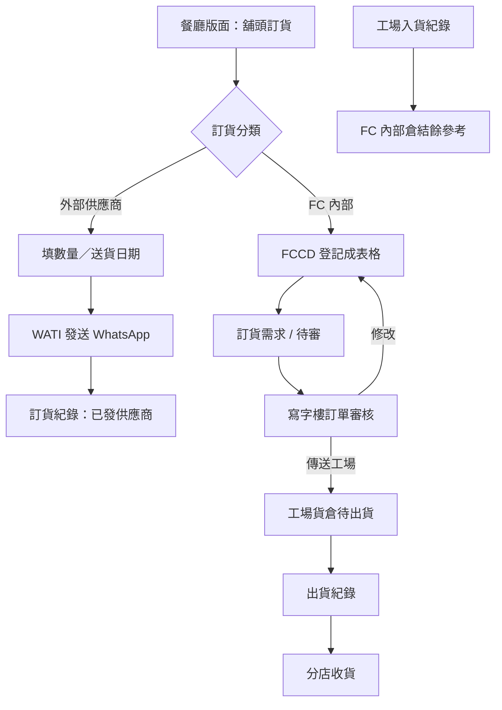

# 分店凍貨／乾貨訂貨與 Shop HR PRD

| 項目 | 內容 |
| --- | --- |
| 文件版本 | 1.6 |
| 文件日期 | 2026-09-03 |
| 文件狀態 | 已對《餐廳供應商產品清單》：15 間供應商、416 項；FC_凍肉／FC_乾貨為內部，其餘外部。 |
| 所屬模塊 | 餐廳版面、餐廳訂貨、凍貨、乾貨、工場貨倉、人力資源 |
| 主要使用者 | 餐廳同事／Shop Manager、寫字樓審核、工場、Shop HR、Accounting、Admin／Super Admin |
| 目標 | 旗下餐廳用獨立餐廳版面做每日營運與訂貨；外部供應商經 WATI 發 WhatsApp，自己倉在 FCCD 登記後經寫字樓修改或傳送工場；工場貨倉可入貨與出貨。後續再補 Shop HR。 |
| 參考 | `docs/API_FUNCTIONAL_PRD.md`；`docs/SITEMAP.md`；`docs/WATI_ORDER_NOTIFICATIONS.md`；`docs/reference/restaurant-supplier-catalog.csv` |

| 版本 | 日期 | 修訂 |
| --- | --- | --- |
| 1.0 | 2026-09-03 | 初稿。 |
| 1.1 | 2026-09-03 | 第一批只將軍澳、寫字樓審核、先批再手動傳工場、無截單、不顯示價格、一次出完、現有主檔加「分店可訂」、不停舊 `meat_orders`、Shop HR 獨立角色、網頁打卡。 |
| 1.2 | 2026-09-03 | Phase 2 要做 MPF；乾貨庫存不足警示但仍可出。 |
| 1.3 | 2026-09-03 | 整理二級頁：供應商列表、訂貨需求（外部 WhatsApp／自己倉登記）、訂貨紀錄、供應商電話簿；舖頭訂貨 URL；訂單審核可改單或傳工場；工場貨倉入＋出貨；獨立餐廳版面含現有每日銷售等營運頁。 |
| 1.4 | 2026-09-03 | 外部供應商訊息改走現有 WATI 管道（新範本，核准後才可發送）。外部可訂品項來源維持未定。 |
| 1.5 | 2026-09-03 | 依《餐廳供應商產品清單》確認分類為 **FC 內部** 與 **外部供應商**。可訂目錄以該清單為準，不再在「餐廳食材 vs 另維簡表」之間懸空。Excel 檔尚未能讀取。 |
| 1.6 | 2026-09-03 | 已讀清單：欄位為編號／貨品名稱／單位／供應商名稱。FC 內部＝`FC_凍肉`（14）＋`FC_乾貨`（131）；外部 13 家共 271 項。匯出 `docs/reference/restaurant-supplier-catalog.csv`。 |

### 0.1 已確認決策

| 主題 | 決定 |
| --- | --- |
| 第一批店舖 | 只將軍澳店；資料模型預留多店。 |
| 餐廳版面 | **獨立工作區**（與工場版面、司機送貨同級），餐廳同事主要在這裡操作。 |
| 訂貨雙通道 | **外部供應商**→WATI 發 WhatsApp；**FC 內部**→在 FCCD 登記成表格，走審核／工場貨倉。 |
| 審核 | 寫字樓審核；可**修改**申請，或**傳送工場**。店長不可批。 |
| 傳工場 | 先處理／修改，再**手動**傳送工場；不會自動發送。 |
| 截單 | 沒有每日截單。下單必填送貨日期。 |
| 價格 | 舖頭訂貨不顯示成本或轉撥價。 |
| 出貨 | 自己倉申請一次出完。 |
| 目錄 | 以《餐廳供應商產品清單》為餐廳可訂主檔，按供應商分成 **FC 內部**／**外部供應商**。FC 內部品項再對應現有凍貨／`ingredients` 以便扣倉；對不上的先登記名稱與單位，不強迫先改廚房主檔。 |
| 外部 WhatsApp | **接 WATI**。沿用現有 outbox／worker；新事件與核准範本未啟用前不得真送。 |
| 舊凍肉店舖單 | 不停 `meat_orders`。 |
| 貨倉 | 工場「貨倉存貨」可做**入貨紀錄**與**出貨紀錄**。乾貨不足警示但仍可出。 |
| Shop HR | 獨立角色；Phase 2。打卡先做網頁。MPF 要做（手記）。 |

## 1. 背景與問題

分店（第一批：將軍澳）日常要訂兩類貨。業務清單《餐廳供應商產品清單》已按供應商把可訂品項分成：

1. **外部供應商**：店舖直接向外面供應商叫貨，經 WATI 發 WhatsApp，不是工場執貨。
2. **FC 內部**：向 Food Channel 自己倉（荃灣凍房／乾貨倉）要貨。必須在 FCCD 登記成表，寫字樓改完後才傳工場，工場入／出貨。

「自己倉」= FC 內部的履約倉，不是另一個分類名稱。畫面上的訂貨分類用 **FC 內部／外部供應商**。

現行缺口：沒有餐廳專用工作區、沒有「餐廳訂貨」二級頁、沒有把該清單做成可訂目錄、沒有 WATI 叫貨、沒有 FC 內部待審→傳工場、乾貨沒有出入倉流水。每日銷售等營運頁已在主系統 `/restaurant/*`，但餐廳同事不應和到會訂單工作區混在一起。

## 2. 產品目標

1. 餐廳同事進入**餐廳版面**，做每日銷售等現有輸入，以及舖頭訂貨。
2. 寫字樓在主系統「餐廳訂貨」下管理供應商分類、電話簿、訂貨需求、訂貨紀錄與審核。
3. 外部供應商需求經 **WATI** 發 WhatsApp（電話簿號碼＋核准範本）。
4. FC 內部需求在 FCCD 登記成表格，寫字樓可修改，或傳送工場。
5. 工場貨倉看到已傳送的 FC 內部單，可入貨、出貨；不足警示仍可出。
6. Phase 2 在餐廳版面補 Shop Manager／Shop HR：同事、假期、更表、打卡、MPF。

## 3. 資訊架構

三個工作區，資料同一套，入口分開。

```text
工作區（全域頂部，與現有工場／司機同級）
├─ 工場版面          現有到會生產 + 本期貨倉存貨
├─ 司機送貨          現有
├─ 餐廳版面          【新增】餐廳同事專用 URL
└─ 客戶自助          第二階段
```

### 3.1 餐廳版面 `/restaurant-workspace`（舖頭 URL）

餐廳同事預設登陸這裡，不進到會訂單桌。第一批將軍澳。

```text
餐廳版面
├─ 舖頭訂貨              建訂貨需求（外部 WATI / FC 內部登記）
├─ 訂貨紀錄              只看本店
├─ 每日銷售              現有 /restaurant/daily-sales
├─ 每日採購              現有 /restaurant/daily-purchases
├─ 餐廳盤點              現有 /restaurant/inventory
├─ 月度支出              現有 /restaurant/monthly-expenses
├─ 同事／假期／更表／打卡／MPF   Phase 2
└─ 本店設定（可後補）
```

「舖頭訂貨 (連結 URL)」= 此工作區的訂貨頁，可用 `/restaurant-workspace` 或等價短鏈從全域「工作區」打開，類似 `/factory`。

現有主系統餐廳頁**不刪**；餐廳版面複用同一頁面與權限，避免兩套輸入。Shop Manager 開餐廳版面即可完成日常，不必先經過到會主頁。

### 3.2 寫字樓主系統：餐廳訂貨（新二級頁）

掛在主工作區「餐廳」下，給寫字樓／Admin，不是店舖日常入口。

```text
餐廳
├─ （現有設定、員工主檔、報告入口可留在主系統）
└─ 餐廳訂貨
   ├─ 供應商列表（訂貨分類）
   ├─ 訂貨需求
   ├─ 訂貨紀錄
   ├─ 供應商電話簿
   └─ 訂單審核          修改 / 傳送工場
```

### 3.3 工場版面：貨倉存貨

到會工場板保留。另外分組，避免和工作餐單混在一起。

```text
工場版面
├─ （現有訂單／出產／列印）
└─ 貨倉存貨
   ├─ 待出貨（已傳送工場的 FC 內部單）
   ├─ 出貨紀錄
   └─ 入貨紀錄
```

## 4. 範圍與分期

### 4.1 Phase 1

- 餐廳版面工作區 + 現有每日銷售／採購／盤點／月支移入（或鏡像）該版面。
- 舖頭訂貨、訂貨需求雙通道、訂貨紀錄、供應商列表（分類）、供應商電話簿。
- 訂單審核：修改或傳送工場。
- 工場貨倉：入貨紀錄、出貨紀錄；自己倉扣帳／在途／收貨。
- 第一批只將軍澳；權限、RLS、審計。

### 4.2 Phase 2

Shop Manager／獨立 Shop HR：同事列表、假期、更表、網頁打卡、MPF。掛在餐廳版面。

### 4.3 不包含

- 到會客戶下單、報價、Shopify。
- 用 WhatsApp 單自動產生正式會計應付或取代每日採購（每日採購仍是實際入帳）。
- 自動出糧、MPF 法定計算／電子申報。
- 考勤機、定位打卡。
- 停用 `meat_orders` 或改寫凍肉成本／供應商 PDF 報價。
- 工場擅自換貨。

## 5. 名詞

| 名詞 | 定義 |
| --- | --- |
| 餐廳版面 | 獨立工作區，餐廳同事專用，含舖頭訂貨與現有每日輸入。 |
| 訂貨分類 | 供應商列表上的分類：**外部供應商** 與 **FC 內部**。一間供應商只屬一種通道。 |
| FC 內部 | Food Channel 自己倉（荃灣凍房／乾貨倉）。履約走 FCCD 登記→審核→工場。 |
| 餐廳供應商產品清單 | 餐廳可訂目錄的業務來源。按供應商列出可訂品項；匯入後成為供應商列表＋可訂品項。 |
| 訂貨需求 | 店舖提出的要貨單。外部＝經 WATI 發 WhatsApp；FC 內部＝在 FCCD 登記的表格。 |
| 舖頭訂貨 | 餐廳版面建立訂貨需求的頁。 |
| 訂單審核 | 寫字樓改自己倉單，或傳送工場。 |
| 供應商電話簿 | 外部供應商聯絡人與電話，供 WhatsApp。 |
| 入貨紀錄 | 貨倉收貨入 FCCD 自己倉。 |
| 出貨紀錄 | 貨倉發給分店；一張 FC 內部申請一次出完。 |

## 6. 角色

| 角色 | 餐廳版面 | 寫字樓餐廳訂貨 | 工場貨倉 |
| --- | --- | --- | --- |
| Shop Manager／餐廳同事 | 舖頭訂貨、本店紀錄、每日銷售等；**不可審核、不可傳工場** | 不可進入審核／電話簿管理（除非另授權） | 不可 |
| 寫字樓 | 可代店開單（可後補） | 供應商、電話簿、需求、紀錄、審核修改／傳工場 | 只讀出貨狀態（可後補） |
| Factory | 不可 | 不可審核 | 待出貨、入貨、出貨 |
| Shop HR | Phase 2 人事頁 | 不可訂貨審核 | 不可 |
| Accounting | 只讀本店／授權範圍 | 只讀紀錄 | 只讀入／出貨 |

約束：自己倉未傳送工場前，工場不可執貨或扣倉。餐廳只能看本店。下單不顯示價格。

建議 page keys：`workspace.restaurant`、`restaurant.ordering`、`.suppliers`、`.requests`、`.records`、`.phonebook`、`.review`、`.review.send_factory`、`restaurant.workspace.shop_order`、`factory.warehouse`、`.inbound`、`.outbound`。

## 7. 兩條訂貨通道



### 7.1 外部供應商 → WhatsApp

1. 選外部供應商（來自供應商列表＋電話簿）。
2. 選該供應商在《餐廳供應商產品清單》下的可訂品項、數量、送貨日期、備註。不顯示價格。
3. 「發送 WhatsApp」：用電話簿號碼，經現有 **WATI** 管道發送（新事件／核准範本，參數含店名、送貨日期、品項與數量摘要）。
4. 系統把該需求記進訂貨紀錄（狀態如 `wati_queued`／`wati_sent`／`wati_failed`）。**不傳工場、不扣自己倉。**
5. 實際付款／入帳仍用現有每日採購，不把 WATI 訊息當會計憑證。
6. 範本未在 WATI 核准、或 `wati_order_notification_templates` 未啟用時，按鈕不可真送（fail closed），與到會通知同一套規則。見 `docs/WATI_ORDER_NOTIFICATIONS.md`。
7. 收件人是供應商電話簿號碼，不是客人、也不是到會內部提醒名單。重試走現有 outbox，不得重複當成兩張訂貨需求。

### 7.2 FC 內部 → FCCD 登記

1. 選 FC 內部供應商：`FC_凍肉` 或 `FC_乾貨`（可同一張需求混兩倉，工場按供應商拆倉執貨）。
2. 只可選該供應商在清單上的品項。能對上現有凍貨／`ingredients` 的用來扣倉，對不上的仍可下單但工場出貨要警示。
3. 送出後在 FCCD **登記成表格**（有編號、行、狀態），出現在寫字樓「訂貨需求」與「訂單審核」。
4. 寫字樓可改行、改量、刪行、拒絕、標記缺貨。
5. 「傳送工場」後才進工場貨倉待出貨。一次出完。
6. 出貨寫出貨紀錄與存貨流水；分店可在餐廳版面確認收貨。

FC 內部狀態：

```text
draft → submitted → in_review → sent_to_factory → picking → in_transit → received
                 ↘ rejected / cancelled
in_transit → exception
```

`submitted`／`in_review` 對應待審。寫字樓修改仍留在審核，不會自動傳工場。

## 8. 畫面規格

列表遵循 `docs/UI_TABLE_STANDARD.md`（15 筆、表頭固定、伺服器分頁）。

### 8.1 餐廳版面

獨立 shell，導航只顯示 §3.1。權限 `workspace.restaurant`。沒有此權限的到會帳號不應被丟進餐廳版面。

每日銷售／採購／盤點／月支：**沿用現有元件與 RPC**，只改入口與版面 chrome。行為與現在主系統頁相同。

### 8.2 舖頭訂貨

| 欄位 | 規則 |
| --- | --- |
| 店舖 | 鎖定本店（將軍澳） |
| 訂貨分類／供應商 | 必填，決定 WATI 或 FC 內部 |
| 送貨日期 | 必填；不可早於今天；無截單 |
| 明細 | 至少一行；品項只來自該供應商在產品清單上的可訂項 |
| 價格 | 不顯示 |

外部：經 WATI 發送 WhatsApp。FC 內部：保存並送出登記。

### 8.3 供應商列表（訂貨分類）

寫字樓維護：名稱、分類（**FC 內部**／**外部供應商**）、啟用、可訂品項、排序。

可訂目錄以已匯入的《餐廳供應商產品清單》為準（工作表 `餐廳`；CSV：`docs/reference/restaurant-supplier-catalog.csv`）。舖頭選品不要改用整份廚房 `ingredients`。

**清單欄位**

| Excel 欄 | 系統 | 說明 |
| --- | --- | --- |
| 編號（原文「編唬」） | `sku` | FC 內部多數有碼（`FCR*`、`LKO*`、`LKJ*`、`LKA*` 等）。外部幾乎全空，系統用名稱＋供應商識別，空 SKU 允許。 |
| 貨品名稱 | `name` | 必填。可含訂貨備註，例如「每訂6包牛展片要跟1包牛展頭」。 |
| 單位 | `unit` | 必填，自由文字（條、包、箱、KG、2kg / 包）。不在下單時換算。 |
| 供應商名稱 | `supplier_name` | 決定通道：名稱以 `FC_` 開頭＝**FC 內部**，否則＝**外部供應商**。 |

**供應商（416 項）**

| 供應商 | 項數 | 通道 | 貨倉 |
| --- | --- | --- | --- |
| FC_凍肉 | 14 | FC 內部 | 凍房 |
| FC_乾貨 | 131 | FC 內部 | 乾貨倉 |
| 鴻發號糧油食品有限公司 | 138 | 外部 | — |
| 日鮮食品有限公司 | 65 | 外部 | — |
| 意華 | 21 | 外部 | — |
| 金福華食物(香港)有限公司 | 15 | 外部 | — |
| 新豐凍肉食品市埸 | 13 | 外部 | — |
| 浚峰企業有限公司 | 4 | 外部 | — |
| 源興 | 4 | 外部 | — |
| 三潤麵皇食品有限公司 | 3 | 外部 | — |
| 長明國際(香港)集團有限公司 | 3 | 外部 | — |
| 強記蛋行 | 2 | 外部 | — |
| 鳳香園麵飽有限公司 | 1 | 外部 | — |
| 益力多公司 | 1 | 外部 | — |
| 淘大 | 1 | 外部 | — |

資料品質（匯入時保留，不要丟行）：

- 304 項沒有編號（幾乎全是外部；FC 內部也有少數，如綠豆沙、甜酸咕嚕汁、雀巢咖啡粉）。
- 單位寫法不統一（`2kg / 包`、`2kg/包`、`（500G）`、`原箱訂`）。
- 浚峰有兩行同名「丁晴藍無粉手套 (100隻)」，匯入後仍作兩行或合併須業務確認；預設保留兩行。
- 供應商名稱「新豐凍肉食品市埸」按原文保存。

寫字樓可之後改啟用、排序、電話簿；**不可**在未對帳前把廚房主檔覆蓋這 416 行。FC 內部品項能對上凍貨／`ingredients` 的再寫對應 ID 以便扣倉；對不上仍可下單，工場出貨警示。

### 8.4 供應商電話簿

聯絡人、電話、所屬供應商、備註。一個供應商可多個號碼；發 WATI 時可選。沒有可用電話則不能發送。號碼格式須符合現有 WATI 發送規則。

### 8.5 訂貨需求（寫字樓）

全店佇列：通道、供應商、店舖、送貨日期、狀態。FC 內部可點進審核；外部可看 WATI 發送狀態、範本、收件號碼與重試。

### 8.6 訂貨紀錄

寫字樓看全部，餐廳版面只看本店。欄位：編號、通道、供應商、日期、狀態、WhatsApp／工場／出貨結果。

### 8.7 訂單審核

只處理 FC 內部單。可修改（行、量、備註）或傳送工場。修改要留審計。傳送後店舖不可再改量。拒絕要原因。

### 8.8 工場貨倉存貨

**入貨紀錄：** 品項、數量、單位、日期、供應商／來源、批次（可空）、操作者。寫入自己倉流水（凍貨走現有 movement；乾貨新建）。不可改寫盤點快照。

**出貨紀錄：** 對已傳送的 FC 內部單執貨。實發 ≤ 核准。不足／未盤點警示仍可出。一單一次出完。出貨後在途，待分店收貨。

**待出貨：** 僅 `sent_to_factory` 及之後。未傳送不可見。

## 9. Phase 1 需求

| 編號 | 需求 | 優先 |
| --- | --- | --- |
| WS-01 | 新增餐廳版面工作區與 URL，全域工作區選單與工場／司機並列。 | P0 |
| WS-02 | 餐廳版面包含舖頭訂貨、本店訂貨紀錄，以及現有每日銷售、採購、盤點、月度支出。 | P0 |
| WS-03 | 餐廳版面帳號只見本店；第一批將軍澳。 | P0 |
| ORD-01 | 舖頭可建訂貨需求，必填送貨日期，不顯示價格；品項只來自該供應商清單。 | P0 |
| ORD-02 | 外部供應商需求經 WATI 發送 WhatsApp（電話簿號碼＋核准範本），並寫入訂貨紀錄與 outbox 狀態。 | P0 |
| ORD-03 | FC 內部需求在 FCCD 登記成表格，進入訂貨需求／訂單審核。 | P0 |
| ORD-04 | 寫字樓供應商列表以 **FC 內部／外部供應商** 分類，可訂品項以《餐廳供應商產品清單》為準。 | P0 |
| ORD-05 | 寫字樓供應商電話簿；無可用電話或範本未啟用時不可發送。 | P0 |
| ORD-06 | 寫字樓訂貨需求與訂貨紀錄可篩通道、店、日期、狀態。 | P0 |
| REV-01 | 訂單審核可修改自己倉單，並留審計。 | P0 |
| REV-02 | 訂單審核可手動傳送工場；未傳送工場不可見該單。 | P0 |
| REV-03 | 店長不可審核、不可傳送工場。 | P0 |
| WH-01 | 工場貨倉可建入貨紀錄，寫入自己倉流水。 | P0 |
| WH-02 | 工場貨倉可對已傳送單出貨，一次出完，寫出貨紀錄。 | P0 |
| WH-03 | 乾貨／凍貨不足或未盤點警示，仍可出貨。 | P0 |
| WH-04 | 出貨與入貨重試不得重複入帳或扣帳。 | P0 |
| WH-05 | 乾貨必須新建出入流水，不得覆蓋盤點事件。自己倉凍貨優先用現有 meat movement。 | P0 |
| RCV-01 | 餐廳版面可確認自己倉收貨；差異走異常。 | P1 |
| REP-OLD | 不停 `meat_orders`；舊店舖訂貨數量報告不切換。 | P0 |

## 10. 資料模型（建議）

| 實體 | 用途 |
| --- | --- |
| 現有 `suppliers`＋分類欄或對照表 | 訂貨分類：external／own_warehouse |
| 供應商可訂品項 | 來自《餐廳供應商產品清單》。外部只掛外部供應商；FC 內部可另對應凍貨／`ingredients` |
| `shop_supplier_contacts` | 電話簿 |
| `shop_order_requests`／`_lines` | 訂貨需求（兩通道共用頭，通道欄位分流） |
| `shop_order_events` | 修改、WhatsApp、傳工場審計 |
| `shop_warehouse_receipts` | 入貨紀錄 |
| `shop_shipments`／`_lines` | 出貨紀錄 |
| 現有凍貨 movement＋新乾貨 movement | 自己倉流水 |
| 現有 `restaurant_*` 營運表 | 餐廳版面每日輸入，不複製 |

WATI 發送寫入現有 outbox／send log（或等價欄位）：事件、範本、號碼、參數快照、狀態。不把已發送訊息當已入帳。新事件需獨立 template row，未核准不得 `is_active`。

編號：自己倉 `SR-YYYYMMDD-####`；外部可用 `WX-YYYYMMDD-####`，與到會訂單分開。

### 10.1 乾貨現況

舖頭選品以《餐廳供應商產品清單》為準，不是整份廚房 `ingredients` 目錄。`ingredients`／凍貨主檔只供 FC 內部品項對應扣倉。`ingredient_stocktake_events`／`packing_stocktake_events` 只是盤點快照。`restaurant_ingredients` 可對照匯入，不是訂貨唯一來源，也不是自己倉結餘。乾貨出入倉流水本期要新建。入／出貨都不准寫成假盤點。

## 11. 營運規則

| 規則 | 狀態 | 內容 |
| --- | --- | --- |
| 第一批店 | 已確認 | 將軍澳；餐廳版面只開這店。 |
| 餐廳版面 | 已確認 | 獨立工作區，含每日銷售等現有功能。 |
| 雙通道 | 已確認 | 外部 WATI；FC 內部 FCCD 登記。分類名用 FC 內部／外部供應商。 |
| 審核 | 已確認 | 寫字樓可改單或傳工場。 |
| 無截單／必填送貨日／不顯示價／一次出完 | 已確認 | 同 v1.2。 |
| 貨倉入＋出 | 已確認 | 工場貨倉兩邊都做。 |
| 警示可出 | 已確認 | 不足仍可出。 |
| WhatsApp 發送管道 | **已確認** | 接 WATI；新範本核准並啟用後才可發送。 |
| 可訂目錄 | **已確認** | 清單 416 項；`FC_`＝內部（凍肉／乾貨兩倉），其餘 13 家外部走 WATI。 |
| 寫字樓代店下單 | 可後補 | Phase 1 以餐廳版面下單為主。 |

## 12. Phase 2：Shop Manager ＋ Shop HR

掛在**餐廳版面**。本期不定實作任務。

```text
餐廳版面
├─ 營運／訂貨     Phase 1
├─ Shop Manager   本店同事、更表、假期覆核
└─ Shop HR        同事、假期、更表、網頁打卡、MPF
```

### 12.1 同事列表

延伸 `restaurant_staff`。

| 編號 | 需求 |
| --- | --- |
| HR-01 | 維護姓名、電話、店舖、部門、全／兼職、入職／離職、啟用。 |
| HR-02 | 可關聯登入帳號；沒有帳號的同事仍可存在。 |
| HR-03 | Shop Manager 只看本店；Shop HR／Admin 按授權看多店。 |
| HR-04 | 停用不得刪歷史假期、MPF、打卡與更表。 |

### 12.2 同事假期

現有 holidays 設定只是類別。

| 編號 | 需求 |
| --- | --- |
| HR-05 | 申請或代記：同事、類別、日期、日數、狀態。 |
| HR-06 | 與更表衝突警示。 |
| HR-07 | 批准後才可供工時／薪酬使用。 |

### 12.3 MPF 紀錄

要做。手記／匯入，不做法定計算或申報。

| 編號 | 需求 |
| --- | --- |
| HR-08 | 按同事、月份：僱員部分、僱主部分、工資基數、狀態、備註、憑證。 |
| HR-09 | 保留誰改了什麼。 |
| HR-10 | 僅 Shop HR、Accounting、Admin 可見。 |

### 12.4 更表

| 編號 | 需求 |
| --- | --- |
| HR-11 | 依店、部門、日期、同事、時段排更。 |
| HR-12 | 檢查假期、重疊、跨日。 |
| HR-13 | 工時時區 Asia/Hong_Kong。 |
| HR-14 | 第一期手動更表即可。 |

### 12.5 打卡

| 編號 | 需求 |
| --- | --- |
| HR-15 | 網頁打上班／下班。 |
| HR-16 | 不接考勤機、不強制定位。 |
| HR-17 | 主管可補打卡（要原因與審計）。 |
| HR-18 | 可對照更表異常；公式後補才進薪酬報告。 |

### 12.6 Phase 2 非目標

自動出糧、IR56、MPF 電子申報、未授權跨店調班、用假期類別頁冒充請假。HR 不阻擋 Phase 1 訂貨。

## 13. 與現有模組邊界

```text
餐廳版面每日銷售等  == 現有 /restaurant/* 同一資料
外部訂貨 ──WhatsApp──► 供應商     ✗ 不扣自己倉  ✗ 不傳工場
自己倉訂貨 ──審核修改／傳工場──► 貨倉出貨 ──► 分店收貨
工場入貨 ──► 自己倉流水
✗ 不到會 orders / Shopify
✗ WhatsApp 單不自動寫 restaurant_supplier_purchases
✗ 出入貨不覆蓋 stocktake 歷史
```

| 現有 | 關係 |
| --- | --- |
| `/restaurant/daily-sales` 等 | 搬進／鏡像餐廳版面，同一功能 |
| `/restaurant/daily-purchases` | 實際對外採購入帳；WhatsApp 訂貨不是這張單 |
| `/factory` | 到會板保留；貨倉另組 |
| `meat_orders` | 不停 |
| `/restaurant/staff` | Phase 2 主檔 |

## 14. UX 與實作約束

1. 中文預設；字串走 `src/i18n.ts`。
2. 遵循 UI／Design System；餐廳版面可簡化 chrome，但表格標準相同。
3. 純函式放 `src/lib/`。
4. 寫入必須 RLS／RPC，不可只藏選單。
5. 外部訂貨經 WATI 發送，不改用瀏覽器 `wa.me` 當正式通道；秘密與範本啟用規則與到會通知相同。
6. 附件（收貨異常、MPF）走 private bucket。
7. 時區 Asia/Hong_Kong。
8. 測試只跑本需求相關頁與狀態機。

## 15. 驗收（Phase 1）

1. 工作區可開餐廳版面；將軍澳可做每日銷售與舖頭訂貨；到會桌不是餐廳預設首頁。
2. 外部供應商單經 WATI 進入 outbox 並出現在訂貨紀錄；工場看不到該單。範本未啟用時不能真送。
3. FC 內部（`FC_凍肉`／`FC_乾貨`）單在 FCCD 成表；寫字樓可修改；未傳工場前工場不可見。工場待出貨應能分凍房／乾貨倉。
4. 傳送工場後，貨倉可出貨；入貨紀錄可增加自己倉數量參考。
5. 不足警示仍可出；重試不重複入／出帳。
6. 下單無價格；店長不能傳工場。
7. 乾貨出入不覆蓋盤點快照。
8. 匿名與無權限拒絕。

## 16. 尚餘問題

不阻擋開規格：

1. 將軍澳對應哪一筆 `restaurants`。
2. 寫字樓審核掛 Admin 還是另開權限。
3. 浚峰兩行同名手套要保留兩行還是合併。
4. 13 家外部供應商的電話簿號碼（清單沒有電話）。
5. 新 WATI 範本名稱、參數順序與誰按發送。建議：舖頭送出即入 outbox。

## 17. 建議下一步

1. 以本 PRD 開 OpenSpec change `add-shop-replenishment`（餐廳版面＋雙通道訂貨＋貨倉入出）。
2. Phase 2 HR 另開 change。
