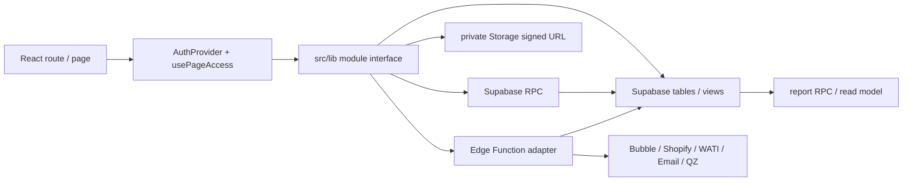
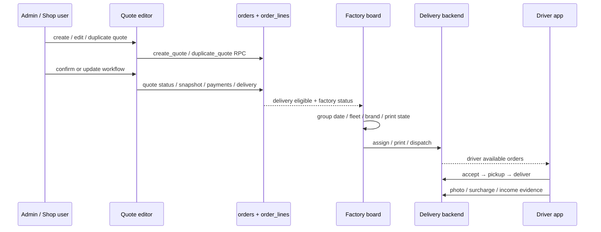
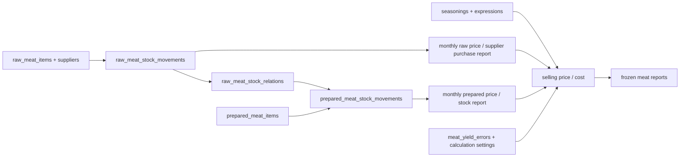
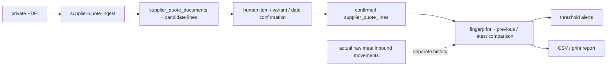

# 資料流與外部整合

## 主應用資料流

前端模組通常以 Supabase publishable key 讀寫；敏感流程（admin user、Bubble、driver file、quote PDF ingest、quote confirmation、QZ signing／label、Shopify sync、login log）轉交 Edge Function 或 RPC。實際呼叫位置可由 [機械索引](generated/index.json) 的 `dataCalls`、`edgeFunctions` 和 `migrationObjects` 反查。

## 訂單 → 報價 → 生產 → 配送

主要 evidence：`src/lib/quote-editor.ts`、`src/lib/order-editor.ts`、`src/lib/factory-board.ts`、`src/lib/deliveries.ts`、`src/lib/driver-delivery.ts`；RPC 和狀態約束以 migrations 為準。

## 跨域 handoff、owner 與觸發條件

| Handoff | Direction | Owner / module | Trigger | Evidence |
| --- | --- | --- | --- | --- |
| Quote → Order | quote editor → `orders`／`order_lines`／`deliveries` | Order／Quote module；RPC 負責交易邊界 | create／duplicate／confirm／update quote | `src/lib/quote-editor.ts:154` |
| Order → Kitchen／Factory | order + delivery → kitchen／factory read view | Kitchen／Factory board | delivery date、order status、factory flag 變更 | `src/lib/factory-board.ts:301` |
| Delivery → Driver | backend delivery → driver token RPC | Delivery module + driver adapter | assignment／available order polling | `src/lib/driver-delivery.ts:122` |
| Raw meat → Prepared meat | raw movement → stock relation → prepared movement | Frozen inventory module | inbound／outbound／raw source selection | `src/lib/prepared-meat-inventory.ts:789` |
| Supplier PDF → Quote report | private PDF → confirmed quote line → comparison／alert | Supplier quote module；reviewer owns confirmation | upload、review、confirm、threshold evaluation | `src/lib/supplier-quote-api.ts:252` |
| Restaurant input → Reports | daily／monthly records → report RPC | Restaurant input + report read model | save daily record、month close／P&L state | `src/lib/restaurant-daily-sales.ts:375` |
| Bubble source → Migration tables | Bubble proxy → phase／checkpoint／entity writes | Migration operator + Edge Function | scan、phase import、checkpoint resume | `src/lib/bubble-api.ts:20` |
| Factory → QZ | factory print job → label command／signature | Factory module + QZ adapter | print／reprint action | `src/lib/factory-label.ts:15` |

未能由靜態程式判斷的 owner、provider retry policy 或部署觸發條件列在 [差異與缺口](gaps-and-differences.md)，不在圖上假定為 confirmed。

## 凍貨庫存 → 成本／報表

供應商 PDF 報價另走：

confirmed quote 不會覆蓋 `raw_meat_stock_movements`；這是凍貨報價 PRD 要求，也是目前資料模型分表的原因。

## 餐廳資料輸入 → 財務／報告

每日 sales、daily purchases、monthly expenses 先載入 restaurant／department／period／payment／platform master，再以香港日期邊界寫入 `restaurant_daily_sales`、`restaurant_supplier_purchases`、`restaurant_monthly_costs`。stocktake 另由 `restaurant_stocktake_events` RPC 管理。reports 透過 report RPC／聚合讀取，不是另一個交易來源。

## 外部整合

| Integration | 觸發入口 | server-side adapter | 輸出／失敗邊界 |
| --- | --- | --- | --- |
| Bubble Data API | migration pages、scan、relationship analysis | `bubble-scan`、`bubble-relations`、phase／incremental functions | browser 只收到 aggregate／checkpoint；credentials 不進 client |
| Shopify | `/orders/shopify-pending`、sync workflows | `shopify-order-sync` | external order sync issues 需可追蹤，不能默認為 order 已完成 |
| WATI／Email | quote confirmation | `send-quote-confirmation` | quote confirmation 需同時檢查 provider 結果與本地狀態 |
| QZ Tray | factory label／sign | `qz-label-tspl`、`qz-sign` | label command／signature 失敗時不可標示列印完成 |
| Driver photos | driver delivery app | `driver-delivery-files` | private Storage、session token、signed／proxy URL |
| Supplier quote PDF | frozen supplier quotes | `supplier-quote-ingest` + private bucket | parser／OCR／AI 限制和人工 confirmation 見凍貨報價 PRD |
| Login／admin user | auth／settings | `login-log`、`admin-users` | 敏感操作留 server-side audit，browser 只用 publishable key |
