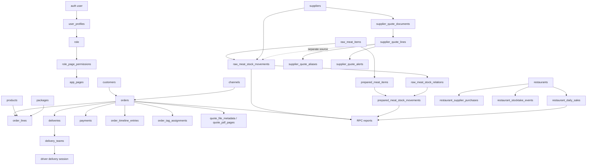

# 領域模型與模組關係

## 核心詞彙

| 詞彙 | 本專案中的精確含義 | 不應混用 |
| --- | --- | --- |
| User / Profile | Supabase auth user 及 `user_profiles` 的應用資料 | Role、Customer |
| Role | `SYSTEM_ROLES` 中的角色名稱，透過 page／action permission 控制能力 | Permission |
| Permission | page key 或 action key 的 `canAccess`／`canManage` 設定 | UI 是否顯示 |
| Order | `orders.document_type = order` 的正式交易／交付主體 | Quote、unconfirmed |
| Quote | 可轉正式 order 的報價主體，仍共用 `orders` 及部分 delivery／payment 結構 | Supplier quote |
| Supplier quote | 供應商 PDF 的版本化文件與 quote lines | Actual inbound price |
| Raw meat item | 凍肉原料主檔 | Prepared meat item、Product |
| Stock movement | raw／prepared／restaurant 的存貨變動 | Price version |
| Delivery | order 的配送安排及配送狀態 | Driver session |
| Factory job | 工場從 delivery／order 產生的生產與列印工作視圖 | Kitchen calendar |
| Snapshot | 寫入 order／line／payment 時保存的當時名稱、地址、價格等值 | Master record |
| Evidence | 能把功能結論定位回檔案、符號、SQL object、測試或產品文件的引用 | 推測 |

## 實體關係

## 主要 module interface 與 seam

| Module | Interface 提供的行為 | Implementation／adapter | Seam 與深度觀察 |
| --- | --- | --- | --- |
| `AuthProvider` | session、profile、signIn／signOut／reset、refresh | Supabase Auth + `user_profiles` + login log | 全域 context 是深 module；各入口只依賴小 interface |
| `usePageAccess` | `canAccess`、`canManage`、section access | role permission map + Super Admin 規則 | auth／nav／page gate 的 seam；可見和可管理分開 |
| `order-editor` | options、load draft、save order／lines／payments／delivery | Supabase table upsert、void、snapshot mapping | 跨頁面複用的深 module；副作用集中在 save interface |
| `quote-editor` | create／duplicate／load／update quote、payments、confirmation | RPC + order／delivery／payment adapters | Quote 與 Order 的共用 seam；document type 是關鍵 invariant |
| `supplier-quotes` | fingerprint、compare、threshold、alert、CSV | 純函式 domain logic + UI／API adapters | 計算邏輯可單測；資料來源和 AI／PDF pipeline 仍是外部 seam |
| `raw-meat-inventory` | unit conversion、item／supplier／movement read/write | Supabase RPC／tables | 凍貨主檔與 movement 的資料 seam；不可與 PDF quote source 混淆 |
| `deliveries` | filter、status predicate、list、assign、cancel、export | Supabase tables／RPC + storage photo adapter | 後台配送與司機 token flow 是兩個 adapter |
| `factory-board` | eligible delivery、group、print status、job load | delivery／meat order queries + QZ label adapter | 工場是 delivery 的下游視圖，不是另一個 order master |
| `driver-delivery` | token login、accept／pickup／deliver、income、photo | token RPC family + `driver-delivery-files` | 外部 session token 是獨立 seam；不使用一般 staff role page access |
| `reports` | 月度價格／庫存／supplier purchase／shop quantity queries | report RPC adapter | 報告多為 read model；不應回寫來源資料 |
| `bubble-api`／`bubble-relations` | aggregate scan、relationship analysis | server-side Bubble proxy Edge Functions | secret isolation seam；瀏覽器只收到摘要 |

## 重要不變條件

1. `document_type` 區分 quote／unconfirmed／order；quote workflow 不應直接被當正式 order。
2. order line、payment、customer／address 等 snapshot 是交易時值，不等同於可變 master。
3. supplier PDF quote price 與 raw meat actual inbound price 是兩條獨立歷史；比較前需有 supplier／item／variant／unit 條件。
4. raw／prepared stock movement 透過 relations 和 unit conversion 連結；報表可聚合但不能將報表平均值當 movement 寫回。
5. `canAccess` 控制入口可見／可進入，`canManage` 控制管理操作；RLS／RPC 是第二道 enforcement，不只依賴前端 gate。
6. Storage private file 只能以 signed URL／server proxy 暴露；service role／provider secret 不進 browser bundle。
7. Edge Function、RPC、外部 webhook 失敗時，UI 應呈現失敗或待處理狀態，不以成功 toast 代替持久化證據。
